# MASTER AUDIT INDEX & REVERSE ENGINEERING DOSSIER

> **Mission:** Full-system reverse engineering and clean architecture dossier across the migrated platform (`lms-server`, `lms-client`) with rigorous reconciliation against legacy repositories (`express`, `tuition-frontend`).

## 1. Operating Rules & Protocol

1. **Strict Batch Sizing:** Exactly 5 to 8 files per phase. Never exceed 8 files. Never fewer than 5 files.
2. **Strict Layer Separation:** Frontend and Backend files are never mixed in the same phase. All modules are completed cleanly.
3. **Zero-Shortcuts Rule:** Every file is analyzed down to state mutations, hooks, network calls, parameters, return shapes, and edge cases. Banned: `...`, `// rest of code`, generic summaries.
4. **Legacy Reconciliation:** Every file is cross-referenced with its corresponding legacy counterpart in `express` or `tuition-frontend` to capture lost business rules and edge-case regressions.
5. **Zero-Degradation On-Disk Persistence:** Every phase audit is saved immediately to `docs/audit/phase-XX-[module-name].md`, preserving complete audit depth across context resets.

---

## 2. System Inventory Summary

| Layer | Target Repository | Legacy Counterpart | Total Files Audited | Total Phases |
| :--- | :--- | :--- | :---: | :---: |
| **Backend** | `/Users/chandupa/lms-server` (TypeScript / Express / Mongoose) | `/Users/chandupa/express` (JavaScript / Express / MongoDB) | 93 files | Phases 1 – 13 (13 phases) |
| **Frontend** | `/Users/chandupa/lms-client` (Next.js 16 / React 19 / Tailwind) | `/Users/chandupa/tuition-frontend` (Next.js / React) | 147 files | Phases 14 – 34 (21 phases) |
| **Total** | **NexvoLearn Platform** | **Legacy Platform** | **240 files** | **34 Phases** |

---

## 3. Master Phase Matrix Table

| Phase | Layer | Module / Domain | Files | Status | Dossier File | Target Files |
| :---: | :---: | :--- | :---: | :---: | :--- | :--- |
| 01 | BE | Core Architecture, Config & Middlewares | 7 | 🟢 Complete | [`phase-01-be-core-architecture.md`](./phase-01-be-core-architecture.md) | `src/server.ts` `src/app.ts` `src/config/db.ts` `src/config/env.ts` `src/config/modules.ts` `src/middlewares/errorHandler.ts` `src/middlewares/rateLimiter.ts` |
| 02 | BE | Identity, Auth Models & RBAC Schema | 7 | 🟢 Complete | [`phase-02-be-auth-rbac-models.md`](./phase-02-be-auth-rbac-models.md) | `src/models/User.ts` `src/models/Role.ts` `src/models/Permission.ts` `src/models/RolePermission.ts` `src/models/OTP.ts` `src/models/StudentProfile.ts` `src/middlewares/auth.ts` |
| 03 | BE | Auth & User Management (Services & API Routes) | 7 | 🟢 Complete | [`phase-03-be-auth-user-controllers.md`](./phase-03-be-auth-user-controllers.md) | `src/services/authService.ts` `src/controllers/authController.ts` `src/controllers/usersController.ts` `src/controllers/permissionsController.ts` `src/routes/authRoutes.ts` `src/routes/usersRoutes.ts` `src/routes/permissionsRoutes.ts` |
| 04 | BE | Curriculum, Classes & Entitlements (Models & Services) | 8 | 🟢 Complete | [`phase-04-be-classes-entitlements.md`](./phase-04-be-classes-entitlements.md) | `src/models/Class.ts` `src/models/Subject.ts` `src/models/ClassEnrollment.ts` `src/models/ClassEntitlement.ts` `src/services/classService.ts` `src/services/entitlementService.ts` `src/controllers/classController.ts` `src/routes/classRoutes.ts` |
| 05 | BE | Class Applications, Zoom Meetings & Admissions | 7 | 🟢 Complete | [`phase-05-be-applications-meetings.md`](./phase-05-be-applications-meetings.md) | `src/models/ClassApplication.ts` `src/models/MeetingTicket.ts` `src/services/classApplicationService.ts` `src/controllers/classApplicationController.ts` `src/controllers/meetingController.ts` `src/routes/classApplicationRoutes.ts` `src/routes/meetingRoutes.ts` |
| 06 | BE | Assessment Data Model & Question Bank Schema | 8 | 🟢 Complete | [`phase-06-be-assessments-schema.md`](./phase-06-be-assessments-schema.md) | `src/models/Quiz.ts` `src/models/QuizQuestion.ts` `src/models/QuizSubmission.ts` `src/models/Assessment.ts` `src/models/AssessmentQuestion.ts` `src/models/AssessmentSubmission.ts` `src/models/AssessmentMatch.ts` `src/models/ChallengeMatch.ts` |
| 07 | BE | Quiz Engine, Evaluation Pipeline & Live Challenges | 7 | 🟢 Complete | [`phase-07-be-quiz-challenge-engine.md`](./phase-07-be-quiz-challenge-engine.md) | `src/models/UserAssessmentStats.ts` `src/models/UserPerformance.ts` `src/services/assessmentService.ts` `src/controllers/quizController.ts` `src/controllers/challengeController.ts` `src/routes/quizRoutes.ts` `src/routes/challengeRoutes.ts` |
| 08 | BE | Assignments, Student Attendance & Academic Grading | 8 | 🟢 Complete | [`phase-08-be-assignments-attendance-grades.md`](./phase-08-be-assignments-attendance-grades.md) | `src/models/Assignment.ts` `src/models/AttendanceRecord.ts` `src/models/Grade.ts` `src/models/ExamResult.ts` `src/controllers/assignmentController.ts` `src/controllers/attendanceController.ts` `src/controllers/gradeController.ts` `src/routes/assignmentRoutes.ts` |
| 09 | BE | Recordings, File Management & Media Streaming | 8 | 🟢 Complete | [`phase-09-be-recordings-media-pipeline.md`](./phase-09-be-recordings-media-pipeline.md) | `src/models/Recording.ts` `src/models/File.ts` `src/services/recordingService.ts` `src/services/mediaService.ts` `src/controllers/recordingController.ts` `src/controllers/mediaController.ts` `src/routes/recordingsRoutes.ts` `src/routes/mediaRoute.ts` |
| 10 | BE | Cloud Storage Adapters, Utilities & Tracking Routes | 7 | 🟢 Complete | [`phase-10-be-storage-utilities-tracking.md`](./phase-10-be-storage-utilities-tracking.md) | `src/utils/driveClient.ts` `src/utils/driveHelpers.ts` `src/utils/googleDrive.ts` `src/utils/supabaseClient.ts` `src/utils/monthKey.ts` `src/routes/attendanceRoutes.ts` `src/routes/gradeRoutes.ts` |
| 11 | BE | Payment Gateways & Financial Transactions | 7 | 🟢 Complete | [`phase-11-be-payments-transactions.md`](./phase-11-be-payments-transactions.md) | `src/models/Transaction.ts` `src/services/payments/paymentProvider.ts` `src/services/payments/paymentFactory.ts` `src/services/payments/stripeProvider.ts` `src/services/payments/payhereProvider.ts` `src/controllers/payments/paymentController.ts` `src/routes/payments/paymentRoutes.ts` |
| 12 | BE | White-Label Branding & Site Customization Engine | 7 | 🟢 Complete | [`phase-12-be-branding-customization.md`](./phase-12-be-branding-customization.md) | `src/models/TenantSettings.ts` `src/models/SiteSettings.ts` `src/controllers/systemConfigController.ts` `src/controllers/customizationController.ts` `src/routes/systemConfigRoutes.ts` `src/routes/customizationRoutes.ts` `src/scripts/migrateCustomization.ts` |
| 13 | BE | Database Seeders, Storage Cleaner & Test Harness | 5 | 🟢 Complete | [`phase-13-be-seeders-storage-cleaner.md`](./phase-13-be-seeders-storage-cleaner.md) | `src/scripts/seedPermissions.ts` `src/scripts/seedData.ts` `src/scripts/storageCleaner.ts` `src/scripts/verify-full-regression.ts` `src/scripts/verify-permissions.ts` |
| 14 | FE | Types, Network Client & Auth State Engine | 7 | 🟢 Complete | [`phase-14-fe-types-network-authstate.md`](./phase-14-fe-types-network-authstate.md) | `src/types/axios.d.ts` `src/types/quiz.ts` `src/types/recordings.ts` `src/types/user.ts` `src/lib/axios.ts` `src/lib/api.ts` `src/lib/authState.ts` |
| 15 | FE | Auth Context, Access Gates & Login Flow | 7 | 🟢 Complete | [`phase-15-fe-auth-context-access-gates.md`](./phase-15-fe-auth-context-access-gates.md) | `src/context/AuthContext.tsx` `src/components/auth/AccessGate.tsx` `src/components/auth/AccessDenied.tsx` `src/components/ui/auth/login-form.tsx` `src/components/ui/auth/register-form.tsx` `src/components/ui/auth/ReLoginDialog.tsx` `src/app/login/page.tsx` |
| 16 | FE | Global Contexts (Branding, Customization) & Core Utilities | 7 | 🟢 Complete | [`phase-16-fe-global-contexts-utilities.md`](./phase-16-fe-global-contexts-utilities.md) | `src/context/BrandingContext.tsx` `src/context/CustomizationContext.tsx` `src/context/EditModeContext.tsx` `src/lib/fetcher.ts` `src/lib/formatters.ts` `src/lib/permissions.ts` `src/lib/utils.ts` |
| 17 | FE | Custom Hooks, Cloud Connectors & Debouncing | 8 | 🟢 Complete | [`phase-17-fe-custom-hooks-connectors.md`](./phase-17-fe-custom-hooks-connectors.md) | `src/hooks/useAuth.ts` `src/hooks/useBranding.ts` `src/hooks/usePermission.ts` `src/hooks/useDebounce.ts` `src/hooks/use-toast.ts` `src/lib/site-config.ts` `src/lib/cloudinary.ts` `src/lib/globalLoading.ts` |
| 18 | FE | Global Layout, Responsive Navigation & Topbar | 7 | 🟢 Complete | [`phase-18-fe-global-layout-navigation.md`](./phase-18-fe-global-layout-navigation.md) | `src/app/layout.tsx` `src/components/layout/layout-wrapper.tsx` `src/components/ui/navbar/index.tsx` `src/components/ui/navbar/NavbarDesktop.tsx` `src/components/ui/navbar/NavbarMobile.tsx` `src/components/ui/navbar/navAnimations.ts` `src/components/ui/navbar/useNavPermissions.ts` |
| 19 | FE | Navigation Bars, Brand Logo & Shell Components | 7 | 🟢 Complete | [`phase-19-fe-navbars-brand-logo-shell.md`](./phase-19-fe-navbars-brand-logo-shell.md) | `src/components/ui/navbar.tsx` `src/components/ui/side-navbar.tsx` `src/components/ui/topbar.tsx` `src/components/ui/brand-logo.tsx` `src/components/ui/navConfig.ts` `src/components/ui/footer.tsx` `src/components/system/GlobalLoader.tsx` |
| 20 | FE | Design System Loaders, Skeletons & Card Sections | 7 | 🟢 Complete | [`phase-20-fe-design-loaders-skeletons.md`](./phase-20-fe-design-loaders-skeletons.md) | `src/components/reusable/calculating-loader.tsx` `src/components/reusable/detail-loader.tsx` `src/components/reusable/section-loader.tsx` `src/components/reusable/section-header.tsx` `src/components/reusable/sub-section.tsx` `src/components/reusable/card-section.tsx` `src/components/ui/skeleton.tsx` |
| 21 | FE | Data Presentation Widgets & Rich Text Editing | 7 | 🟢 Complete | [`phase-21-fe-data-presentation-rich-text.md`](./phase-21-fe-data-presentation-rich-text.md) | `src/components/ui/button.tsx` `src/components/ui/stat-card.tsx` `src/components/ui/title.tsx` `src/components/ui/empty-state.tsx` `src/components/ui/data-table.tsx` `src/components/ui/command-search.tsx` `src/components/ui/rich-text-editor.tsx` |
| 22 | FE | Content Editors & Public Landing Experience | 7 | 🟢 Complete | [`phase-22-fe-content-editors-landing.md`](./phase-22-fe-content-editors-landing.md) | `src/components/ui/text-editor.tsx` `src/components/admin/editable-content.tsx` `src/components/admin/editable-image.tsx` `src/components/ui/hero-marketing.tsx` `src/components/ui/landing/LandingHero.tsx` `src/components/ui/landing/PopularClasses.tsx` `src/app/page.tsx` |
| 23 | FE | Frontend API Services: Identity, Users & Core Classes | 7 | 🟢 Complete | [`phase-23-fe-services-auth-users-classes.md`](./phase-23-fe-services-auth-users-classes.md) | `src/services/authService.ts` `src/services/userService.ts` `src/services/classService.ts` `src/services/class/classCrudService.ts` `src/services/class/applicationService.ts` `src/services/class/entitlementService.ts` `src/services/class/zoomTicketService.ts` |
| 24 | FE | Frontend API Services: Assessments, Media & Academic Records | 7 | 🟢 Complete | [`phase-24-fe-services-assessments-media-records.md`](./phase-24-fe-services-assessments-media-records.md) | `src/services/quizService.ts` `src/services/assignmentService.ts` `src/services/recordingService.ts` `src/services/mediaService.ts` `src/services/attendanceService.ts` `src/services/gradeService.ts` `src/lib/content-v2-mock.ts` |
| 25 | FE | Student Dashboard, User Profiles & Info Hub | 7 | 🟢 Complete | [`phase-25-fe-dashboard-user-profile.md`](./phase-25-fe-dashboard-user-profile.md) | `src/app/dashboard/page.tsx` `src/app/dashboard/profile/page.tsx` `src/app/user/[id]/page.tsx` `src/app/info/page.tsx` `src/components/ui/user/UserCard.tsx` `src/components/ui/user/UserForm.tsx` `src/utils/cropImage.ts` |
| 26 | FE | Class Catalog, Class Cards & Hook Abstraction | 7 | 🟢 Complete | [`phase-26-fe-class-catalog-cards.md`](./phase-26-fe-class-catalog-cards.md) | `src/hooks/useClass.ts` `src/app/classes/page.tsx` `src/components/reusable/classCard.tsx` `src/components/ui/class-view/empty-card.tsx` `src/components/ui/class-view/theme-provider.tsx` `src/utils/datetime.ts` `src/utils/upload-class.tsx` |
| 27 | FE | Student Class Detail Hub & Layout Framework | 7 | 🟢 Complete | [`phase-27-fe-class-detail-hub-layout.md`](./phase-27-fe-class-detail-hub-layout.md) | `src/app/classes/[id]/page.tsx` `src/components/ui/class-view/class-page.tsx` `src/components/ui/class-view/class-header.tsx` `src/components/ui/class-view/class-sidebar.tsx` `src/components/ui/class-view/class-tabs.tsx` `src/components/ui/class-view/class-syllabus.tsx` `src/components/ui/class-view/class-recordings.tsx` |
| 28 | FE | Class Academic Submodules (Attendance, Grades & Tasks) | 7 | 🟢 Complete | [`phase-28-fe-class-academic-submodules.md`](./phase-28-fe-class-academic-submodules.md) | `src/components/ui/class-view/class-attendance.tsx` `src/components/ui/class-view/class-grades.tsx` `src/components/ui/class-view/class-quizzes.tsx` `src/components/ui/class-view/class-assignments.tsx` `src/components/ui/class-view/AssignmentsDownloadAndView.tsx` `src/components/ui/class-view/apply-class.tsx` `src/components/ui/class-view/class-form.tsx` |
| 29 | FE | Class Admissions, Document Review & Application Dashboard | 7 | 🟢 Complete | [`phase-29-fe-admissions-application-dashboard.md`](./phase-29-fe-admissions-application-dashboard.md) | `src/components/ui/class-view/ClassForm.tsx` `src/components/ui/application/application-status-badge.tsx` `src/components/ui/application/document-viewer-dialog.tsx` `src/components/ui/application/application-action-dialog.tsx` `src/components/ui/application/class-applications-dashboard.tsx` `src/app/admin/classes/applications/page.tsx` `src/app/admin/classes/assignment/page.tsx` |
| 30 | FE | Admin Class Authoring & Course Configuration | 7 | 🟢 Complete | [`phase-30-fe-admin-class-authoring.md`](./phase-30-fe-admin-class-authoring.md) | `src/app/admin/dashboard/page.tsx` `src/app/admin/classes/page.tsx` `src/app/admin/classes/add/page.tsx` `src/app/admin/classes/edit/[id]/page.tsx` `src/app/admin/classes/edit/[id]/client.tsx` `src/app/admin/settings/branding/page.tsx` `src/app/admin/customization/page.tsx` |
| 31 | FE | Student Quiz Catalog, Interactive Quiz Engine & Popups | 7 | 🟢 Complete | [`phase-31-fe-quiz-catalog-taking-engine.md`](./phase-31-fe-quiz-catalog-taking-engine.md) | `src/hooks/useQuizzes.ts` `src/hooks/useChallenges.ts` `src/app/quizzes/page.tsx` `src/app/quizzes/[id]/page.tsx` `src/app/quizzes/[id]/take/page.tsx` `src/components/ui/quiz/quiz-card.tsx` `src/components/ui/quiz/quiz-engine.tsx` |
| 32 | FE | Quiz Evaluation, Performance Analytics & Question Authoring | 8 | 🟢 Complete | [`phase-32-fe-quiz-evaluation-analytics-authoring.md`](./phase-32-fe-quiz-evaluation-analytics-authoring.md) | `src/components/ui/quiz/QuizPopup.tsx` `src/components/ui/quiz/header.tsx` `src/components/ui/quiz/question-editor.tsx` `src/components/ui/quiz/performance-tracker.tsx` `src/app/quizzes/review/[submission]/page.tsx` `src/app/quizzes/review/quizReview.tsx` `src/app/quizzes/performance/page.tsx` `src/app/admin/quizez/performances/page.tsx` |
| 33 | FE | Admin Quiz Authoring & Video Recording View | 6 | 🟢 Complete | [`phase-33-fe-admin-quizzes-recordings-view.md`](./phase-33-fe-admin-quizzes-recordings-view.md) | `src/components/ui/quiz/create-quiz-form.tsx` `src/app/admin/quizez/add/page.tsx` `src/app/admin/quizez/edit/[id]/page.tsx` `src/app/admin/quizez/edit/client.tsx` `src/app/recordings/[id]/page.tsx` `src/components/ui/recordings/recorded-class.tsx` |
| 34 | FE | Admin Video Editing, User Administration & RBAC Management | 6 | 🟢 Complete | [`phase-34-fe-admin-recordings-users-rbac.md`](./phase-34-fe-admin-recordings-users-rbac.md) | `src/components/ui/recordings/add-recording.tsx` `src/app/admin/recording/add/page.tsx` `src/app/admin/recording/edit/[id]/page.tsx` `src/app/admin/user/page.tsx` `src/app/admin/permissions/page.tsx` `src/components/PermissionMatrix.tsx` |

---

## 4. Cross-Module Architecture & Dependency Map

```mermaid
flowchart TD
    subgraph Backend ["Backend Services: lms-server"]
        P01["Phase 01: Core Architecture & Middlewares"] --> P02["Phase 02: RBAC & Auth Models"]
        P02 --> P03["Phase 03: Auth & User Services"]
        P03 --> P04["Phase 04: Classes & Entitlements"]
        P04 --> P05["Phase 05: Class Applications & Zoom Meetings"]
        P04 --> P06["Phase 06: Assessment Schema"]
        P06 --> P07["Phase 07: Quiz Engine & Challenges"]
        P04 --> P08["Phase 08: Assignments, Attendance & Grades"]
        P04 --> P09["Phase 09: Recordings & Media Pipeline"]
        P09 --> P10["Phase 10: Cloud Storage Utilities"]
        P04 --> P11["Phase 11: Payments & Transactions"]
        P01 --> P12["Phase 12: White-Label Branding"]
        P02 --> P13["Phase 13: Seeders & Test Harness"]
    end

    subgraph Frontend ["Frontend Client: lms-client"]
        P14["Phase 14: Types, Network Client & Auth State"] --> P15["Phase 15: Auth Context & Access Gates"]
        P14 --> P16["Phase 16: Global Contexts & Utils"]
        P16 --> P17["Phase 17: Hooks & Cloud Connectors"]
        P15 --> P18["Phase 18: Global Layout & Navigation"]
        P18 --> P19["Phase 19: Navbars, Topbar & Shell"]
        P19 --> P20["Phase 20: Design Loaders & Skeletons"]
        P20 --> P21["Phase 21: Data Presentation & Editors"]
        P21 --> P22["Phase 22: Landing Experience"]
        P14 --> P23["Phase 23: Core Services: Auth & Classes"]
        P14 --> P24["Phase 24: Core Services: Quizzes & Media"]
        P23 --> P25["Phase 25: Dashboards & Profiles"]
        P23 --> P26["Phase 26: Class Catalog & Cards"]
        P26 --> P27["Phase 27: Class Detail Hub"]
        P27 --> P28["Phase 28: Class Academic Tabs"]
        P28 --> P29["Phase 29: Admissions & Applications"]
        P29 --> P30["Phase 30: Admin Class Authoring"]
        P24 --> P31["Phase 31: Quiz Taking Engine"]
        P31 --> P32["Phase 32: Quiz Analytics & Review"]
        P32 --> P33["Phase 33: Admin Quizzes & Video Player"]
        P25 --> P34["Phase 34: Admin Recordings, Users & RBAC Matrix"]
    end
```

