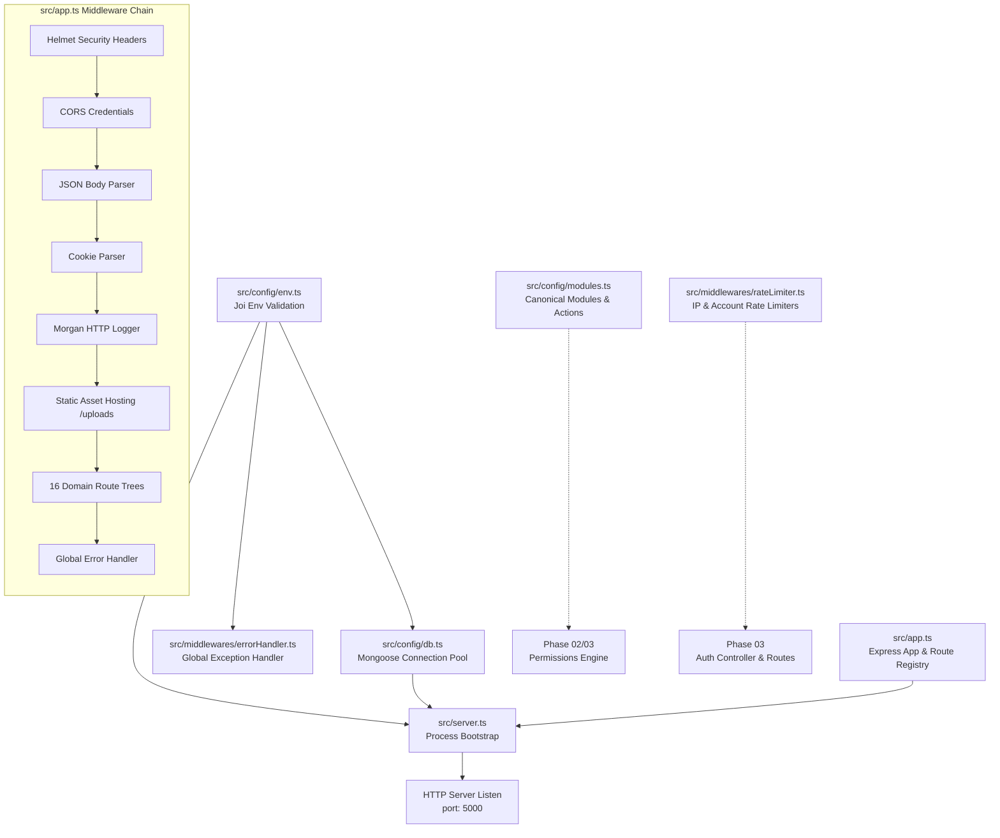
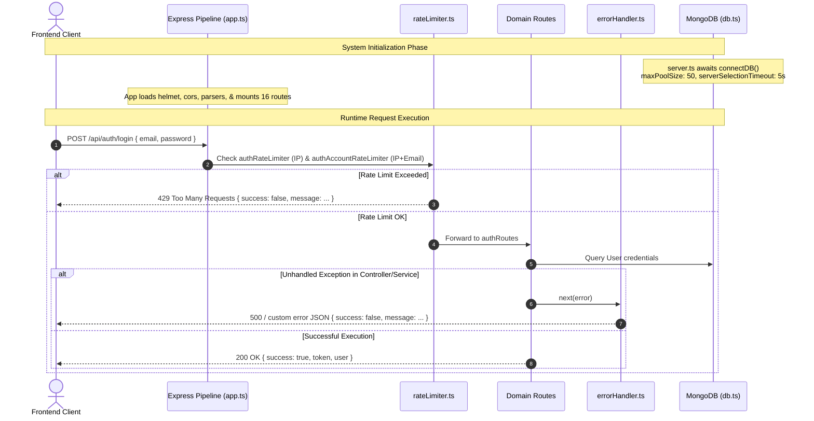

# Phase 01: Core Architecture, Config & Middlewares

**Layer:** Backend (`lms-server`)  
**Domain:** Core Application Lifecycle, Environment Configuration, Database Connection & Foundational Middleware  
**Date:** 2026-10-01  
**Status:** Completed  

---

## 1. Module Overview & Dependency Graph

Phase 01 audits the foundational entry points, configuration validators, connection pooling, and baseline security/error middlewares of `lms-server`. These components establish the runtime execution environment for all subsequent domain services and controllers.



---

## 2. File-by-File Exhaustive Technical Audit

---

### `src/server.ts`
* **System Role & Domain:** Process lifecycle orchestrator and application bootstrap entry point. It is responsible for deterministic startup sequence: establishing the database connection, executing startup seeds (RBAC roles/permissions), initializing background cleanup intervals, and binding the HTTP listener.
* **Core Logic & Signatures:**
  * Function `startServer = async (): Promise<void>`
    * **Input:** None (reads from `config`).
    * **Return:** `Promise<void>`.
    * **Mutations:** Invokes `connectDB()`, triggers idempotent RBAC seeder `seedPermissionsAndRoles()`, instantiates background storage cleaner `initStorageCleaner()`, and calls `app.listen(config.port)`.
    * **Thrown Exceptions:** Unhandled rejections during `connectDB()` or seed scripts propagate to Node process unhandledRejection handlers.
* **Lifecycle & Workflow:**
  * Process launch (`ts-node src/server.ts` or `node dist/server.js`) $\rightarrow$ Import configurations $\rightarrow$ `connectDB()` awaits Mongoose connection pool $\rightarrow$ Checks `config.mongoUri` $\rightarrow$ Awaits `seedPermissionsAndRoles()` $\rightarrow$ Invokes `initStorageCleaner()` timer $\rightarrow$ Calls `app.listen(config.port)` $\rightarrow$ Emits console log with runtime environment and port.
* **UI/Visual Mapping:** N/A (Backend Core).
* **Legacy Delta & Gaps:**
  * In the legacy repository (`/Users/chandupa/express/server.js`), server startup directly contained raw Mongoose connection code, an inline `createOrUpdateTeacherAccount` routine with hardcoded bcrypt comparisons, and duplicate `app.listen` calls conflicting with `express/app.js`.
  * In `lms-server/src/server.ts`, all seeding logic is abstracted into dedicated idempotent scripts (`seedPermissions`), eliminating hardcoded user creation on every process restart.
* **Technical Debt & Scalability Risks:**
  * Lacks graceful shutdown handling: No handlers for `SIGTERM` or `SIGINT` to gracefully drain inflight HTTP connections (`server.close()`) or close Mongoose connection pool (`mongoose.connection.close()`).
  * If `seedPermissionsAndRoles()` fails or hangs due to a database lock, HTTP server binding is completely blocked.

---

### `src/app.ts`
* **System Role & Domain:** HTTP application assembler and middleware pipeline coordinator. Defines global HTTP security headers, CORS policies, parser middlewares, static asset file delivery, route mounting for all 16 business modules, and terminal error routing.
* **Core Logic & Signatures:**
  * Instantiates `app = express()`.
  * Exports `app: express.Express`.
  * Middleware Registrations:
    * `helmet({ crossOriginResourcePolicy: false })`: Sets standard HTTP security headers (X-Frame-Options, Strict-Transport-Security, X-Content-Type-Options) while allowing cross-origin media and image loading from `/uploads`.
    * `cors({ origin: true, credentials: true })`: Dynamically reflects origin and permits credentials (cookies/auth headers) across browser clients.
    * `express.json()`: Parses incoming JSON request payloads up to default limits.
    * `cookieParser()`: Parses signed and unsigned cookies from request headers.
    * `morgan('dev')`: Formatted console request logging (method, status, response time).
    * `express.static(path.join(__dirname, '../public/uploads'))`: Serves persistent local filesystem media under `/uploads`.
  * Route Mounts: 16 route groups mounted with canonical URI prefixes (`/api/auth`, `/api/users`, `/api/permissions`, `/api/classes`, `/api/class-applications`, `/api/quizzes`, `/api/challenges`, `/api/assignments`, `/api/recordings`, `/api/media`, `/api/payments`, `/api/customization`, `/api/system`, `/api/meetings`, `/api/attendance`, `/api/grades`).
  * Terminal handler: `app.use(errorHandler)`.
* **Lifecycle & Workflow:**
  * Inbound TCP connection $\rightarrow$ Helmet headers injected $\rightarrow$ CORS validation $\rightarrow$ Body & Cookie parsing $\rightarrow$ Morgan log generated $\rightarrow$ URI prefix matching $\rightarrow$ Route tree execution $\rightarrow$ If next(err) invoked $\rightarrow$ `errorHandler` catch-all.
* **UI/Visual Mapping:** N/A (Backend Core).
* **Legacy Delta & Gaps:**
  * In legacy `app.js`, every incoming HTTP request triggered a database connection middleware: `app.use(async (_req, _res, next) => { await dbConnect(); next(); })` and `app.use((_req, _res, next) => { ensureTeacher().finally(() => {}); next(); })`. This imposed massive per-request latency and event loop blocking.
  * Migrated `app.ts` completely removes per-request connection overhead, delegating connection management to startup pooling in `server.ts`.
  * Legacy lacked `helmet`, `cookie-parser`, `errorHandler`, and had uncoordinated route prefixes. Migrated `app.ts` formalizes all 16 domains.
* **Technical Debt & Scalability Risks:**
  * `cors({ origin: true })` reflects whatever origin is provided in the request header rather than validating against an explicit whitelist of trusted frontend domains (e.g. Next.js staging/production domains).
  * No explicit request payload body size limit passed to `express.json({ limit: '10mb' })`, leaving server vulnerable to large payload denial-of-service (DoS) attacks.
  * Static file serving (`/uploads`) directly from local disk is problematic in containerized or multi-replica deployments where container storage is ephemeral.

---

### `src/config/db.ts`
* **System Role & Domain:** Database persistence infrastructure connector. Establishes and manages the shared Mongoose connection pool to MongoDB with resilience parameters and connection timeout limits.
* **Core Logic & Signatures:**
  * Function `connectDB = async (): Promise<void>`
    * **Input:** None (reads `config.mongoUri`).
    * **Return:** `Promise<void>`.
    * **Mutations:** Mutates internal `mongoose.connection` state.
    * **Thrown Exceptions:** Catches errors, logs to stderr via `console.error`, and terminates process via `process.exit(1)`.
    * **Pool Configuration:**
      * `maxPoolSize: 50`: Maintains up to 50 concurrent socket connections to MongoDB.
      * `wtimeoutMS: 2500`: Write concern timeout threshold.
      * `serverSelectionTimeoutMS: 5000`: Fails fast after 5 seconds if primary replica/cluster node is unreachable.
* **Lifecycle & Workflow:**
  * `server.ts` calls `connectDB()` $\rightarrow$ Checks if `config.mongoUri` is defined $\rightarrow$ Calls `mongoose.connect()` with pool options $\rightarrow$ Logs `MongoDB Connected: <host>` $\rightarrow$ Returns promise resolution.
* **UI/Visual Mapping:** N/A (Backend Core).
* **Legacy Delta & Gaps:**
  * Legacy code in `lib/db.js` used global cached connection objects designed for serverless Vercel lambdas (`cached = global.mongoose`), but when run as a standalone Express server, it caused race conditions during startup.
  * Migrated `db.ts` standardizes on a long-lived connection pool with explicit concurrency controls (`maxPoolSize: 50`).
* **Technical Debt & Scalability Risks:**
  * If `config.mongoUri` is falsy, it prints a warning and returns cleanly instead of throwing. This permits `server.ts` to proceed to bind ports with a completely offline database.
  * Calling `process.exit(1)` abruptly prevents ongoing cleanup operations and bypasses graceful process exit hooks.
  * Lacks listener hooks for connection health (`mongoose.connection.on('disconnected')`, `mongoose.connection.on('error')`).

---

### `src/config/env.ts`
* **System Role & Domain:** Environment configuration loader and runtime schema validation layer. Ensures critical environment variables (`PORT`, `NODE_ENV`, `MONGO_URI`, `JWT_SECRET`, `SUPABASE_URL`, `SUPABASE_KEY`) conform to expected types and default constraints before application runtime execution.
* **Core Logic & Signatures:**
  * Instantiates Joi schema:
    ```typescript
    Joi.object({
      PORT: Joi.number().default(5000),
      NODE_ENV: Joi.string().valid('development', 'production', 'test').default('development'),
      MONGO_URI: Joi.string().required(),
      JWT_SECRET: Joi.string().required(),
      SUPABASE_URL: Joi.string().required(),
      SUPABASE_KEY: Joi.string().required(),
    }).unknown(true)
    ```
  * Exports `config: { port: number, env: string, mongoUri: string, jwtSecret: string, supabaseUrl: string, supabaseKey: string }`.
* **Lifecycle & Workflow:**
  * Module loaded $\rightarrow$ `dotenv.config()` loads `.env` into `process.env` $\rightarrow$ `envSchema.validate(process.env)` executes synchronously $\rightarrow$ Logs error if schema fails $\rightarrow$ Frozen configuration object `config` exported.
* **UI/Visual Mapping:** N/A (Backend Core).
* **Legacy Delta & Gaps:**
  * Legacy repository accessed `process.env.VARIABLE_NAME` directly throughout 30+ disparate files without any schema validation or default values, causing silent runtime crashes when keys were missing.
  * Migrated `env.ts` centralizes all configuration extraction and type validation into a single immutable dictionary.
* **Technical Debt & Scalability Risks:**
  * When `error` is detected during Joi validation, it logs via `console.error` but does **not** throw an exception or exit. Consequently, if `JWT_SECRET` is missing, `config.jwtSecret` will be `undefined`, causing crypto runtime errors later during authentication requests.
  * Payment keys (`STRIPE_SECRET_KEY`, `PAYHERE_SECRET`), Zoom OAuth credentials, and Google Drive credentials are not yet included in the validated Joi schema.

---

### `src/config/modules.ts`
* **System Role & Domain:** System domain definitions and canonical Role-Based Access Control (RBAC) permission taxonomy. Defines the standardized system entities and action verbs utilized by security seeders and administrative permission matrix interfaces.
* **Core Logic & Signatures:**
  * Exported Constants:
    * `MODULES: Array<{ key: string, label: string }>`:
      * `classes` ('Classes')
      * `quizzes` ('Quizzes')
      * `challenges` ('Challenges')
      * `assignments` ('Assignments')
      * `recordings` ('Recordings')
      * `payments` ('Payments')
      * `users` ('User Management')
      * `reports` ('Reports')
    * `ACTIONS: string[]`: `['create', 'read', 'update', 'delete']`
* **Lifecycle & Workflow:**
  * Imported by database seed scripts (`seedPermissions.ts`) and administrative UI controllers $\rightarrow$ Combinatorial mapping generates default permission keys (`${module}.${action}`) for role assignment.
* **UI/Visual Mapping:** Direct source of truth for the Admin Permission Matrix UI.
* **Legacy Delta & Gaps:**
  * Legacy system lacked any centralized RBAC taxonomy; permissions were hardcoded strings scattered in route middlewares (e.g. `'admin'`, `'teacher'`) without granular action-level controls.
  * Migrated `modules.ts` introduces clean action-matrix decomposition.
* **Technical Debt & Scalability Risks:**
  * Does not yet include newly introduced platform modules: `attendance`, `grades`, `customization`, `system`, and `applications`. These are managed in `seedPermissions.ts` directly, creating a slight divergence in modular registry completeness.

---

### `src/middlewares/errorHandler.ts`
* **System Role & Domain:** Global exception and HTTP error termination middleware. Catches all unhandled exceptions passed through `next(err)` and returns standardized JSON error payloads while safeguarding against sensitive stack trace leaks in production environments.
* **Core Logic & Signatures:**
  * Function `errorHandler = (err: any, req: Request, res: Response, next: NextFunction): void`
    * **Input Parameters:**
      * `err`: Thrown exception or error object.
      * `req`: Express HTTP Request.
      * `res`: Express HTTP Response.
      * `next`: Express NextFunction.
    * **Return Shape:**
      ```json
      {
        "success": false,
        "message": "string",
        "stack": "optional string (development only)"
      }
      ```
    * **Status Code Selection:** Evaluates `err.statusCode || 500`. If in `production` and status is 500, masks message to `"Internal Server Error"`.
* **Lifecycle & Workflow:**
  * Route handler or service throws error or passes `next(error)` $\rightarrow$ Express jumps to 4-argument `errorHandler` $\rightarrow$ Logs full error object to server console via `console.error(err)` $\rightarrow$ Calculates status code and sanitized message $\rightarrow$ Sends JSON response.
* **UI/Visual Mapping:** Consumed by frontend toast notification handlers (`use-toast.ts`, Axios error interceptors).
* **Legacy Delta & Gaps:**
  * Legacy Express app completely lacked a centralized error handler. Unhandled controller errors hung requests indefinitely or returned HTML default stack dumps from Express.
  * Migrated `errorHandler.ts` guarantees deterministic JSON responses for all API clients.
* **Technical Debt & Scalability Risks:**
  * Lacks specialized parsing for known Mongoose errors (e.g. `CastError` for invalid ObjectIDs, `ValidationError` for schema violations, or `MongoServerError` code 11000 for unique key duplicate collisions), which default to generic 500 status instead of 400 or 409.
  * Does not log structured telemetry or integrate with APM tools (e.g. Sentry/Datadog).

---

### `src/middlewares/rateLimiter.ts`
* **System Role & Domain:** Security throttling and denial-of-service prevention middleware. Mitigates brute-force credential stuffing, password cracking, and SMS/OTP bombing across public authentication endpoints.
* **Core Logic & Signatures:**
  * Exported Middleware:
    * `authRateLimiter`:
      * Window: 15 minutes (`15 * 60 * 1000` ms).
      * Max: 10 requests per IP address.
      * Headers: `standardHeaders: true` (`RateLimit-*` headers emitted), `legacyHeaders: false`.
      * Response: HTTP 429 with `{ success: false, message: 'Too many requests from this IP, please try again after 15 minutes' }`.
    * `authAccountRateLimiter`:
      * Window: 15 minutes.
      * Max: 5 requests.
      * Compound Key Generator: `(req) => `${req.ip}_${(req.body?.email || req.body?.identifier || '').toLowerCase().trim()}``
      * Response: HTTP 429 with `{ success: false, message: 'Too many attempts for this account or IP, please try again after 15 minutes' }`.
* **Lifecycle & Workflow:**
  * Inbound POST `/api/auth/login` or `/api/auth/verify-otp` $\rightarrow$ `authRateLimiter` increments IP hits $\rightarrow$ If hit count > 10 $\rightarrow$ Throttles with HTTP 429 $\rightarrow$ Passes to `authAccountRateLimiter` $\rightarrow$ Extracts and normalizes target account $\rightarrow$ Increments compound key hits $\rightarrow$ If hit count > 5 $\rightarrow$ Throttles with HTTP 429 $\rightarrow$ If valid $\rightarrow$ Passes to route controller.
* **UI/Visual Mapping:** Triggers `"Too many attempts"` modal/toast on the frontend authentication form.
* **Legacy Delta & Gaps:**
  * Legacy application had zero rate limiting on any endpoint. Authentication endpoints were completely vulnerable to automated credential enumeration.
  * Migrated codebase introduces compound account+IP throttling to prevent distributed botnet attacks targeting single student accounts.
* **Technical Debt & Scalability Risks:**
  * Uses default in-memory storage (`express-rate-limit` MemoryStore). Hits are tracked inside Node.js process memory. In a clustered deployment with multiple Node instances or behind a load balancer, rate limits are not shared across processes. Requires Redis store adapter (`rate-limit-redis`) for cluster deployments.
  * `req.ip` behind a reverse proxy (e.g. Cloudflare or Nginx) requires `app.set('trust proxy', 1)` in `app.ts` to prevent all clients from sharing the proxy's IP address.

---

## 3. End-of-Phase Architecture Diagram



---

## 4. Cross-Module Dependencies & Legacy Gaps Summary

1. **Missing Reverse Proxy Trust Configuration:** `app.set('trust proxy', 1)` is missing in `src/app.ts`. This means `req.ip` in `rateLimiter.ts` may resolve to the internal proxy IP when deployed behind Nginx, Vercel, or AWS ALB.
2. **CORS Whitelist Tightening Required:** `app.use(cors({ origin: true }))` is currently in permissive reflection mode. It must be constrained to explicit tenant origins in production.
3. **Mongoose Error Customization:** `errorHandler.ts` needs specialized handlers for Mongo `ValidationError` and duplicate key code `11000` to prevent 500 status codes for simple bad input.
4. **Environment Failure Mode:** `src/config/env.ts` logs an error on schema validation failure but does not abort, which can lead to unpredictable silent failures during auth or database initialization.
