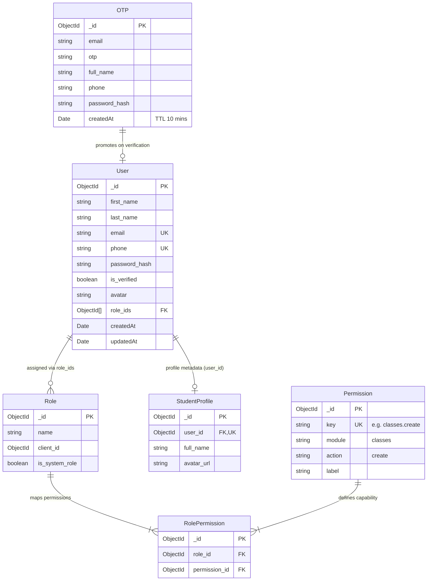
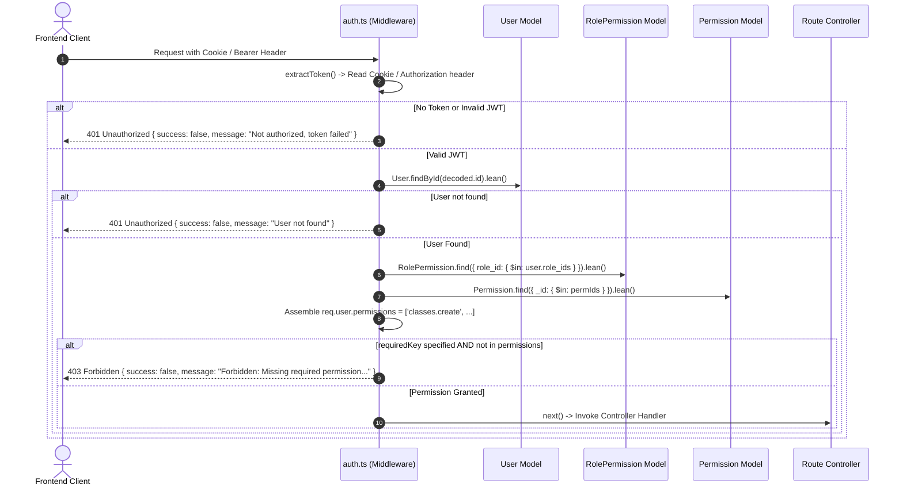

# Phase 02: Identity, Auth Models & RBAC Schema

**Layer:** Backend (`lms-server`)  
**Domain:** Identity Storage, Canonical RBAC Data Modeling, Registration Staging & Authorization Middleware  
**Date:** 2026-10-01  
**Status:** Completed  

---

## 1. Module Overview & Dependency Graph

Phase 02 audits the core data structures and middleware engine governing user identity, credential lifecycle, staged OTP registration, role-based access control (RBAC), and live permission hydration.

---

## 2. File-by-File Exhaustive Technical Audit

---

### `src/models/User.ts`
* **System Role & Domain:** Core identity entity model. Stores primary authentication credentials, contact coordinates (email, phone), verification status, avatar reference, and relational links to assigned roles. Consumed by auth services, user management controllers, and token verification middlewares.
* **Core Logic & Signatures:**
  * Schema Definition (`userSchema`):
    * `first_name: { type: String, required: true }`
    * `last_name: { type: String, required: true }`
    * `email: { type: String, required: true, unique: true }`
    * `phone: { type: String, required: true, unique: true }`
    * `password_hash: { type: String, required: true }`
    * `is_verified: { type: Boolean, default: false }`
    * `avatar: { type: String, default: null }`
    * `role_ids: [{ type: mongoose.Schema.Types.ObjectId, ref: 'Role' }]`
    * Timestamps: `createdAt`, `updatedAt`.
  * Virtuals:
    * `computedName`: Returns `${this.first_name} ${this.last_name}` if both present, fallback to `first_name`, fallback to `email`, fallback to `'—'`.
  * Serialization Hooks (`toJSON` Transform):
    * Enabled `virtuals: true`.
    * Transform function: Explicitly executes `delete (ret as any).password_hash`. Guarantees `password_hash` is never emitted over the wire in HTTP responses.
  * Exported Model: `User = mongoose.model('User', userSchema)`.
* **Lifecycle & Workflow:**
  * Created during OTP verification (`authService.verifyOTP`) $\rightarrow$ Fetched during login $\rightarrow$ `role_ids` referenced during token decoding and permission hydration $\rightarrow$ Serialized via `.toJSON()` to sanitize credentials.
* **UI/Visual Mapping:** Renders user identities across Navbar, User Management Table (`/admin/user`), Profile Dashboard (`/dashboard/profile`), and Class Rosters.
* **Legacy Delta & Gaps:**
  * In legacy `models/user.js`, users only had a single `full_name` string and a rigid string `role` field (`enum: ['student', 'teacher', 'moderator']`).
  * Legacy lacked `toJSON` password sanitization; controllers had to manually project `.select('-password_hash')`, and several legacy routes accidentally leaked password hashes.
  * Migrated model splits first/last names, links to multiple dynamic `role_ids`, and provides automated password redaction.
* **Technical Debt & Scalability Risks:**
  * Missing case-insensitive collation or lowercasing modifier on `email` (`lowercase: true, trim: true`), creating a risk where `User@example.com` and `user@example.com` could exist as separate records if not sanitized upstream.
  * `phone` format validation regex is absent in the schema, relying solely on controller validation.

---

### `src/models/Role.ts`
* **System Role & Domain:** Role entity definition in the dynamic RBAC system. Represents named bundles of capabilities (e.g. `'Admin'`, `'Teacher'`, `'Moderator'`, `'Student'`) that can be assigned to users.
* **Core Logic & Signatures:**
  * Schema Definition (`roleSchema`):
    * `name: { type: String, required: true }`: Human-readable identifier.
    * `client_id: { type: mongoose.Schema.Types.ObjectId }`: Optional multi-tenant tenant identifier for tenant-specific custom roles.
    * `is_system_role: { type: Boolean, default: false }`: Flag designating default core roles that cannot be deleted or renamed by tenant admins.
    * Timestamps: `createdAt`, `updatedAt`.
  * Exported Model: `Role = mongoose.model('Role', roleSchema)`.
* **Lifecycle & Workflow:**
  * Seeded on system startup (`seedPermissions.ts`) $\rightarrow$ Assigned to users in `User.role_ids` $\rightarrow$ Queried by `auth.ts` to hydrate permissions.
* **UI/Visual Mapping:** Displayed in Role selector dropdowns in Admin User Management (`/admin/user`) and the Permission Matrix (`/admin/permissions`).
* **Legacy Delta & Gaps:**
  * Legacy system had **zero** `Role` collection. Roles were hardcoded string enums in `user.js` and could not be extended, renamed, or customized.
* **Technical Debt & Scalability Risks:**
  * `name` lacks a unique index constraint (`unique: true`), meaning accidental seed executions or admin requests could create duplicate roles with the same name.
  * Lacks cascade-delete protection: If a `Role` is deleted, references in `User.role_ids` and `RolePermission` are left orphaned.

---

### `src/models/Permission.ts`
* **System Role & Domain:** Atomic security capability catalog. Represents individual granular actions within system modules that can be granted to roles.
* **Core Logic & Signatures:**
  * Schema Definition (`permissionSchema`):
    * `key: { type: String, required: true, unique: true }`: Canonical dotted permission key (e.g. `"classes.create"`, `"quizzes.read"`, `"system.branding.manage"`).
    * `module: { type: String, required: true }`: Functional grouping (e.g. `"classes"`, `"payments"`).
    * `action: { type: String, required: true }`: Verb (e.g. `"create"`, `"read"`, `"update"`, `"delete"`, `"manage"`).
    * `label: { type: String, required: true }`: Display label for administrative consoles.
    * Timestamps: `createdAt`, `updatedAt`.
  * Exported Model: `Permission = mongoose.model('Permission', permissionSchema)`.
* **Lifecycle & Workflow:**
  * Seeded by `seedPermissions.ts` $\rightarrow$ Indexed by unique `key` $\rightarrow$ Looked up during route access evaluation in `requirePermission(requiredKey)`.
* **UI/Visual Mapping:** Rendered as column/row toggles in the interactive Admin Permission Matrix table (`/admin/permissions`).
* **Legacy Delta & Gaps:**
  * Completely absent in legacy. Legacy routes relied on ad-hoc role comparisons (`['teacher', 'admin'].includes(req.user.role)`).
* **Technical Debt & Scalability Risks:**
  * Dotted key consistency relies entirely on convention. If a developer uses `"class.create"` instead of `"classes.create"`, the seeder and route guards mismatch silently.

---

### `src/models/RolePermission.ts`
* **System Role & Domain:** Many-to-many junction entity binding `Role` documents to `Permission` documents. Enables granular permission assignment per role.
* **Core Logic & Signatures:**
  * Schema Definition (`rolePermissionSchema`):
    * `role_id: { type: mongoose.Schema.Types.ObjectId, ref: 'Role', required: true }`
    * `permission_id: { type: mongoose.Schema.Types.ObjectId, ref: 'Permission', required: true }`
    * Timestamps: `createdAt`, `updatedAt`.
  * Index:
    * `rolePermissionSchema.index({ role_id: 1, permission_id: 1 }, { unique: true })`: Prevents duplicate permission assignments to the same role.
  * Exported Model: `RolePermission = mongoose.model('RolePermission', rolePermissionSchema)`.
* **Lifecycle & Workflow:**
  * Seeded during startup $\rightarrow$ Updated via Admin Permission Matrix PUT endpoint $\rightarrow$ Scanned by `getPermissionsForRoles(roleIds)` on every authenticated HTTP request to assemble the caller's active permission array.
* **UI/Visual Mapping:** Directly controls the checked/unchecked state of permission checkboxes in the Admin UI.
* **Legacy Delta & Gaps:**
  * No counterpart in legacy.
* **Technical Debt & Scalability Risks:**
  * Evaluated on every authenticated request without caching. If a user has 3 roles and each role has 25 permissions, `RolePermission` queries MongoDB on every request. Lacks an in-memory or Redis caching layer for hydrated role permissions.

---

### `src/models/OTP.ts`
* **System Role & Domain:** Staged registration cache and verification challenge store. Temporarily holds student registration inputs (name, phone, hashed password) alongside a generated numeric OTP code prior to account confirmation.
* **Core Logic & Signatures:**
  * Schema Definition (`otpSchema`):
    * `email: { type: String, required: true }`
    * `otp: { type: String, required: true }`
    * `full_name: { type: String, required: true }`
    * `phone: { type: String, required: true }`
    * `password_hash: { type: String, required: true }`
    * `createdAt: { type: Date, default: Date.now, expires: 600 }`: MongoDB native TTL index that automatically deletes the document after 600 seconds (10 minutes).
    * Timestamps: `createdAt`, `updatedAt`.
  * Exported Model: `OTP = mongoose.model('OTP', otpSchema)`.
* **Lifecycle & Workflow:**
  * User submits registration form $\rightarrow$ Password hashed $\rightarrow$ OTP document saved with 10-minute TTL $\rightarrow$ Email dispatched $\rightarrow$ User submits 6-digit OTP $\rightarrow$ Document looked up $\rightarrow$ If valid, data transferred to `User` and `StudentProfile` $\rightarrow$ OTP document deleted.
* **UI/Visual Mapping:** Interacts with the multi-step registration modal and OTP input boxes (`components/ui/auth/register-form.tsx`).
* **Legacy Delta & Gaps:**
  * In legacy `OTPCollection.js`, the schema only stored `email`, `otp`, and `expiry: Date`. It did **not** store the registration form data. As a result, legacy registration required either maintaining state in client memory across multiple requests or passing unhashed passwords repeatedly.
  * Migrated `OTP.ts` caches the staged registration state server-side and uses automatic MongoDB TTL document expiration instead of manual cron scripts.
* **Technical Debt & Scalability Risks:**
  * `otp` is stored in plaintext rather than as a cryptographic hash. If the database is compromised, active OTPs are visible in plaintext.
  * Does not track failed verification attempts. An attacker could potentially brute-force a 6-digit code within the 10-minute window unless restricted by IP rate limiting.

---

### `src/models/StudentProfile.ts`
* **System Role & Domain:** Domain-specific extended profile for students. Holds student-specific metadata, biographical information, and cloud avatar URLs decoupled from the core `User` authentication document.
* **Core Logic & Signatures:**
  * Schema Definition (`studentProfileSchema`):
    * `user_id: { type: mongoose.Schema.Types.ObjectId, ref: 'User', required: true, unique: true }`: 1:1 foreign key binding with unique index constraint.
    * `full_name: { type: String, required: true }`
    * `avatar_url: { type: String }`: Public CDN/Supabase Storage URL for student profile pictures.
    * Timestamps: `createdAt`, `updatedAt`.
  * Exported Model: `StudentProfile = mongoose.model('StudentProfile', studentProfileSchema)`.
* **Lifecycle & Workflow:**
  * Created automatically when a user account with the `'Student'` role is confirmed $\rightarrow$ Queried by student dashboard and user profile views $\rightarrow$ Updated when student edits their personal profile.
* **UI/Visual Mapping:** Displays student name and avatar on top navigation bar, profile page (`/dashboard/profile`), and assignment submissions.
* **Legacy Delta & Gaps:**
  * Legacy had `models/student.js` which contained redundant fields (`email`, `phone`, `password`) duplicated from `models/user.js`, leading to data desynchronization bugs when users updated their email or phone.
  * Migrated model establishes a strict 1:1 foreign key relationship (`user_id`) without data duplication.
* **Technical Debt & Scalability Risks:**
  * Currently limited to `full_name` and `avatar_url`. Does not yet include fields for student school, grade level, or emergency parent contact coordinates.

---

### `src/middlewares/auth.ts`
* **System Role & Domain:** Central authentication and authorization gateway. Extracts JWT tokens from cookies or Authorization headers, verifies cryptographic signatures, hydrates user state with real-time permissions from indexed database lookups, and enforces route-level access rules.
* **Core Logic & Signatures:**
  * `declare global`: Extends `Express.Request` to include `user?: any`.
  * Exported Function `getPermissionsForRoles = async (roleIds: any[]): Promise<string[]>`:
    * Performs two-stage lean query: `RolePermission.find({ role_id: { $in: roleIds } })` $\rightarrow$ extracts `permission_ids` $\rightarrow$ `Permission.find({ _id: { $in: permIds } })` $\rightarrow$ returns array of string keys.
  * Private Function `extractToken(req: Request): string | null`:
    * Checks `req.cookies?.token` first (secure HTTP-only cookie support), then checks `req.headers.authorization?.startsWith('Bearer ')`.
  * Exported Middleware `optionalAuth = async (req: Request, res: Response, next: NextFunction)`:
    * Decodes token if present $\rightarrow$ Loads user and hydrates live permissions $\rightarrow$ Sets `req.user = { ...user, userId, permissions }`.
    * If token missing or invalid $\rightarrow$ Sets `req.user = null` and proceeds via `next()` without error.
  * Exported Middleware Factory `requirePermission = (requiredKey?: string)`:
    * Verifies token $\rightarrow$ Rejects with HTTP 401 if missing/invalid $\rightarrow$ Hydrates live permissions $\rightarrow$ If `requiredKey` specified, checks `permissions.includes(requiredKey)` $\rightarrow$ Rejects with HTTP 403 `{ success: false, message: "Forbidden: Missing required permission '...'" }` if unauthorized $\rightarrow$ Passes to controller via `next()`.
  * Exported Middleware `authenticate = requirePermission()`: Convenience middleware requiring valid session without checking a specific permission key.
* **Lifecycle & Workflow:**
  * Request arrives at route $\rightarrow$ `extractToken` reads cookie/header $\rightarrow$ `jwt.verify` decodes user ID $\rightarrow$ `User.findById` queries identity $\rightarrow$ `getPermissionsForRoles` fetches all active permission strings $\rightarrow$ Permission evaluated against required action $\rightarrow$ Controller called.
* **UI/Visual Mapping:** 401 triggers `ReLoginDialog.tsx` or redirects to `/login`. 403 triggers `AccessDenied.tsx` banner.
* **Legacy Delta & Gaps:**
  * Legacy `middleware/auth.js` only checked `Authorization: Bearer` (no cookie support), and performed static string comparisons on `req.user.role` (e.g. `permissions.includes(req.user.role)`). This meant that if a user's role permissions were updated in the database, the user retained old permissions until their token expired.
  * Migrated `auth.ts` provides **live hydration**: permission changes take effect on the very next request.
* **Technical Debt & Scalability Risks:**
  * **Database Amplification:** Every authenticated API request triggers 3 database queries (`User.findById`, `RolePermission.find`, and `Permission.find`). Under high concurrent load (e.g. 1000 req/sec during live Zoom classes or quiz submissions), this will place severe load on MongoDB.
  * **Typing:** `req.user` is typed as `any` instead of a strongly-typed `AuthenticatedUser` interface containing `userId`, `email`, `role_ids`, and `permissions: string[]`.

---

## 3. End-of-Phase Architecture Diagram

---

## 4. Cross-Module Dependencies & Legacy Gaps Summary

1. **Permission Query Bottleneck:** Live database permission hydration on every request guarantees instant permission revocation, but introduces up to 3 queries per HTTP request. An in-memory LRU or Redis cache with event-driven invalidation on permission mutation will be critical for scaling beyond 500 concurrent students.
2. **Schema Sanitization:** `User.ts` should enforce `lowercase: true` and `trim: true` on `email` to avoid collation-based authentication mismatches.
3. **OTP Security Hardening:** Staged registration OTPs in `OTP.ts` should be stored as SHA-256 hashes with an attempt-counter field (max 3 failed tries before invalidation) to eliminate brute-force vulnerability.
4. **Strong Typing:** `declare global { namespace Express { interface Request { user?: any; } } }` should be refactored to an explicit `IAuthUser` interface across all controllers.
