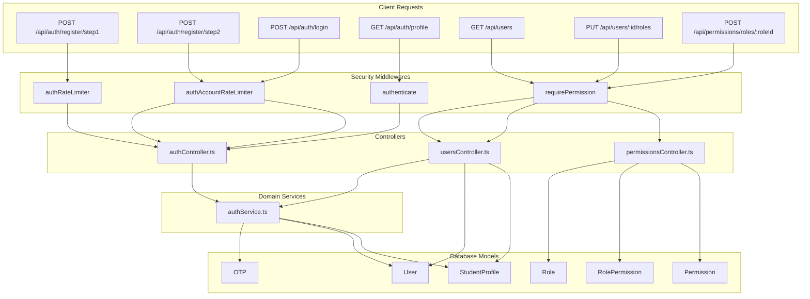
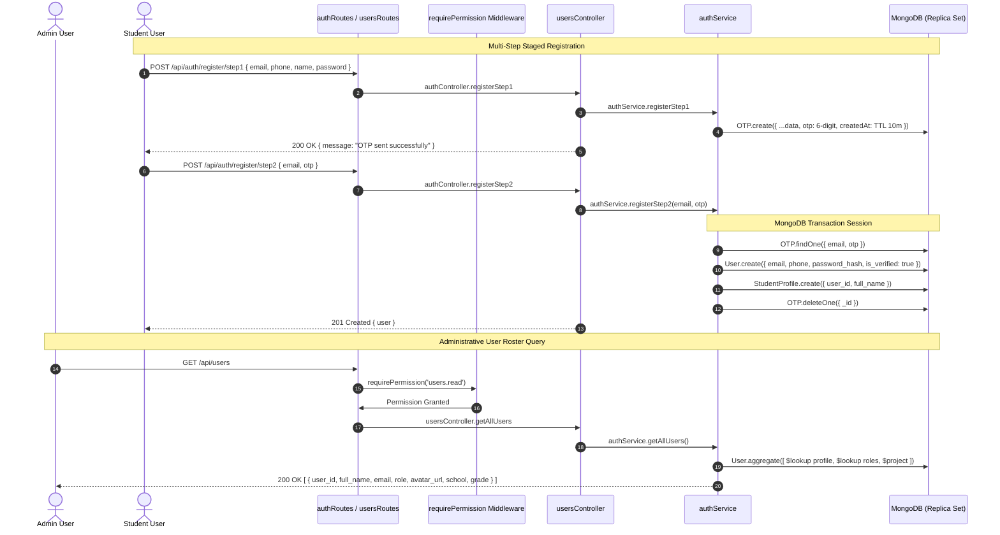

# Phase 03: Auth & User Management (Services & API Routes)

**Layer:** Backend (`lms-server`)  
**Domain:** User Authentication, Registration Transactions, Profile Management, Role Assignment & Permission API  
**Date:** 2026-10-01  
**Status:** Completed  

---

## 1. Module Overview & Dependency Graph

Phase 03 audits the business services, controllers, and routing pipelines executing authentication, multi-step registration with transactional staging, profile queries via aggregation pipelines, and administrative RBAC mutations.

---

## 2. File-by-File Exhaustive Technical Audit

---

### `src/services/authService.ts`
* **System Role & Domain:** Core identity domain service. Implements business logic for two-step OTP registration with atomic rollback, and high-performance cross-collection aggregation for administrative user rosters.
* **Core Logic & Signatures:**
  * `async registerStep1(data: { email: string; phone: string; full_name: string; password_hash: string }): Promise<{ message: string }>`:
    * Generates a 6-digit pseudo-random numeric code (`Math.floor(100000 + Math.random() * 900000).toString()`).
    * Persists staged data into `OTP` collection (backed by 10-minute MongoDB TTL).
    * Logs dispatch coordinates and returns confirmation message.
  * `async registerStep2(email: string, otp: string): Promise<IUser>`:
    * Manages MongoDB replica set transaction via `mongoose.startSession()`.
    * Atomically queries `OTP` document matching `{ email, otp }`.
    * Checks collision across existing users via `$or: [{ email }, { phone }]`.
    * Creates `User` document with `is_verified: true`.
    * Creates 1:1 `StudentProfile` record linked by `user._id`.
    * Atomically removes the staged `OTP` record.
    * Commits transaction or aborts on error; ends session in `finally`.
  * `async getAllUsers(): Promise<any[]>`:
    * Executes a single optimized Mongoose aggregation pipeline:
      * `$lookup` from `studentprofiles` on `user_id`.
      * `$unwind` on `$profile` with `preserveNullAndEmptyArrays: true`.
      * `$lookup` from `roles` on `role_ids`.
      * `$addFields` for `full_name`, `avatar_url`, `school`, `grade`, and lowercase primary `role`.
      * `$project` projecting away `password_hash`, `profile`, and raw `roles`.
* **Lifecycle & Workflow:**
  * Client requests registration $\rightarrow$ `registerStep1` stages data $\rightarrow$ Client submits OTP $\rightarrow$ `registerStep2` executes ACID transaction $\rightarrow$ Admin accesses `/admin/user` $\rightarrow$ `getAllUsers` returns denormalized user objects in a single database round-trip.
* **UI/Visual Mapping:** Powers registration wizard (`register-form.tsx`) and Admin User Table (`/admin/user`).
* **Legacy Delta & Gaps:**
  * Legacy `authService.js` had multiple distinct, uncoordinated methods (`register`, `verifyOTP`, `registerUserAfterOTPVerification`). It lacked database transactions, meaning if profile creation failed, an orphaned, half-initialized user record remained permanently in MongoDB.
  * Legacy `getAllUsers` performed multiple `find()` queries inside loops, causing N+1 query performance degradation. Migrated service replaces this with an aggregation pipeline.
* **Technical Debt & Scalability Risks:**
  * **Critical Schema Bug in `registerStep2`:** In `src/models/User.ts`, `first_name` and `last_name` are defined with `required: true`. In `authService.registerStep2`, it instantiates `new User({ email: cached.email, phone: cached.phone, password_hash: cached.password_hash, is_verified: true })` without passing `first_name` or `last_name` (it only has `cached.full_name`). This will throw a Mongoose `ValidationError` during user creation unless `cached.full_name` is parsed into `first_name` and `last_name`.
  * Transaction operations require a MongoDB replica set. In standalone local MongoDB instances without replica sets, `startSession()` will throw.
  * OTP generation uses standard `Math.random()`, which is not cryptographically secure. It should use `crypto.randomInt(100000, 999999)`.

---

### `src/controllers/authController.ts`
* **System Role & Domain:** HTTP request controller for authentication and profile management. Handles input validation, password hashing, JWT minting, HTTP-only cookie injection, password resets, and user profile updates.
* **Core Logic & Signatures:**
  * `registerStep1(req, res, next)`: Validates body via `registerStep1Schema` (checks email, phone, name, password max 72 chars to prevent Bcrypt DoS) $\rightarrow$ Pre-checks email/phone collision $\rightarrow$ Hashes password with bcrypt (salt 10) $\rightarrow$ Calls `authService.registerStep1` $\rightarrow$ Returns 200.
  * `registerStep2(req, res, next)`: Validates body via `verifyOtpSchema` $\rightarrow$ Calls `authService.registerStep2` $\rightarrow$ Returns 201 with created user.
  * `login(req, res, next)`: Accepts `email` or `identifier` + `password` $\rightarrow$ Fetches user $\rightarrow$ Compares password hash $\rightarrow$ Signs JWT (`expiresIn: '1d'`) $\rightarrow$ Sets HTTP-only cookie `'token'` (`sameSite: 'lax'`, `maxAge: 24h`) $\rightarrow$ Hydrates legacy role name and permission keys $\rightarrow$ Returns 200 with `{ success: true, user: userObj }`.
  * `forgotPassword(req, res, next)`: Validates email $\rightarrow$ Currently returns mock response `{ success: true, message: 'OTP sent if email exists' }`.
  * `logout(req, res, next)`: Calls `res.clearCookie('token')` $\rightarrow$ Returns 200.
  * `getProfile(req, res, next)`: Uses `req.user._id` $\rightarrow$ Loads User without password hash $\rightarrow$ Populates legacy role name and active permission keys $\rightarrow$ Returns 200 with user data.
  * `getUserById(req, res, next)`: Fetches user by ID, joins profile, computes role, returns composite object.
  * `adminResetPassword(req, res, next)`: Hashes new password with bcrypt $\rightarrow$ Overwrites `user.password_hash` $\rightarrow$ Returns 200.
  * `changePassword(req, res, next)`: Compares `oldPassword` with `user.password_hash` $\rightarrow$ Hashes `newPassword` $\rightarrow$ Saves $\rightarrow$ Returns 200.
  * `editUser(req, res, next)`: Updates user `phone`, splits `full_name` into `first_name`/`last_name`, updates/upserts `StudentProfile` with bio, school, grade, qualifications.
* **Lifecycle & Workflow:**
  * Inbound HTTP request $\rightarrow$ Joi schema validation $\rightarrow$ Service/Mongoose mutation $\rightarrow$ Cookie/JWT management $\rightarrow$ Standardized response or `next(err)`.
* **UI/Visual Mapping:** Login form (`login-form.tsx`), Register form (`register-form.tsx`), User profile drawer/modal, and Password Change settings.
* **Legacy Delta & Gaps:**
  * Legacy `authContoller.js` sent JWT tokens exclusively in JSON bodies, forcing client-side storage in `localStorage` which was vulnerable to XSS token theft. Migrated controller injects secure HTTP-only cookies (`res.cookie('token')`).
  * Legacy forgot password sent a live OTP email; migrated `forgotPassword` is currently stubbed/mocked.
  * Migrated controller adds Joi schema constraints capping password length at 72 bytes to mitigate CPU-exhaustion Bcrypt DoS attacks.
* **Technical Debt & Scalability Risks:**
  * In `login`, `getProfile`, and `getUserById`, role names and permissions are manually queried using direct `mongoose.model('Role')` and `mongoose.model('Permission')` lookups instead of invoking `authService` or `auth.ts:getPermissionsForRoles`. This duplicates permission hydration logic in 4 different places.
  * `adminResetPassword` route lacks explicit authorization middleware at the route level in `authRoutes.ts` (it only uses `authenticate`, allowing any logged-in student to reset another user's password if they know the user ID!).

---

### `src/controllers/usersController.ts`
* **System Role & Domain:** Administrative user lifecycle controller. Manages bulk user retrieval, administrative account creation, and atomic role mutations with automatic orphaned profile cleanup.
* **Core Logic & Signatures:**
  * `getAllUsers(req, res, next)`: Delegates to `authService.getAllUsers()` $\rightarrow$ Returns HTTP 200 with data array.
  * `updateUserRole(req, res, next)`:
    * Manages MongoDB transaction session.
    * Updates `user.role_ids = role_ids`.
    * Checks if newly assigned roles include `'Student'`.
    * If user is no longer a student, executes `StudentProfile.deleteOne({ user_id: user._id })` inside the transaction to eliminate orphaned/zombie profiles.
    * Commits transaction and returns HTTP 200.
  * `createUser(req, res, next)`:
    * Accepts `first_name`, `last_name` (or parses from `full_name`), `email`, `phone`, `password`, `role_ids` (or resolves by name `role`).
    * Validates uniqueness on email/phone.
    * Hashes password via bcrypt.
    * Creates `User` with `is_verified: true`.
    * If role is Student, automatically creates corresponding `StudentProfile`.
    * Returns HTTP 201 with created user document.
* **Lifecycle & Workflow:**
  * Admin opens User Management console (`/admin/user`) $\rightarrow$ `getAllUsers` populates roster table $\rightarrow$ Admin selects new role $\rightarrow$ `updateUserRole` updates roles and purges incompatible profile documents $\rightarrow$ Admin manually creates user $\rightarrow$ `createUser` sets verified flag and creates role bindings.
* **UI/Visual Mapping:** Consumed by Admin User Table (`/admin/user`), Role Edit Modal, and User Creation Dialog (`components/ui/user/UserForm.tsx`).
* **Legacy Delta & Gaps:**
  * Legacy system had a dedicated `createModerator` endpoint in `authContoller.js` that hardcoded teacher-only checks and lacked generalized multi-role assignment.
  * When roles were changed in legacy, old student/teacher profiles remained orphaned in the database, causing invalid joins. Migrated controller deletes zombie profiles atomically.
* **Technical Debt & Scalability Risks:**
  * `createUser` uses `const bcrypt = require('bcrypt')` dynamically inside the method body instead of top-level ES module import.
  * Does not support pagination, filtering, or search parameters in `getAllUsers`. In an institution with 10,000+ students, fetching the entire user base in one unpaginated query will cause high memory pressure and slow client rendering.

---

### `src/controllers/permissionsController.ts`
* **System Role & Domain:** Dynamic Role-Based Access Control administration controller. Exposes APIs to query available roles, list system permissions, inspect role-permission bindings, and mutate permission grants.
* **Core Logic & Signatures:**
  * `getRoles(req, res)`: Queries `Role.find().lean()` $\rightarrow$ Returns array of roles.
  * `getPermissions(req, res)`: Queries `Permission.find().lean()` $\rightarrow$ Returns all system permissions with keys and modules.
  * `getRolePermissions(req, res)`: Queries `RolePermission.find({ role_id: req.params.roleId })` $\rightarrow$ Returns array of granted `permission_id` ObjectIds.
  * `updateRolePermissions(req, res)`:
    * Accepts `req.params.roleId` and `req.body.permissionIds: string[]`.
    * Validates role existence.
    * Executes `RolePermission.deleteMany({ role_id: roleId })`.
    * Maps and executes `RolePermission.insertMany(inserts)`.
    * Returns HTTP 200 `{ success: true, message: 'Permissions updated successfully' }`.
  * `addRolePermission(req, res)`: Upserts a single `{ role_id, permission_id }` junction record via `RolePermission.updateOne(..., { upsert: true })`.
  * `removeRolePermission(req, res)`: Deletes junction record via `RolePermission.deleteOne()`.
* **Lifecycle & Workflow:**
  * Admin opens Permission Matrix (`/admin/permissions`) $\rightarrow$ Fetches roles, permissions, and active role-permissions $\rightarrow$ Admin toggles permission checkboxes $\rightarrow$ Submits `updateRolePermissions` $\rightarrow$ Live permission cache invalidates on next user request.
* **UI/Visual Mapping:** Interactive grid in `components/PermissionMatrix.tsx` at `/admin/permissions`.
* **Legacy Delta & Gaps:**
  * Completely new functionality. Legacy platform had zero permission management endpoints or dynamic RBAC administration.
* **Technical Debt & Scalability Risks:**
  * `updateRolePermissions` deletes all existing permissions and then inserts new ones **without a transaction session**. If `insertMany` fails due to network drop or database error, all existing permissions for that role are wiped out, locking out all users assigned to that role.
  * No protection preventing admins from revoking `users.update` or `users.read` from the system Admin role, introducing risk of accidental administrative lockout.

---

### `src/routes/authRoutes.ts`
* **System Role & Domain:** HTTP routing specification for public and self-service authentication workflows. Mounts rate limiters and auth guards on authentication endpoints.
* **Core Logic & Signatures:**
  * Routes:
    * `POST /register/step1`: [authRateLimiter] $\rightarrow$ `authController.registerStep1`
    * `POST /register/step2`: [authAccountRateLimiter] $\rightarrow$ `authController.registerStep2`
    * `POST /login`: [authAccountRateLimiter] $\rightarrow$ `authController.login`
    * `POST /forgot-password`: [authAccountRateLimiter] $\rightarrow$ `authController.forgotPassword`
    * `POST /logout`: `authController.logout`
    * `GET /profile`: [authenticate] $\rightarrow$ `authController.getProfile`
    * `GET /user/:id`: [authenticate] $\rightarrow$ `authController.getUserById`
    * `POST /admin/reset-password/:id`: [authenticate] $\rightarrow$ `authController.adminResetPassword`
    * `POST /change-password`: [authenticate] $\rightarrow$ `authController.changePassword`
    * `PUT /edit-user/:id`: [authenticate] $\rightarrow$ `authController.editUser`
* **Lifecycle & Workflow:**
  * Inbound requests to `/api/auth/*` route through rate limiters, session authenticators, and invoke respective `authController` methods.
* **UI/Visual Mapping:** Consumed by client authentication forms, profile editors, and session checks.
* **Legacy Delta & Gaps:**
  * Migrated routes integrate dual-tier rate limiting (`authRateLimiter` and `authAccountRateLimiter`) on all credential submission endpoints.
* **Technical Debt & Scalability Risks:**
  * **Critical Authorization Vulnerability:** `POST /admin/reset-password/:id` is protected only by `authenticate` instead of `requirePermission('users.update')`. Any logged-in student can execute an administrative password reset on any other user account by posting to this endpoint.

---

### `src/routes/usersRoutes.ts`
* **System Role & Domain:** HTTP routing specification for administrative user management. Enforces strict canonical RBAC permissions on user collection operations.
* **Core Logic & Signatures:**
  * Routes:
    * `GET /`: `[requirePermission('users.read')]` $\rightarrow$ `usersController.getAllUsers`
    * `POST /`: `[requirePermission('users.create')]` $\rightarrow$ `usersController.createUser`
    * `PUT /:id/roles`: `[requirePermission('users.update')]` $\rightarrow$ `usersController.updateUserRole`
* **Lifecycle & Workflow:**
  * Admin triggers user management actions $\rightarrow$ Token permissions inspected for `users.read`, `users.create`, or `users.update` $\rightarrow$ Dispatched to `usersController`.
* **UI/Visual Mapping:** Admin User Management dashboard (`/admin/user`).
* **Legacy Delta & Gaps:**
  * Replaces legacy hardcoded role comparisons (`req.user.role === 'teacher'`) with canonical granular permission keys (`users.read`, `users.create`, `users.update`).
* **Technical Debt & Scalability Risks:**
  * Lacks soft-delete or user deactivation endpoint (`DELETE /:id` or `PUT /:id/status`).

---

### `src/routes/permissionsRoutes.ts`
* **System Role & Domain:** HTTP routing specification for RBAC roles and permissions management.
* **Core Logic & Signatures:**
  * Routes:
    * `GET /roles`: `[requirePermission('users.read')]` $\rightarrow$ `getRoles`
    * `GET /`: `[requirePermission('users.read')]` $\rightarrow$ `getPermissions`
    * `GET /roles/:roleId`: `[requirePermission('users.read')]` $\rightarrow$ `getRolePermissions`
    * `POST /roles/:roleId`: `[requirePermission('users.update')]` $\rightarrow$ `updateRolePermissions`
    * `POST /roles/:roleId/permissions/:permissionId`: `[requirePermission('users.update')]` $\rightarrow$ `addRolePermission`
    * `DELETE /roles/:roleId/permissions/:permissionId`: `[requirePermission('users.update')]` $\rightarrow$ `removeRolePermission`
* **Lifecycle & Workflow:**
  * Permission Matrix UI loads roles and definitions via GET endpoints $\rightarrow$ Updates or adds permissions via POST/DELETE endpoints with permission verification.
* **UI/Visual Mapping:** Permission Matrix table in Admin Portal (`/admin/permissions`).
* **Legacy Delta & Gaps:**
  * Entirely new routing module; no legacy equivalent existed.
* **Technical Debt & Scalability Risks:**
  * Governed by `users.read` and `users.update` rather than dedicated `roles.read` and `roles.manage` permissions, creating a slight conflation between managing user profiles and mutating system-wide security policies.

---

## 3. End-of-Phase Architecture Diagram

---

## 4. Cross-Module Dependencies & Legacy Gaps Summary

1. **CRITICAL SECURITY BUG — Missing Guard on Admin Reset Password:**
   In `src/routes/authRoutes.ts`, line 18:
   `router.post('/admin/reset-password/:id', authenticate, authController.adminResetPassword);`
   Only checks `authenticate` (any valid JWT). It does **not** check `requirePermission('users.update')`. Any logged-in student can reset the password of any teacher or admin if they send a POST request with the target user's ObjectID.
2. **CRITICAL SCHEMA BUG — Name Mismatch in Registration Step 2:**
   In `src/services/authService.ts` line 46:
   `new User({ email: cached.email, phone: cached.phone, password_hash: cached.password_hash, is_verified: true })`
   Omits `first_name` and `last_name`, which are strictly required by `src/models/User.ts`. Registration step 2 will throw a Mongoose validation error unless `cached.full_name` is split into `first_name` and `last_name`.
3. **Transaction Safety in Permissions Controller:**
   In `permissionsController.ts:updateRolePermissions`, `RolePermission.deleteMany` followed by `RolePermission.insertMany` executes without a transaction session. A failure mid-operation wipes the role's permissions completely.
4. **Duplicated Permission Hydration:**
   In `authController.ts`, lines 97–112, 155–172, and 185–193 repeatedly re-implement manual role and permission queries instead of calling `auth.ts:getPermissionsForRoles`.
