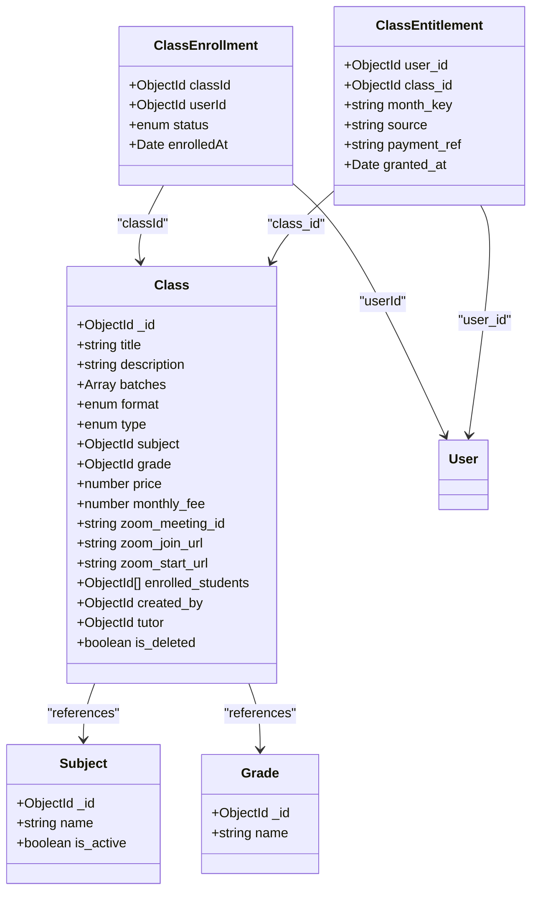
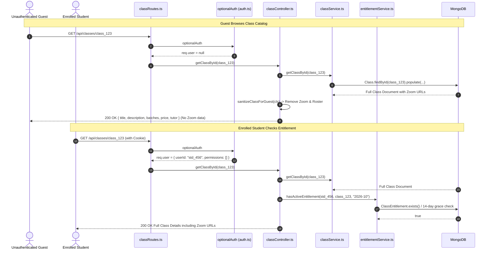

# Phase 04: Curriculum, Classes & Entitlements (Models & Services)

**Layer:** Backend (`lms-server`)  
**Domain:** Academic Curriculum, Class Lifecycle, Student Enrollment Bridge, Monthly Entitlements & Guest Data Sanitization  
**Date:** 2026-10-01  
**Status:** Completed  

---

## 1. Module Overview & Dependency Graph

Phase 04 audits the core academic course schema, subject definitions, dual-model student enrollment bridges, monthly access entitlements with automated grace periods, and guest boundary sanitizers.

---

## 2. File-by-File Exhaustive Technical Audit

---

### `src/models/Class.ts`
* **System Role & Domain:** Core entity model for academic offerings. Stores syllabus descriptions, multi-batch schedules, format classifications (`theory`, `revision`, `seminar`), instructional tier (`special`, `regular`, `custom`), pricing models, Zoom meeting credentials, tutor assignments, and relational arrays for quizzes, recordings, and enrolled students.
* **Core Logic & Signatures:**
  * Schema Definition (`classSchema`):
    * `title: { type: String, required: true }`
    * `description: { type: String, required: true }`
    * `batches: [{ batch_name: String, day: String, start: String, end: String }]`: Array of recurring lecture time slots.
    * `format: { type: String, enum: ['theory', 'revision', 'seminar'], required: true }`
    * `type: { type: String, enum: ['special', 'regular', 'custom'], required: true }`
    * `subject: { type: Schema.Types.ObjectId, ref: 'Subject', required: true }`
    * `grade: { type: Schema.Types.ObjectId, ref: 'Grade', required: true }`
    * `price: { type: Number, required: true }`: Upfront or standard registration price.
    * `monthly_fee: { type: Number }`: Recurring monthly subscription charge.
    * `currency: { type: String, default: 'LKR' }`
    * `image: { type: String }`: Cover asset URL.
    * `zoom_meeting_id`, `zoom_join_url`, `zoom_start_url`: Synchronous meeting credentials.
    * `is_deleted: { type: Boolean, default: false }`: Soft-delete flag.
    * `created_by: { type: Schema.Types.ObjectId, ref: 'User', required: true }`
    * `tutor: { type: Schema.Types.ObjectId, ref: 'User' }`
    * `quizzes: [{ type: Schema.Types.ObjectId, ref: 'Quiz' }]`
    * `recordings: [{ type: Schema.Types.ObjectId, ref: 'Recording' }]`
    * `enrolled_students: [{ type: Schema.Types.ObjectId, ref: 'User', index: true }]`: Legacy array maintained for backward compatibility.
  * Exported Interface & Model: `IClass` document interface and `Class = mongoose.model<IClass>('Class', classSchema)`.
* **Lifecycle & Workflow:**
  * Created via admin class creation form $\rightarrow$ Queried by public catalog (with Zoom fields stripped) $\rightarrow$ Referenced by Zoom tickets, assignments, recordings, and student enrollments.
* **UI/Visual Mapping:** Powers Class Catalog grid (`/classes`), Admin Course Table (`/admin/classes`), and Student Class Detail Hub (`/classes/[id]`).
* **Legacy Delta & Gaps:**
  * In legacy `models/class.js`, `subject` and `grade` were unstructured strings (`subject: { type: String }`, `grade: { type: String }`). This prevented referential integrity and caused data fragmentation (e.g. `"Math"`, `"math"`, `"Mathematics"` as separate classes).
  * Migrated model transforms `subject` and `grade` into strict relational `ObjectId` references to dedicated collections.
* **Technical Debt & Scalability Risks:**
  * Dual storage of student enrollments: both in `Class.enrolled_students` (unbounded document array) and `ClassEnrollment` (normalized collection). Storing thousands of student IDs in a single MongoDB document risks hitting MongoDB's 16MB document size limit.

---

### `src/models/Subject.ts`
* **System Role & Domain:** Academic subject taxonomy entity. Standardizes subject names (e.g. "Physics", "Chemistry", "Combined Mathematics", "Biology") across classes, quizzes, and learning materials.
* **Core Logic & Signatures:**
  * Schema Definition (`subjectSchema`):
    * `name: { type: String, required: true, unique: true }`
    * `is_active: { type: Boolean, default: true }`
    * Timestamps: `created_at`, `updated_at`.
  * Exported Interface & Model: `ISubject` and `Subject = mongoose.model<ISubject>('Subject', subjectSchema)`.
* **Lifecycle & Workflow:**
  * Seeded or created by administration $\rightarrow$ Referenced by `Class.subject` $\rightarrow$ Queried by frontend catalog filter chips.
* **UI/Visual Mapping:** Filter chips and dropdown menus in Class Catalog (`PopularClasses.tsx`, `/classes`).
* **Legacy Delta & Gaps:**
  * Entirely absent in legacy; legacy relied on ad-hoc raw string fields in classes.
* **Technical Debt & Scalability Risks:**
  * Missing lowercase normalization on `name`, allowing `"physics"` and `"Physics"` if unique constraint collation is case-sensitive.

---

### `src/models/ClassEnrollment.ts`
* **System Role & Domain:** Normalized student enrollment junction entity. Establishes the relationship between students and courses with enrollment status and lifecycle tracking.
* **Core Logic & Signatures:**
  * Schema Definition (`classEnrollmentSchema`):
    * `classId: { type: Schema.Types.ObjectId, ref: 'Class', required: true, index: true }`
    * `userId: { type: Schema.Types.ObjectId, ref: 'User', required: true, index: true }`
    * `status: { type: String, enum: ['active', 'dropped', 'completed'], default: 'active', index: true }`
    * `enrolledAt: { type: Date, default: Date.now }`
  * Compound Index:
    * `classEnrollmentSchema.index({ classId: 1, userId: 1 }, { unique: true })`: Prevents duplicate enrollment records for the same student in a course.
  * Exported Interface & Model: `IClassEnrollment` and `ClassEnrollment = mongoose.model<IClassEnrollment>('ClassEnrollment', classEnrollmentSchema)`.
* **Lifecycle & Workflow:**
  * Created when class application is approved or payment verified $\rightarrow$ Queried by student enrolled classes list $\rightarrow$ Updated to `'dropped'` upon withdrawal.
* **UI/Visual Mapping:** Controls class access gates, enrolled student badges, and roster lists in `/admin/classes`.
* **Legacy Delta & Gaps:**
  * Legacy system had no enrollment collection; enrollments were tracked purely via an array of ObjectIds in `Class.enrolled_students`.
  * Migrated model normalizes enrollments into independent documents with lifecycle states (`active`, `dropped`, `completed`).
* **Technical Debt & Scalability Risks:**
  * When a class is deleted or dropped, application code must ensure sync between `ClassEnrollment` and `Class.enrolled_students` until the legacy array is fully deprecated.

---

### `src/models/ClassEntitlement.ts`
* **System Role & Domain:** Time-bound resource authorization model. Governs month-by-month access grants to course lectures, materials, recordings, and live meeting tickets.
* **Core Logic & Signatures:**
  * Schema Definition (`classEntitlementSchema`):
    * `user_id: { type: Schema.Types.ObjectId, ref: 'User', required: true }`
    * `class_id: { type: Schema.Types.ObjectId, ref: 'Class', required: true }`
    * `month_key: { type: String, required: true }`: Dotted or hyphenated calendar key (e.g. `"2026-03"`).
    * `source: { type: String, default: 'manual' }`: Acquisition vector (e.g. `'manual'`, `'stripe'`, `'payhere'`, `'bank_slip'`).
    * `payment_ref: { type: String, default: null }`: External transaction identifier.
    * `granted_at: { type: Date, default: Date.now }`
  * Compound Index:
    * `classEntitlementSchema.index({ user_id: 1, class_id: 1, month_key: 1 }, { unique: true })`: Enforces idempotent access grants per calendar month.
  * Exported Interface & Model: `IClassEntitlement` and `ClassEntitlement = mongoose.model<IClassEntitlement>('ClassEntitlement', classEntitlementSchema)`.
* **Lifecycle & Workflow:**
  * Created upon payment confirmation or admin grant $\rightarrow$ Evaluated by `entitlementService.hasActiveEntitlement` before unlocking class recordings, Zoom meetings, and lesson files.
* **UI/Visual Mapping:** Monthly entitlement badges in Student Class View and Payment Access Locks.
* **Legacy Delta & Gaps:**
  * In legacy `ClassEntitlement.js`, fields existed but lacked standard compound indexing and automatic grace-period evaluation.
* **Technical Debt & Scalability Risks:**
  * `month_key` format is not schema-enforced with a regex (e.g. `/^\d{4}-\d{2}$/`). If inconsistent strings (e.g. `"2026-3"` vs `"2026-03"`) are inserted, month queries will fail.

---

### `src/services/classService.ts`
* **System Role & Domain:** Core academic domain service. Implements course creation, flexible query filtering (supporting both ObjectIds and regex name lookups), soft deletion, enrollment retrieval with automatic backfilling, and student schedule resolution.
* **Core Logic & Signatures:**
  * `createClass(data: any, userId: string): Promise<IClass>`:
    * Instantiates `Class` setting `created_by: userId`.
    * Checks `process.env.ZOOMCLIENT === 'True'` to fail-loud on meeting scheduling.
    * Saves and returns created class document.
  * `getClasses(filters: any = {}): Promise<IClass[]>`:
    * Query base: `{ is_deleted: { $ne: true } }`.
    * Polymorphic `grade` filter: If ObjectId, matches `query.grade`. If string/number (e.g. `"12"`, `"Grade 12"`), queries `Grade` collection via case-insensitive regex to resolve matching IDs.
    * Polymorphic `subject` filter: If ObjectId, matches `query.subject`. If string, queries `Subject` collection via regex to resolve IDs.
    * Filters by `format`, `type`, and `tutor`.
    * Populates `grade` (name), `subject` (name), and `tutor` (names, email).
  * `getClassById(classId: string): Promise<IClass | null>`: Loads class with populated relations.
  * `updateClass(classId: string, updateData: any): Promise<IClass>`: Merges updates and saves.
  * `deleteClass(classId: string): Promise<{ message: string }>`: Sets `is_deleted = true`.
  * `getEnrolledStudents(classId: string): Promise<any[]>`:
    * Checks `ClassEnrollment` collection first (`status: 'active'`).
    * **Automatic Backfill Mechanism:** If `ClassEnrollment` is empty, reads `Class.enrolled_students` and executes `ClassEnrollment.updateOne(..., { $setOnInsert: ... }, { upsert: true })` to backfill normalized records transparently!
  * `getAllClassesWithStudents(): Promise<any[]>`: Fetches all active classes and resolves student rosters.
  * `getEnrolledClassesForUser(userId: string): Promise<IClass[]>`: Queries classes matching either `ClassEnrollment.userId` or legacy `Class.enrolled_students`.
* **Lifecycle & Workflow:**
  * Client requests `/api/classes` $\rightarrow$ `getClasses` resolves string/ID filters $\rightarrow$ Populates relations $\rightarrow$ Returns active courses.
* **UI/Visual Mapping:** Main catalog browse, Admin course authoring, and student enrolled course drawer.
* **Legacy Delta & Gaps:**
  * Legacy `classService.js` required exact string matches for `subject` and `grade`. Migrated service handles both relational IDs and fuzzy regex string aliases (`"grade 12"`, `"12"`).
  * Migrated service provides the transparent backfilling bridge from legacy `Class.enrolled_students` array to `ClassEnrollment`.
* **Technical Debt & Scalability Risks:**
  * **N+1 Query Bottleneck in `getAllClassesWithStudents`:** Loops over every class and makes sequential queries (`getEnrolledStudents(cls._id)`). For 50 classes, this triggers 50+ sequential database requests instead of a single `$lookup` aggregation.

---

### `src/services/entitlementService.ts`
* **System Role & Domain:** Access control entitlement evaluator. Determines whether a student holds valid authorization to consume a specific class module for a given calendar month, including business grace periods.
* **Core Logic & Signatures:**
  * `hasActiveEntitlement = async (userId: string, classId: string, targetMonthKey: string): Promise<boolean>`:
    * **Step 1:** Direct lookup: `ClassEntitlement.exists({ user_id: userId, class_id: classId, month_key: targetMonthKey })`. If true, returns `true`.
    * **Step 2: 14-Day Grace Period Evaluation:**
      * Calculates current calendar month key (`YYYY-MM`).
      * If `targetMonthKey === currentMonthKey` AND current day of month $\le 14$ (`now.getDate() <= 14`):
        * Computes previous calendar month key (`YYYY-MM`).
        * Checks if student held an active entitlement for the previous month (`hasPrev`).
        * If `hasPrev` is true, returns `true` (access granted under grace period).
      * Otherwise returns `false`.
* **Lifecycle & Workflow:**
  * Student attempts to stream recording, join Zoom lecture, or download monthly material $\rightarrow$ Controller calls `hasActiveEntitlement` $\rightarrow$ Checks current month entitlement $\rightarrow$ Falls back to 14-day prior-month grace window $\rightarrow$ Grants or denies access.
* **UI/Visual Mapping:** Determines locked/unlocked state of lesson materials and play buttons.
* **Legacy Delta & Gaps:**
  * In legacy, the 14-day grace period logic was duplicated across recording controllers and Zoom controllers with inconsistent day thresholds (some checked 10 days, some checked 14 days).
  * Migrated `entitlementService.ts` centralizes this into a single canonical business rule.
* **Technical Debt & Scalability Risks:**
  * Date calculations use local server time (`now.getDate()`), which may vary across timezones if server operates in UTC while students reside in Sri Lanka (UTC+5:30). Should use UTC or institutional timezone normalization.

---

### `src/controllers/classController.ts`
* **System Role & Domain:** HTTP controller for class catalog and administration. Manages CRUD operations, handles public guest sanitization, and returns enrollment rosters.
* **Core Logic & Signatures:**
  * `createClass(req, res)`: Extracts `req.body` and `req.user._id` $\rightarrow$ Calls `classService.createClass` $\rightarrow$ Returns HTTP 201.
  * `sanitizeClassForGuest(cls: any)`: Strips `zoom_meeting_id`, `zoom_join_url`, `zoom_start_url`, and `enrolled_students` from class object.
  * `getClasses(req, res)`: Checks if caller is privileged (`classes.update` or `classes.create`). If not privileged, sanitizes all classes before returning.
  * `getClassById(req, res)`: Loads class. Checks if user is privileged OR if user is enrolled (`enrolled_students.includes(userId)`). If neither, sanitizes Zoom coordinates and roster before returning.
  * `updateClass(req, res)`: Delegates to `classService.updateClass`.
  * `deleteClass(req, res)`: Delegates to `classService.deleteClass` (soft delete).
  * `getEnrolledStudents(req, res)`: Returns enrolled students for specified class.
  * `getEnrolledClasses(req, res)`: Returns courses current user is enrolled in.
  * `getAllClassesWithStudents(req, res)`: Returns all active classes with their student rosters.
* **Lifecycle & Workflow:**
  * HTTP request arrives $\rightarrow$ Controller invokes `classService` $\rightarrow$ Checks user enrollment/permissions $\rightarrow$ Applies `sanitizeClassForGuest` if unauthorized $\rightarrow$ Dispatches JSON.
* **UI/Visual Mapping:** Powers class browse catalog, class landing page, and admin edit modal.
* **Legacy Delta & Gaps:**
  * Legacy `classController.js` leaked Zoom credentials (`zoom_join_url`, `zoom_meeting_id`) to unauthenticated guests visiting public class URLs.
  * Migrated controller implements strict `sanitizeClassForGuest` filtering.
* **Technical Debt & Scalability Risks:**
  * In `getClassById`, enrollment check inspects `cls.enrolled_students?.some(...)`. If a student was enrolled only in `ClassEnrollment` and not yet backfilled into `Class.enrolled_students`, `getClassById` will mistakenly consider them non-enrolled and sanitize the Zoom link. The enrollment check should query `ClassEnrollment.exists(...)`.
  * All error handlers log to console and return generic `{ success: false, message: 'Internal Server Error' }` with status 500, masking 400 Bad Request or 404 Not Found errors.

---

### `src/routes/classRoutes.ts`
* **System Role & Domain:** Class route tree definition. Establishes endpoint paths, assigns authentication guards (`optionalAuth`, `authenticate`, `requirePermission`), and provides aliases for application and assignment operations.
* **Core Logic & Signatures:**
  * Routes:
    * `POST /`: `[requirePermission('classes.create')]` $\rightarrow$ `classController.createClass`
    * `GET /`: `[optionalAuth]` $\rightarrow$ `classController.getClasses`
    * `GET /enrolled`: `[authenticate]` $\rightarrow$ `classController.getEnrolledClasses`
    * `GET /students/all`: `[requirePermission('classes.read')]` $\rightarrow$ `classController.getAllClassesWithStudents`
    * `POST /apply`: `[requirePermission('classes.apply')]` $\rightarrow `classApplicationController.applyForClass`
    * `GET /applications`: `[requirePermission('classes.read')]` $\rightarrow `classApplicationController.getApplications`
    * `POST /handle`: `[requirePermission('classes.update')]` $\rightarrow `classApplicationController.handleApplication`
    * `GET /:id`: `[optionalAuth]` $\rightarrow `classController.getClassById`
    * `PUT /:id`: `[requirePermission('classes.update')]` $\rightarrow `classController.updateClass`
    * `DELETE /:id`: `[requirePermission('classes.delete')]` $\rightarrow `classController.deleteClass`
    * `GET /:id/students`: `[requirePermission('classes.read')]` $\rightarrow `classController.getEnrolledStudents`
    * `POST /:id/assignments`: `[requirePermission('assignments.manage')]` $\rightarrow `assignmentController.createAssignment`
    * `GET /:id/assignments`: `[authenticate]` $\rightarrow `assignmentController.getAssignmentsByClass`
* **Lifecycle & Workflow:**
  * Router matches HTTP method and URI $\rightarrow$ Applies permission or optional authentication $\rightarrow$ Dispatches to target controller.
* **UI/Visual Mapping:** Consumed by client class services (`classService.ts`, `classCrudService.ts`).
* **Legacy Delta & Gaps:**
  * Migrated router protects destructive routes with canonical keys (`classes.create`, `classes.update`, `classes.delete`, `classes.read`) while allowing public catalog browsing via `optionalAuth`.
* **Technical Debt & Scalability Risks:**
  * Route `/handle` dynamically mutates `req.params.id = req.body.application_Id || req.body.applicationId` inline inside the route handler callback rather than in a standardized middleware or parameter sanitizer.

---

## 3. End-of-Phase Architecture Diagram

---

## 4. Cross-Module Dependencies & Legacy Gaps Summary

1. **Guest Sanitization Enrollment Source Discrepancy:**
   In `classController.ts:getClassById`, line 52:
   `const isEnrolled = req.user && cls.enrolled_students?.some((sid: any) => sid.toString() === req.user._id?.toString());`
   Only checks the legacy `cls.enrolled_students` array. If a student's enrollment was registered in the normalized `ClassEnrollment` collection, this check fails, causing the enrolled student to receive a sanitized response without Zoom credentials. It must query `ClassEnrollment.exists({ classId, userId, status: 'active' })`.
2. **N+1 Query Loop in Administrative Class Roster:**
   `classService.ts:getAllClassesWithStudents` performs sequential `getEnrolledStudents` calls in a `for...of` loop. This should be refactored into a single MongoDB aggregation pipeline with `$lookup`.
3. **Timezone Offset in Grace Period Calculation:**
   `entitlementService.ts` evaluates `now.getDate() <= 14` using local server time. If the server is in UTC and students are in UTC+5:30, grace period cutoffs mismatch by several hours on the 14th/15th day of the month.
4. **Error Masking in Class Controller:**
   All `classController.ts` methods catch errors and return a blanket 500 `"Internal Server Error"`. Client validation failures or not-found records are reported as internal server crashes.
