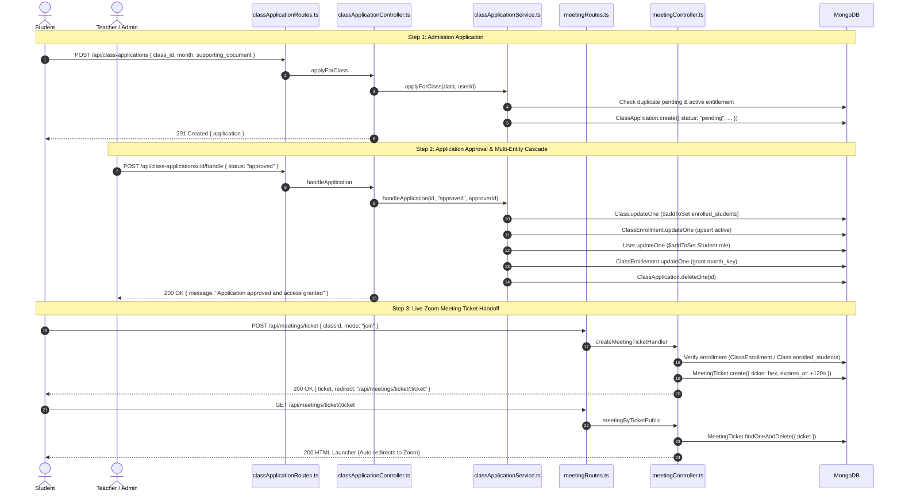
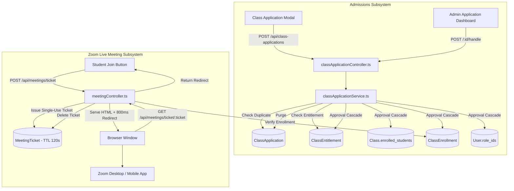

# Phase 05: Class Applications, Zoom Meetings & Admissions

**Layer:** Backend (`lms-server`)  
**Domain:** Admissions Lifecycle, Bank-Slip / Application Verification, Ephemeral Zoom Meeting Tickets & Live Session Handoff  
**Date:** 2026-10-01  
**Status:** Completed  

---

## 1. Module Overview & Dependency Graph

Phase 05 audits the admission workflow (application submission, document verification, multi-entity approval cascades) and live Zoom session authorization via short-lived, single-use meeting tickets.

---

## 2. File-by-File Exhaustive Technical Audit

---

### `src/models/ClassApplication.ts`
* **System Role & Domain:** Course admission and monthly enrollment application model. Stores student requests to join courses (typically accompanied by bank deposit slips or payment proof), status flags, target calendar months, and administrative audit trails.
* **Core Logic & Signatures:**
  * Schema Definition (`classApplicationSchema`):
    * `user_id: { type: Schema.Types.ObjectId, ref: 'User', required: true }`
    * `class_id: { type: Schema.Types.ObjectId, ref: 'Class', required: true }`
    * `status: { type: String, enum: ['pending', 'approved', 'rejected'], required: true, default: 'pending' }`
    * `requested_month: { type: String, match: [/^\d{4}-(0[1-9]|1[0-2])$/, "month must be YYYY-MM"], default: null, index: true }`: Formatted calendar month identifier.
    * `supporting_document: { type: String, default: null }`: Public URL or storage path to bank slip image / document.
    * `applied_at: { type: Date, default: Date.now }`
    * `approved_by: { type: Schema.Types.ObjectId, ref: 'User', default: null }`
    * `approved_at: { type: Date, default: null }`
  * Compound Index:
    * `classApplicationSchema.index({ user_id: 1, class_id: 1, requested_month: 1 }, { unique: true, partialFilterExpression: { status: "pending" } })`: Ensures a student cannot submit duplicate applications for the same course and month while an existing application is still pending.
    * Secondary indexes on `{ status: 1, createdAt: -1 }`, `{ class_id: 1, status: 1, createdAt: -1 }`, `{ user_id: 1, status: 1, createdAt: -1 }`.
  * Exported Interface & Model: `IClassApplication` and `ClassApplication = mongoose.model<IClassApplication>('ClassApplication', classApplicationSchema)`.
* **Lifecycle & Workflow:**
  * Created when student applies for class $\rightarrow$ Queried by Admin Applications Table $\rightarrow$ Deleted upon approval or rejection.
* **UI/Visual Mapping:** Powers Class Application Modal (`apply-class.tsx`), Document Viewer Dialog (`document-viewer-dialog.tsx`), and Application Review Dashboard (`class-applications-dashboard.tsx`).
* **Legacy Delta & Gaps:**
  * Preserves the legacy MongoDB collection name `classApplications` and the partial unique index from `express/models/classApplication.js`.
* **Technical Debt & Scalability Risks:**
  * Destructive lifecycle: Upon approval or rejection, `handleApplication` deletes the application record (`findByIdAndDelete`). This destroys historical audit logs of which admin approved the student and deletes references to the bank slip image. Should use soft-status updates (`status: 'approved' | 'rejected'`) rather than physical document deletion.

---

### `src/models/MeetingTicket.ts`
* **System Role & Domain:** Short-lived authorization ticket model for Zoom meetings. Replaces direct exposure of raw Zoom meeting URLs with single-use, 120-second expiring proxy tokens.
* **Core Logic & Signatures:**
  * Schema Definition (`MeetingTicketSchema`):
    * `ticket: { type: String, required: true, unique: true, index: true }`: Cryptographic hex token.
    * `class_id: { type: Schema.Types.ObjectId, ref: 'Class', required: true, index: true }`
    * `user_id: { type: Schema.Types.ObjectId, ref: 'User', required: true, index: true }`
    * `mode: { type: String, enum: ['start', 'join'], required: true }`: Distinguishes instructor host launch from student participant join.
    * `join_url: { type: String, required: true }`: Target Zoom URL.
    * `expires_at: { type: Date, required: true, expires: 120 }`: 120-second TTL index.
    * `created_at: { type: Date, default: Date.now }`
  * Exported Interface & Model: `IMeetingTicket` and `MeetingTicket = mongoose.model<IMeetingTicket>('MeetingTicket', MeetingTicketSchema)`.
* **Lifecycle & Workflow:**
  * Authenticated user calls `POST /api/meetings/ticket` $\rightarrow$ Ticket generated and saved with 120s TTL $\rightarrow$ User redirected to `GET /api/meetings/ticket/:ticket` $\rightarrow$ Ticket consumed and deleted $\rightarrow$ Zoom client launched.
* **UI/Visual Mapping:** Powers the "Join Live Class" button across student class pages.
* **Legacy Delta & Gaps:**
  * Legacy `MeetingTicket.js` had `used_at` timestamps and allowed configurable TTL via `MEETING_TICKET_TTL`.
  * Migrated model fixes the TTL at a hardcoded 120 seconds with automatic MongoDB TTL document deletion.
* **Technical Debt & Scalability Risks:**
  * In high-concurrency scenarios (e.g. 500 students clicking "Join" simultaneously at the start of a lecture), 500 tickets are rapidly inserted and immediately deleted within seconds, generating high write throughput on MongoDB.

---

### `src/services/classApplicationService.ts`
* **System Role & Domain:** Admissions domain service. Manages student application submission, duplicate validation, pagination queries, and the multi-entity approval cascade.
* **Core Logic & Signatures:**
  * `applyForClass(data: any, userId: string): Promise<IClassApplication>`:
    * Extracts `class_id`, `supporting_document`, `month`.
    * Checks if a pending application already exists for this user, class, and month. Throws `"You have already applied for this class"`.
    * Checks if user already has an active entitlement for this month (`ClassEntitlement.exists`). Throws `"You already have access to that month"`.
    * Creates and saves new `ClassApplication` with `status: 'pending'`.
  * `handleApplication(applicationId: string, status: 'approved' | 'rejected', approverUserId: string): Promise<any>`:
    * Rejection branch: Executes `ClassApplication.findByIdAndDelete(applicationId)` $\rightarrow$ Returns `"Application rejected and deleted"`.
    * Approval branch:
      * Resolves target month key: `application.requested_month || monthKey(new Date())`.
      * Cascades update 1: `Class.updateOne({ _id: classId }, { $addToSet: { enrolled_students: studentId } })`.
      * Cascades update 2: `ClassEnrollment.updateOne({ classId, userId: studentId }, { $setOnInsert: { status: 'active', enrolledAt: new Date() } }, { upsert: true })`.
      * Cascades update 3: Ensures user possesses the `'Student'` role (`User.updateOne({ $addToSet: { role_ids: studentRole._id } })`).
      * Cascades update 4: `ClassEntitlement.updateOne({ user_id: studentId, class_id: classId, month_key: mkey }, { $setOnInsert: { source: 'subscription' } }, { upsert: true })`.
      * Cascades update 5: Deletes the application document (`ClassApplication.findByIdAndDelete`).
  * `getApplications(filters: any, requesterId: string, options: any): Promise<{ data: any[], page: number, limit: number, total: number, totalPages: number }>`:
    * Applies filters (`class_id`, `status`, `student_id`).
    * Paginates via `.skip().limit()`.
    * Populates `user_id` and `class_id` with `lean({ virtuals: true })` to leverage `computedName`.
    * Returns paginated envelope.
* **Lifecycle & Workflow:**
  * Student submits slip $\rightarrow$ Admin views application $\rightarrow$ Admin approves $\rightarrow$ 4 separate models updated atomically $\rightarrow$ Student gains immediate course access.
* **UI/Visual Mapping:** Powers Admin Class Applications dashboard (`class-applications-dashboard.tsx`).
* **Legacy Delta & Gaps:**
  * In legacy `classApplicationService.js`, `getApplications` used an unstable 270-line aggregation pipeline that broke when user profiles were incomplete.
  * Migrated service replaces this with standard `.populate()` and Mongoose virtuals.
* **Technical Debt & Scalability Risks:**
  * **Non-Transactional Multi-Entity Cascade:** The 5 updates in `handleApplication` execute sequentially **without a MongoDB transaction session** (`mongoose.startSession()`). If the server restarts or a database constraint fails during step 4, the student is enrolled in the class but lacks a monthly entitlement, leaving the database in an inconsistent state.

---

### `src/controllers/classApplicationController.ts`
* **System Role & Domain:** HTTP controller for class admission requests. Translates HTTP input into application service calls.
* **Core Logic & Signatures:**
  * `applyForClass(req: Request, res: Response)`: Extracts `req.body` and `req.user._id` $\rightarrow$ Calls `classApplicationService.applyForClass` $\rightarrow$ Returns HTTP 201.
  * `handleApplication(req: Request, res: Response)`: Extracts `req.params.id`, `req.body.status`, and `req.user._id` $\rightarrow$ Calls `classApplicationService.handleApplication` $\rightarrow$ Returns HTTP 200.
  * `getApplications(req: Request, res: Response)`: Extracts `req.query` and `req.user._id` $\rightarrow$ Calls `classApplicationService.getApplications` $\rightarrow$ Returns HTTP 200.
* **Lifecycle & Workflow:**
  * Client sends request $\rightarrow$ Controller delegates to service $\rightarrow$ Formats JSON output.
* **UI/Visual Mapping:** Application action dialog and approval confirmation toasts.
* **Legacy Delta & Gaps:**
  * Standardizes responses to `{ success: true, ... }`.
* **Technical Debt & Scalability Risks:**
  * **User-Facing Error Masking:** All caught errors in `applyForClass` log to console and return HTTP 500 `{ success: false, message: 'Internal Server Error' }`. When a student attempts to apply twice, they receive a generic 500 error instead of the service's informative 400 `"You have already applied for this class"` message.

---

### `src/controllers/meetingController.ts`
* **System Role & Domain:** Zoom meeting authorization controller. Issues short-lived access tickets and serves zero-trace browser redirect pages.
* **Core Logic & Signatures:**
  * `createMeetingTicketHandler(req: Request, res: Response): Promise<void>`:
    * Extracts `classId` and `mode` (`'start'` or `'join'`) from `req.body`.
    * Checks class existence and active status.
    * Authorization validation:
      * If `mode === 'start'`: Caller must hold `zoom.manage`, `classes.update`, or hold role `'teacher'`/`'admin'`.
      * If `mode === 'join'`: If non-privileged, caller must be actively enrolled (`ClassEnrollment.exists` or legacy `Class.enrolled_students`).
    * Resolves Zoom URL: Host receives `zoom_start_url || zoom_join_url`; student receives `zoom_join_url`.
    * Generates 18-byte crypto token (`crypto.randomBytes(18).toString('hex')`).
    * Saves `MeetingTicket` with 120s expiration.
    * Returns `{ success: true, ticket, redirect: "/api/meetings/ticket/<ticket>" }`.
  * `meetingByTicketPublic(req: Request, res: Response): Promise<void>`:
    * Extracts `ticket` from URL params.
    * Queries `MeetingTicket.findOne({ ticket })`.
    * If expired or missing, renders HTTP 410 HTML "Link Expired" page.
    * If valid, deletes ticket immediately (`MeetingTicket.deleteOne`).
    * Renders styled HTML landing page with CSS spinner and JavaScript redirect (`setTimeout(() => window.location.href = targetUrl, 800)`).
* **Lifecycle & Workflow:**
  * Student clicks "Join Class" $\rightarrow$ Frontend requests ticket $\rightarrow$ Receives redirect URL $\rightarrow$ Browser navigates to ticket URL $\rightarrow$ Ticket deleted $\rightarrow$ Browser redirects into Zoom app.
* **UI/Visual Mapping:** Renders connecting spinner page during Zoom launch.
* **Legacy Delta & Gaps:**
  * Legacy `meetingAccessController.js` (446 lines) had complex Zoom API registrant creation via OAuth token, handling Zoom 300/404 errors, and constructing `zoommtg://` and `zoomus://` deep links with obfuscated base64 payloads.
  * Migrated `meetingController.ts` simplifies this to static URL proxying via short-lived tickets.
* **Technical Debt & Scalability Risks:**
  * **Loss of Per-Student Zoom Registrant Tracking:** In legacy, every student was registered in Zoom via API, giving each student a unique join link with attendance tracking. The migrated implementation hands out the shared `classDoc.zoom_join_url`, meaning all students join using the identical meeting URL. Zoom cannot distinguish individual student attendance from webhooks.
  * In `createMeetingTicketHandler`, `user` is typed via `(req as any).user`.

---

### `src/routes/classApplicationRoutes.ts`
* **System Role & Domain:** Routing tree for class applications and admission reviews.
* **Core Logic & Signatures:**
  * Routes:
    * `POST /`: `[requirePermission('classes.apply')]` $\rightarrow$ `applyForClass`
    * `GET /`: `[requirePermission('classes.read')]` $\rightarrow$ `getApplications`
    * `POST /:id/handle`: `[requirePermission('classes.update')]` $\rightarrow$ `handleApplication`
* **Lifecycle & Workflow:**
  * Routes mounted at `/api/class-applications` with canonical permission keys.
* **UI/Visual Mapping:** Consumed by `services/class/applicationService.ts`.
* **Legacy Delta & Gaps:**
  * Decouples application routes from `classRoutes.js` into their own dedicated routing module.
* **Technical Debt & Scalability Risks:**
  * None; clean routing module.

---

### `src/routes/meetingRoutes.ts`
* **System Role & Domain:** Routing tree for Zoom meeting tickets and launcher endpoints.
* **Core Logic & Signatures:**
  * Routes:
    * `POST /ticket`: `[authenticate]` $\rightarrow$ `createMeetingTicketHandler`
    * `GET /ticket/:ticket`: Public route $\rightarrow$ `meetingByTicketPublic`
* **Lifecycle & Workflow:**
  * Routes mounted at `/api/meetings`.
* **UI/Visual Mapping:** Consumed by Zoom launch buttons and browser redirect flows.
* **Legacy Delta & Gaps:**
  * Simplifies legacy meeting endpoints to a clean 2-route ticket interface.
* **Technical Debt & Scalability Risks:**
  * Public endpoint `/ticket/:ticket` is unprotected by rate limiting, making it theoretically possible to probe tickets (although 18-byte hex tokens provide $2^{144}$ entropy).

---

## 3. End-of-Phase Architecture Diagram

---

## 4. Cross-Module Dependencies & Legacy Gaps Summary

1. **Non-Transactional Approval Cascade:**
   `classApplicationService.ts:handleApplication` executes 5 separate database operations across `Class`, `ClassEnrollment`, `Role`, `User`, `ClassEntitlement`, and `ClassApplication` without a MongoDB transaction. If any step fails, the system enters an inconsistent state.
2. **Audit Trail Destruction on Approval/Rejection:**
   Both approved and rejected applications are physically deleted (`ClassApplication.findByIdAndDelete`). This eliminates historical proof of bank slip submissions and audit logs of which teacher authorized the admission.
3. **Loss of Zoom Individual Registrant Attendance:**
   The legacy system created unique registrants per student via Zoom API for automated attendance webhook tracking. Migrated `meetingController.ts` shares the static `classDoc.zoom_join_url`, preventing Zoom from reporting individual student attendance via webhooks.
4. **Generic Error Masking in Application Controller:**
   `classApplicationController.ts:applyForClass` masks all errors behind HTTP 500, preventing students from understanding validation errors (e.g. duplicate application or existing access).
