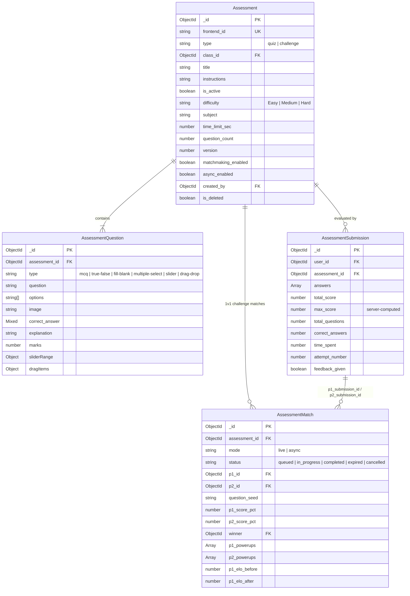

# Phase 06: Assessment Data Model & Question Bank Schema

**Layer:** Backend (`lms-server`)  
**Domain:** Assessment Entities, Question Bank Modeling, Submission Evaluation Records & Gamified Matchmaking Schema  
**Date:** 2026-10-01  
**Status:** Completed  

---

## 1. Module Overview & Dependency Graph

Phase 06 audits the assessment and testing data layer. The codebase contains two parallel, coexisting schema hierarchies: the legacy-compatible Quiz hierarchy (`Quiz`, `QuizQuestion`, `QuizSubmission`, `ChallengeMatch`) and the modernized Clean Architecture Assessment aggregate (`Assessment`, `AssessmentQuestion`, `AssessmentSubmission`, `AssessmentMatch`).



---

## 2. File-by-File Exhaustive Technical Audit

---

### `src/models/Quiz.ts`
* **System Role & Domain:** Legacy-compatible testing entity model. Stores standard quiz configurations, difficulty tiers, time limits, and matchmaking parameters. Consumed by legacy quiz routes and controllers.
* **Core Logic & Signatures:**
  * Schema Definition (`quizSchema`):
    * `frontend_id: { type: String, sparse: true, unique: true }`: Client-generated offline UUID.
    * `class_id: { type: Schema.Types.ObjectId, ref: 'Class', required: false }`: Optional binding to a specific course.
    * `title: { type: String, required: true }`
    * `instructions: { type: String, required: true }`
    * `type: { type: String, enum: ['quiz', 'challenge'], default: 'quiz' }`
    * `is_active: { type: Boolean, default: true }`
    * `difficulty: { type: String, enum: ['Easy', 'Medium', 'Hard'], default: 'Easy' }`
    * `subject: { type: Schema.Types.ObjectId, ref: 'Subject' }`
    * `time_limit_sec: { type: Number, default: 0 }`: 0 indicates untimed quiz.
    * `question_count: { type: Number }`
    * `version: { type: Number, default: 1 }`: Incremented on question bank changes.
    * `matchmaking_enabled: { type: Boolean, default: true }`
    * `async_enabled: { type: Boolean, default: true }`
    * `created_by: { type: Schema.Types.ObjectId, ref: 'User', required: true }`
    * `is_deleted: { type: Boolean, default: false }`
  * Indexes:
    * `{ class_id: 1, is_active: 1 }`
    * `{ subject: 1, difficulty: 1 }`
  * Exported Model: `Quiz = mongoose.model('Quiz', quizSchema)`.
* **Lifecycle & Workflow:**
  * Teacher builds quiz in quiz editor $\rightarrow$ Saved to MongoDB $\rightarrow$ Listed on Quiz catalog $\rightarrow$ Loaded by quiz engine.
* **UI/Visual Mapping:** Powers Quiz Creation Form (`create-quiz-form.tsx`) and Quiz Card (`quiz-card.tsx`).
* **Legacy Delta & Gaps:**
  * In legacy `models/quiz.js`, `subject` was a freeform string. Migrated `Quiz.ts` upgrades `subject` to a relational `ObjectId` referencing `Subject`.
* **Technical Debt & Scalability Risks:**
  * Coexists with `Assessment.ts`. Maintaining two active collections (`quizzes` and `assessments`) creates confusion unless an automated sync or migration plan is executed.

---

### `src/models/QuizQuestion.ts`
* **System Role & Domain:** Legacy-compatible question item model. Defines the content, scoring weight, interactive format, and evaluation parameters for assessment questions.
* **Core Logic & Signatures:**
  * Schema Definition (`quizQuestionSchema`):
    * `frontend_id: { type: String, sparse: true, unique: true }`
    * `quiz_id: { type: Schema.Types.ObjectId, ref: 'Quiz', required: true, index: true }`
    * `type: { type: String, enum: ['mcq', 'true-false', 'fill-blank', 'multiple-select', 'slider', 'drag-drop'], required: true }`
    * `question: { type: String, required: true }`
    * `options: { type: [String], default: undefined }`: Choices for multiple choice questions.
    * `image: { type: String, default: null }`: Mathematical diagram or illustration URL.
    * `correct_answer: { type: Schema.Types.Mixed, required: true }`: Dynamic shape (number index for MCQ, boolean for true-false, string for fill-blank, number[] for multiple-select, number for slider, object for drag-drop).
    * `explanation: { type: String }`: Pedagogical feedback displayed during post-quiz review.
    * `marks: { type: Number, required: true }`: Point value of question.
    * `sliderRange: { min: Number, max: Number, step: Number }`
    * `dragItems: { items: [String], matches: [String] }`
  * Exported Model: `QuizQuestion = mongoose.model('QuizQuestion', quizQuestionSchema)`.
* **Lifecycle & Workflow:**
  * Created during quiz authoring $\rightarrow$ Loaded by quiz engine (with `correct_answer` withheld until grading) $\rightarrow$ Queried by evaluation service.
* **UI/Visual Mapping:** Question Editor (`question-editor.tsx`) and Quiz Taking Engine (`quiz-engine.tsx`).
* **Legacy Delta & Gaps:**
  * Identical schema preserved from `express/models/quizQuestion.js` for zero-loss backwards compatibility.
* **Technical Debt & Scalability Risks:**
  * `correct_answer` uses `Schema.Types.Mixed`, which bypasses Mongoose schema validation. Corrupted or malformed answer payloads (e.g. string when number expected) cannot be caught at the schema level.

---

### `src/models/QuizSubmission.ts`
* **System Role & Domain:** Quiz attempt record and answer history. Stores individual student responses, timing metrics, and overall score results.
* **Core Logic & Signatures:**
  * Schema Definition (`quizSubmissionSchema`):
    * `user_id: { type: Schema.Types.ObjectId, ref: 'User', required: true }`
    * `quiz_id: { type: Schema.Types.ObjectId, ref: 'Quiz', required: true }`
    * `answers: [{ question_id: ObjectId, answer: Mixed, is_correct: Boolean, score: Number, time_ms: Number }]`
    * `total_score: { type: Number, required: true }`
    * `total_questions: { type: Number }`
    * `correct_answers: { type: Number }`
    * `time_spent: { type: Number, required: true }`: Seconds spent.
    * `submitted_at: { type: Date, default: Date.now }`
    * `attempt_number: { type: Number, default: 1 }`
    * `feedback_given: { type: Boolean, default: false }`
    * `device_info: { type: String }`
    * `ip_address: { type: String }`
  * Compound Indexes:
    * `{ user_id: 1, quiz_id: 1, attempt_number: 1 }, { unique: true }`: Prevents duplicate evaluations for the same attempt.
    * `{ quiz_id: 1, attempt_number: 1, submitted_at: 1 }`
    * `{ user_id: 1, quiz_id: 1, submitted_at: -1 }`
  * Exported Model: `QuizSubmission = mongoose.model('QuizSubmission', quizSubmissionSchema)`.
* **Lifecycle & Workflow:**
  * Student finishes quiz $\rightarrow$ Server grades submission $\rightarrow$ Document written $\rightarrow$ Read during review and analytics.
* **UI/Visual Mapping:** Quiz Review (`quizReview.tsx`) and Performance Tracker (`performance-tracker.tsx`).
* **Legacy Delta & Gaps:**
  * Lacks `max_score`. In legacy, if questions had variable mark weights (e.g. 5 marks each), `total_score` was stored without the maximum possible score, leading to inaccurate percentage calculation during reviews.
* **Technical Debt & Scalability Risks:**
  * Missing `max_score` field requires calculating percentages by dynamically querying questions.

---

### `src/models/Assessment.ts`
* **System Role & Domain:** Modernized Clean Architecture testing aggregate model. Unifies standard Quizzes and competitive 1v1 Challenges into a single polymorphic entity.
* **Core Logic & Signatures:**
  * Schema Definition (`assessmentSchema`):
    * `frontend_id: { type: String, sparse: true, unique: true }`
    * `type: { type: String, enum: ['quiz', 'challenge'], required: true, default: 'quiz' }`
    * `class_id: { type: Schema.Types.ObjectId, ref: 'Class', required: false }`
    * `title: { type: String, required: true }`
    * `instructions: { type: String, required: true }`
    * `is_active: { type: Boolean, default: true }`
    * `difficulty: { type: String, enum: ['Easy', 'Medium', 'Hard'], default: 'Easy' }`
    * `subject: { type: String }`
    * `time_limit_sec: { type: Number, default: 0 }`
    * `question_count: { type: Number }`
    * `version: { type: Number, default: 1 }`
    * `matchmaking_enabled: { type: Boolean, default: true }`
    * `async_enabled: { type: Boolean, default: true }`
    * `created_by: { type: Schema.Types.ObjectId, ref: 'User', required: true }`
    * `is_deleted: { type: Boolean, default: false }`
  * Indexes:
    * `{ class_id: 1, is_active: 1 }`
    * `{ subject: 1, difficulty: 1 }`
    * `{ type: 1 }`
  * Exported Interface & Model: `IAssessment` and `Assessment = mongoose.models.Assessment || mongoose.model<IAssessment>('Assessment', assessmentSchema)`.
* **Lifecycle & Workflow:**
  * Created via unified `assessmentService.ts` $\rightarrow$ Drives both solo quiz sessions and multiplayer challenge matchmaking.
* **UI/Visual Mapping:** Quiz catalog, Challenge matchmaking lobbies, and Admin assessment authoring.
* **Legacy Delta & Gaps:**
  * Legacy maintained separate models and tables for challenges vs quizzes. Migrated `Assessment.ts` unifies them under a single polymorphic model with a `type` discriminator.
* **Technical Debt & Scalability Risks:**
  * `subject` is typed as a `String` rather than `ObjectId` referencing `Subject`, diverging from `Quiz.ts`.

---

### `src/models/AssessmentQuestion.ts`
* **System Role & Domain:** Clean Architecture question entity model. Provides strongly-typed question definitions for the unified `Assessment` aggregate.
* **Core Logic & Signatures:**
  * Schema Definition (`assessmentQuestionSchema`):
    * `frontend_id: { type: String, sparse: true, unique: true }`
    * `assessment_id: { type: Schema.Types.ObjectId, ref: 'Assessment', required: true, index: true }`
    * `type: { type: String, enum: ['mcq', 'true-false', 'fill-blank', 'multiple-select', 'slider', 'drag-drop'], required: true }`
    * `question: { type: String, required: true }`
    * `options: { type: [String], default: undefined }`
    * `image: { type: String, default: null }`
    * `correct_answer: { type: Schema.Types.Mixed, required: true }`
    * `explanation: { type: String }`
    * `marks: { type: Number, required: true }`
    * `sliderRange: { min: Number, max: Number, step: Number }`
    * `dragItems: { items: [String], matches: [String] }`
  * Exported Interface & Model: `IAssessmentQuestion` and `AssessmentQuestion = mongoose.models.AssessmentQuestion || mongoose.model<IAssessmentQuestion>('AssessmentQuestion', assessmentQuestionSchema)`.
* **Lifecycle & Workflow:**
  * Linked to parent `Assessment` via `assessment_id` foreign key.
* **UI/Visual Mapping:** Interactive question editor components.
* **Legacy Delta & Gaps:**
  * Provides complete TypeScript typing interface (`IAssessmentQuestion`) with hot-reload model reusability (`mongoose.models.AssessmentQuestion || ...`).
* **Technical Debt & Scalability Risks:**
  * Redundant with `QuizQuestion.ts`. Both models point to nearly identical database schemas.

---

### `src/models/AssessmentSubmission.ts`
* **System Role & Domain:** Clean Architecture submission model. Stores evaluation results with both `total_score` and server-computed `max_score` for tamper-proof percentage calculation.
* **Core Logic & Signatures:**
  * Schema Definition (`assessmentSubmissionSchema`):
    * `user_id: { type: Schema.Types.ObjectId, ref: 'User', required: true }`
    * `assessment_id: { type: Schema.Types.ObjectId, ref: 'Assessment', required: true }`
    * `answers: [{ question_id: ObjectId, answer: Mixed, is_correct: Boolean, score: Number, time_ms: Number }]`
    * `total_score: { type: Number, required: true }`
    * `max_score: { type: Number, required: true, default: 0 }`: **Server-computed maximum possible score**.
    * `total_questions: { type: Number }`
    * `correct_answers: { type: Number }`
    * `time_spent: { type: Number, required: true }`
    * `attempt_number: { type: Number, default: 1 }`
    * `feedback_given: { type: Boolean, default: false }`
  * Indexes:
    * `{ user_id: 1, assessment_id: 1, attempt_number: 1 }, { unique: true }`
    * `{ assessment_id: 1, attempt_number: 1, submitted_at: 1 }`
    * `{ user_id: 1, assessment_id: 1, submitted_at: -1 }`
  * Exported Interface & Model: `IAssessmentSubmission` and `AssessmentSubmission = mongoose.models.AssessmentSubmission || mongoose.model<IAssessmentSubmission>('AssessmentSubmission', assessmentSubmissionSchema)`.
* **Lifecycle & Workflow:**
  * Saved upon completion of an Assessment attempt.
* **UI/Visual Mapping:** Student quiz review screen and teacher performance reports.
* **Legacy Delta & Gaps:**
  * **Fixes Legacy Score Bug:** Introduces `max_score` directly on the submission document, resolving the issue where review screens miscalculated percentages when total possible marks varied.
* **Technical Debt & Scalability Risks:**
  * `answers.question_id` references `AssessmentQuestion`. If evaluating a legacy `QuizQuestion`, foreign key reference typing is mismatched.

---

### `src/models/AssessmentMatch.ts`
* **System Role & Domain:** Competitive 1v1 challenge match state model. Tracks real-time gamified student duels, question randomization seeds, in-game powerups, and ELO rating adjustments.
* **Core Logic & Signatures:**
  * Schema Definition (`assessmentMatchSchema`):
    * `assessment_id: { type: Schema.Types.ObjectId, ref: 'Assessment', required: true }`
    * `mode: { type: String, enum: ['live', 'async'], required: true }`
    * `status: { type: String, enum: ['queued', 'in_progress', 'completed', 'expired', 'cancelled'], default: 'queued' }`
    * `p1_id: { type: Schema.Types.ObjectId, ref: 'User', required: true }`
    * `p2_id: { type: Schema.Types.ObjectId, ref: 'User' }`
    * `question_seed: { type: String, required: true }`: Deterministic pseudo-random seed ensuring both contestants receive identical question sequences.
    * `assessment_version: { type: Number, required: true }`
    * `time_limit_sec: { type: Number, default: 0 }`
    * `p1_submission_id`, `p2_submission_id`: Links to respective `AssessmentSubmission` documents.
    * `p1_score_pct`, `p2_score_pct`: Normalized percentage scores.
    * `p1_time_ms`, `p2_time_ms`: Millisecond precision timing for speed tiebreakers.
    * `winner: { type: Schema.Types.ObjectId, ref: 'User' }`
    * `p1_powerups`, `p2_powerups`: Log of triggered buffs:
      * `key: 'fifty_fifty' | '+15s' | 'double'`
      * `at_ms: Number`
      * `qid: ObjectId`
    * `p1_streak_max`, `p2_streak_max`: Consecutive correct answer counts.
    * `tiebreak: { type: String, enum: ['faster_time', 'sudden_death', 'none'], default: 'none' }`
    * `p1_elo_before`, `p2_elo_before`, `p1_elo_after`, `p2_elo_after`: Chess ELO rating tracking.
  * Indexes:
    * `{ status: 1, mode: 1, class_id: 1 }`
    * `{ p1_id: 1, status: 1 }`
    * `{ p2_id: 1, status: 1 }`
    * `{ assessment_id: 1, created_at: 1 }`
  * Exported Interface & Model: `IAssessmentMatch` and `AssessmentMatch = mongoose.models.AssessmentMatch || mongoose.model<IAssessmentMatch>('AssessmentMatch', assessmentMatchSchema)`.
* **Lifecycle & Workflow:**
  * P1 queues for match $\rightarrow$ Matchmaking assigns P2 $\rightarrow$ Seed generated $\rightarrow$ Submissions evaluated $\rightarrow$ ELO recalculated $\rightarrow$ Winner declared.
* **UI/Visual Mapping:** Powers Live Challenge arena, powerup buttons, and Head-to-Head result screens.
* **Legacy Delta & Gaps:**
  * Clean Architecture evolution of `ChallengeMatch.ts`.
* **Technical Debt & Scalability Risks:**
  * Concurrent updates from both players submitting answers simultaneously require optimistic concurrency controls or atomic `$set` operations to prevent race conditions during tiebreak evaluation.

---

### `src/models/ChallengeMatch.ts`
* **System Role & Domain:** Legacy-compatible competitive challenge match entity. Preserves backward compatibility with legacy `/api/challenges` routes referencing `Quiz` and `QuizSubmission`.
* **Core Logic & Signatures:**
  * Schema Definition (`challengeMatchSchema`):
    * `quiz_id: { type: Schema.Types.ObjectId, ref: 'Quiz', required: true }`
    * `mode: { type: String, enum: ['live', 'async'], required: true }`
    * `status: { type: String, enum: ['queued', 'in_progress', 'completed', 'expired', 'cancelled'], default: 'queued' }`
    * `p1_id: { type: Schema.Types.ObjectId, ref: 'User', required: true }`
    * `p2_id: { type: Schema.Types.ObjectId, ref: 'User' }`
    * `question_seed: { type: String, required: true }`
    * `quiz_version: { type: Number, required: true }`
    * `p1_submission_id: { type: Schema.Types.ObjectId, ref: 'QuizSubmission' }`
    * `p2_submission_id: { type: Schema.Types.ObjectId, ref: 'QuizSubmission' }`
    * `p1_powerups`, `p2_powerups`: Logs `'fifty_fifty'`, `'+15s'`, `'double'`.
    * `p1_elo_before`, `p2_elo_before`, `p1_elo_after`, `p2_elo_after`.
  * Exported Model: `ChallengeMatch = mongoose.model('ChallengeMatch', challengeMatchSchema)`.
* **Lifecycle & Workflow:**
  * Interacts with legacy challenge controllers.
* **UI/Visual Mapping:** Legacy challenge lobbies.
* **Legacy Delta & Gaps:**
  * 100% drop-in replacement for `express/models/ChallengeMatch.js`.
* **Technical Debt & Scalability Risks:**
  * Parallel maintenance with `AssessmentMatch.ts`.

---

## 3. End-of-Phase Architecture Diagram

```mermaid
flowchart TD
    subgraph Assessment Dual-Hierarchy Schema Architecture
        subgraph Modern Architecture [Assessment Aggregate - Clean Model]
            A[Assessment.ts\ntype: quiz | challenge] --> AQ[AssessmentQuestion.ts\n6 Question Types]
            A --> AS[AssessmentSubmission.ts\nIncludes max_score]
            A --> AM[AssessmentMatch.ts\n1v1 Gamified Duels & ELO]
            AS -.-> AM
        end

        subgraph Legacy Architecture [Quiz & Challenge - Legacy Model]
            Q[Quiz.ts\nsubject: ref Subject] --> QQ[QuizQuestion.ts\nSchema.Types.Mixed answer]
            Q --> QS[QuizSubmission.ts\nLacks max_score]
            Q --> CM[ChallengeMatch.ts\n1v1 Challenges]
            QS -.-> CM
        end
    end

    AQ -.->|Schema Identity| QQ
    AS -.->|Supercedes with max_score| QS
    AM -.->|Supercedes| CM
```

---

## 4. Cross-Module Dependencies & Legacy Gaps Summary

1. **Dual Schema Coexistence (Quiz vs Assessment):**
   The codebase maintains two complete parallel sets of Mongoose schemas (`Quiz/*` vs `Assessment/*`). Services must be verified in Phase 07 to confirm which schema is the active production source of truth and ensure data is not split across collections.
2. **Missing `max_score` in Legacy `QuizSubmission`:**
   In legacy `QuizSubmission.ts`, `max_score` is not stored, forcing recalculation from questions during reviews. The modernized `AssessmentSubmission.ts` fixes this bug by persisting server-computed `max_score`.
3. **`Schema.Types.Mixed` Answer Validation:**
   Both `QuizQuestion` and `AssessmentQuestion` define `correct_answer` as `Schema.Types.Mixed`. Runtime validation in service layers is mandatory to prevent invalid data types from corrupting evaluation engines.
4. **Subject Reference Divergence:**
   In `Quiz.ts`, `subject` is an `ObjectId` referencing `Subject`, whereas in `Assessment.ts`, `subject` is typed as `String`. This discrepancy must be harmonized during Clean Architecture refactoring.
