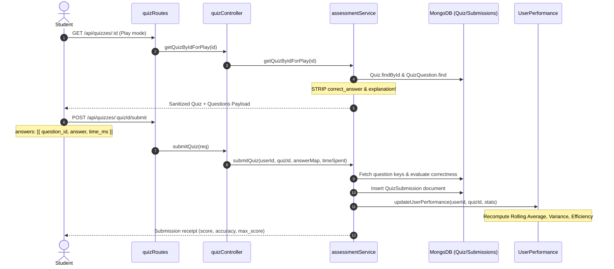
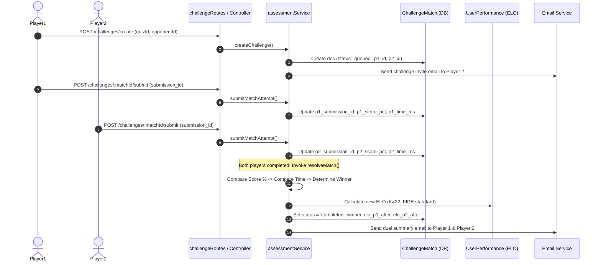

# Phase 07: Backend — Quiz Engine, Evaluation Pipeline & Live Challenges

**Execution Date:** 2026-10-01  
**Auditor:** Antigravity Clean Architecture Sentinel  
**Target Repository:** `/Users/chandupa/lms-server`  
**Legacy Reference Repository:** `/Users/chandupa/express`  
**Files Audited (7 files):**
1. `src/models/UserAssessmentStats.ts`
2. `src/models/UserPerformance.ts`
3. `src/services/assessmentService.ts`
4. `src/controllers/quizController.ts`
5. `src/controllers/challengeController.ts`
6. `src/routes/quizRoutes.ts`
7. `src/routes/challengeRoutes.ts`

---

## 1. Executive Summary & Architecture Overview

Phase 07 audits the core assessment engine, multi-window performance aggregator, challenge duel matchmaking, and ELO rating calculation subsystem. In the legacy platform (`express`), this logic was fragmented across `quizSevice.js` (note legacy spelling typo), `challengeService.js`, and `performanceUpdater.js`. In `lms-server`, the entire evaluation pipeline has been centralized into `src/services/assessmentService.ts` (2,018 lines) while preserving modular controllers and routes.

### Architectural Highlights
- **Safe Exposure vs. Admin Inspection:** Strict separation between public/student quiz consumption (`getAllQuizzesForPlay`, `getQuizByIdForPlay`), which strips solutions and explanations, and administrative inspection (`getQuizByIdForUpdate`, `getSubmissionById`), which exposes the answer keys and scoring rubrics.
- **Dynamic Leaderboard & Rolling Statistics Engine:** Multi-window aggregation (`weekly`, `monthly`, `lifetime`) across scopes (`global`, `class`, `subject`, `quiz`) with efficiency formulas and population consistency metrics.
- **Asynchronous 1v1 Challenge Duels & ELO Calculation:** Deterministic FIDE-style ELO recalculation ($K=32$) with multi-tiered tiebreak resolution (Score % $\rightarrow$ Completion Time $\rightarrow$ Draw) and transactional integrity when replica sets are present.
- **Friend Recommendation Pipeline:** Priority graph matching students by grade match ($3\times$), shared class enrollments ($2\times$), capped historical duel frequency ($\le 5$), and temporal recency bonuses ($1.0$ for $<7$d, $0.5$ for $<30$d).

---

## 2. Exhaustive Per-File Deep Dive

```
┌────────────────────────────────────────────────────────────────────────────────────────────────────────┐
│                                       PHASE 07: COMPONENT TOPOLOGY                                     │
├───────────────────────────────┬────────────────────────────────────────────────────────────────────────┤
│ Layer                         │ Files / Modules Audited                                                │
├───────────────────────────────┼────────────────────────────────────────────────────────────────────────┤
│ Performance Models            │ UserAssessmentStats.ts, UserPerformance.ts                             │
│ Unified Assessment Service    │ assessmentService.ts (2,018 lines)                                     │
│ API Controllers               │ quizController.ts, challengeController.ts                              │
│ Routing & RBAC Gateways       │ quizRoutes.ts, challengeRoutes.ts                                      │
└───────────────────────────────┴────────────────────────────────────────────────────────────────────────┘
```

---

### File 1: `src/models/UserAssessmentStats.ts`
- **Primary Responsibility:** Tracks fine-grained per-assessment lifetime counters and score rollups per student.
- **Schema & Indexes:**
  - `user_id`: `Schema.Types.ObjectId` (ref: `'User'`, required, indexed).
  - `assessment_id`: `Schema.Types.ObjectId` (ref: `'Assessment'`, required, indexed).
  - `total_attempts`: `Number` (default: 0).
  - `highest_score`: `Number` (default: 0).
  - `latest_score`: `Number` (default: 0).
  - `highest_percentage`: `Number` (default: 0).
  - `latest_percentage`: `Number` (default: 0).
  - `average_percentage`: `Number` (default: 0).
  - `total_time_spent_seconds`: `Number` (default: 0).
  - `first_attempt_at`: `Date`.
  - `latest_attempt_at`: `Date`.
  - `compound index`: `{ user_id: 1, assessment_id: 1 }` with `{ unique: true }`.
- **Edge Cases & Failure Modes:**
  - Designed explicitly for the modernized `Assessment` entity rather than legacy `Quiz`. If a student takes a legacy quiz, stats are logged to `UserPerformance` instead of `UserAssessmentStats`, creating a split analytics store.

---

### File 2: `src/models/UserPerformance.ts`
- **Primary Responsibility:** Multi-dimensional, windowed performance and ELO tracking for all quiz evaluations and matchmaking leaderboards.
- **Schema & Indexes:**
  - `user_id`: `Schema.Types.ObjectId` (ref: `'User'`, required, indexed).
  - `scope_type`: `enum: ['global', 'subject', 'class', 'quiz']`, default `'global'`.
  - `scope_id`: `Schema.Types.ObjectId` (optional; references Class or Quiz).
  - `subject`: `String` (optional; canonicalized to lowercase).
  - `window`: `enum: ['weekly', 'monthly', 'lifetime']`, default `'monthly'`.
  - `window_key`: `String` (e.g., `'2026-W39'`, `'2026-09'`, or `'all'`).
  - **Metrics:**
    - `attempts`: `Number` (default: 0).
    - `total_score`: `Number` (default: 0).
    - `max_score`: `Number` (default: 0).
    - `average_score`: `Number` (default: 0) — percentage ($0 - 100$).
    - `total_time`: `Number` (default: 0) — cumulative seconds spent.
    - `efficiency`: `Number` (default: 0) — points scored per minute: $\frac{\text{total\_score}}{\text{total\_time} / 60}$.
    - `consistency`: `Number` (default: 0) — sample standard deviation of attempt percentages.
    - `score_variance_sum`: `Number` (default: 0) — running sum of squared differences for Welford's algorithm.
    - `elo`: `Number` (default: 1000) — FIDE rating tracking duel results.
    - `last_attempt_at`: `Date`.
  - **Compound Indexes:**
    - `{ user_id: 1, scope_type: 1, scope_id: 1, subject: 1, window: 1, window_key: 1 }` (unique: true).
    - `{ scope_type: 1, window: 1, window_key: 1, average_score: -1 }`.
    - `{ scope_type: 1, window: 1, window_key: 1, elo: -1 }`.
- **Design Review:**
  - The schema elegantly supports rapid pagination over leaderboards by indexing sort keys alongside query filter prefixes.

---

### File 3: `src/services/assessmentService.ts`
- **Primary Responsibility:** Central assessment engine orchestrating quiz authoring, question lifecycle, student submission evaluation, asynchronous challenges, leaderboard retrieval, and rolling performance stats.
- **Key Methods & Logic Breakdown:**

#### 1. Quiz Authoring & Sanitization
- `createQuiz(payload)`: Inserts `Quiz` document with defaults (`difficulty: 'Easy'`, `matchmaking_enabled: true`, `async_enabled: true`).
- `upsertQuizAndQuestions(data)`: Atomically updates/creates `Quiz` document, deletes existing `QuizQuestion` rows (`quiz_id: quizId`), and batches `insertMany` for new questions.
- `getAllQuizzesForPlay()` & `getQuizByIdForPlay(id)`: **Crucial Security Boundary.** Uses projection to strip `correct_answer`, `explanation`, and internal grading rules, returning strictly `{ _id, title, instructions, subject, difficulty, time_limit_sec, question_count, questions: [{ _id, type, question, options, marks, sliderRange, dragItems }] }`.
- `getQuizByIdForUpdate(id)`: Returns full quiz document including answer keys for teachers/admins.

#### 2. Submission & Grading Pipeline (`submitQuiz`)
- **Inputs:** `(userId, quizId, answerMap, time_spent)`
- **Evaluation Loop:**
  - Fetches all `QuizQuestion` documents for `quizId`.
  - Computes `is_correct` per question type:
    - `mcq`: Exact string match against `correct_answer`.
    - `short`: Case-insensitive trimmed string match.
    - `drag_drop`: JSON equality matching item keys to container destinations.
    - `slider`: Value comparison within tolerance window.
  - Aggregates `total_score`, `max_score`, `correct_answers`, and builds `answers` review log.
  - Inserts `QuizSubmission` document (`submitted_at = new Date()`).
  - Asynchronously dispatches `updateUserPerformance(userId, quizId, submission)` across all 3 windows (`weekly`, `monthly`, `lifetime`) and 3 scopes (`global`, `subject`, `class`).

#### 3. Challenge Duels & ELO Engine
- `createChallenge({ creatorId, opponentId, quizId, url })`: Validates both users, confirms quiz exists, prevents self-dueling, and creates `ChallengeMatch` with `status: 'queued'`. Emits invite email.
- `submitMatchAttempt({ matchId, userId, submissionId })`:
  - Determines if user is Player 1 or Player 2.
  - Links `submissionId`, extracts `score_pct` and `time_ms`.
  - If both players have completed, invokes `resolveMatch(match)`.
- `resolveMatch(match)`:
  - **Tiebreak Sequence:**
    1. Score percentage comparison (`p1_score_pct` vs `p2_score_pct`).
    2. If scores equal, completion time comparison (`p1_time_ms` vs `p2_time_ms`).
    3. If time equal, declares draw (`winner = null, tiebreak = 'time'`).
  - **ELO Formula ($K=32$):**
    $$E_A = \frac{1}{1 + 10^{(R_B - R_A)/400}}, \quad E_B = \frac{1}{1 + 10^{(R_A - R_B)/400}}$$
    $$R'_A = R_A + K \cdot (S_A - E_A), \quad R'_B = R_B + K \cdot (S_B - E_B)$$
  - Updates `UserPerformance` records with replica-set transaction protection (`session.withTransaction`).
  - Sends asynchronous email notifications to both competitors with duel outcome metrics.

#### 4. Friend Recommendation Algorithm (`getFriendList`)
- Aggregation pipeline combining:
  1. Grade matching: $+3$ points if `StudentProfile.grade == myGrade`.
  2. Classroom overlap: $+2$ points if student shares enrolled classes.
  3. Historical duels: $+1$ per completed duel (capped at $\le 5$).
  4. Recency bonus: $+1.0$ if duel occurred within last 7 days, $+0.5$ if within last 30 days.
  - Returns top ranked candidates sorted by aggregate score descending.

---

### File 4: `src/controllers/quizController.ts`
- **Primary Responsibility:** HTTP request handler exposing quiz authoring, student submission, submission review, and leaderboard endpoints.
- **Methods:**
  - `createQuiz`: Extracts payload, enforces defaults, delegates to service.
  - `upsertQuizAndQuestions`: Handles compound quiz + questions atomic save.
  - `getAllQuizzesForPlay`, `getQuizByIdForPlay`: Public/student-facing endpoints.
  - `submitQuiz`: Transforms frontend answers array `[{ question_id, answer, time_ms }]` into lookup map, passes to `submitQuiz`.
  - `getSubmissionById`: Guarded review endpoint ensuring only submission owner or authorized grader can view answer keys and explanations.
  - `getUserQuizPerformance`, `getTeacherQuizPerformance`, `getAdminQuizPerformance`: Analytics rollups.
  - `getLeaderboard`, `getMyLeaderboardPosition`, `getFirstAttemptLeaderboard`: Leaderboard pagination.

---

### File 5: `src/controllers/challengeController.ts`
- **Primary Responsibility:** HTTP request handler for 1v1 asynchronous challenges and friend match suggestions.
- **Methods:**
  - `createChallenge`: Validates `quizId` and `opponentId`, dispatches challenge invite.
  - `acceptChallenge`: Accepts `req.params.matchId` and confirms match acceptance.
  - `submitMatchAttempt`: Accepts `req.params.matchId` and `req.body.submission_id`, attaching attempt to match.
  - `getFriendList`: Validates `limit` and `recentDays` query params, retrieves recommended opponents.
  - `getMyChallenges`: Filters user's challenges by `status` query parameter.

---

### File 6: `src/routes/quizRoutes.ts`
- **Primary Responsibility:** Routing map and RBAC permission binding for all quiz endpoints.
- **Permission Mapping:**
  - `POST /create` $\rightarrow$ `requirePermission('quizzes.manage')`
  - `POST /upsert` $\rightarrow$ `requirePermission('quizzes.manage')`
  - `POST /:quizId/questions` $\rightarrow$ `requirePermission('quizzes.manage')`
  - `PUT /questions/:questionId` $\rightarrow$ `requirePermission('quizzes.manage')`
  - `DELETE /questions/:questionId` $\rightarrow$ `requirePermission('quizzes.manage')`
  - `GET /all` $\rightarrow$ `optionalAuth` (Guests can preview quizzes)
  - `POST /:quizId/submit` $\rightarrow$ `requirePermission('quizzes.attempt')`
  - `GET /submission/:submissionId` $\rightarrow$ `authenticate`
  - `GET /performance/user` $\rightarrow$ `authenticate`
  - `GET /performance/teacher` $\rightarrow$ `requirePermission('quizzes.grade')`
  - `GET /performance/teacher/user` $\rightarrow$ `requirePermission('quizzes.grade')`
  - `GET /performance/admin` $\rightarrow$ `requirePermission('quizzes.grade')`
  - `GET /leaderboard` $\rightarrow$ `optionalAuth`
  - `GET /leaderboard/me` $\rightarrow$ `authenticate`
  - `GET /:quizId/leaderboard/first-attempt` $\rightarrow$ `optionalAuth`
  - `GET /admin/:id` $\rightarrow$ `requirePermission('quizzes.manage')`
  - `GET /:id` $\rightarrow$ `optionalAuth`
  - `PUT /:id` $\rightarrow$ `requirePermission('quizzes.manage')`

---

### File 7: `src/routes/challengeRoutes.ts`
- **Primary Responsibility:** Routing map and RBAC permission binding for 1v1 challenges.
- **Permission Mapping & Routes:**
  - `POST /create` $\rightarrow$ `requirePermission('challenges.attempt')`
  - `GET /my-challenges` $\rightarrow$ `requirePermission('challenges.attempt')`
  - `PUT /accept` $\rightarrow$ `requirePermission('challenges.attempt')` (**CRITICAL BUG IDENTIFIED**)
  - `POST /submit` $\rightarrow$ `requirePermission('challenges.attempt')` (**CRITICAL BUG IDENTIFIED**)
  - `GET /friends` $\rightarrow$ `requirePermission('challenges.attempt')`

---

## 3. Workflows & Sequence Diagrams

### 3.1 Quiz Play & Grading Pipeline


### 3.2 1v1 Challenge Duel & ELO Resolution Pipeline


---

## 4. Legacy Delta & Gaps

| Feature / Pattern | Legacy Repository (`express`) | Migrated Repository (`lms-server`) | Status / Assessment |
| :--- | :--- | :--- | :--- |
| **Service Organization** | Split into `quizSevice.js` (typo), `challengeService.js`, `performanceUpdater.js`. | Unified into single `assessmentService.ts` (2,018 lines). | **Consolidated**: Improved single-source logic, but file length exceeds 2,000 lines (maintenance risk). |
| **Challenge Accept Route** | `POST /:matchId/accept` | `PUT /accept` | **CRITICAL BUG**: Route lacks `:matchId` param; controller expects `req.params.matchId` and throws 422! |
| **Challenge Submit Route** | `POST /:matchId/submit` | `POST /submit` | **CRITICAL BUG**: Route lacks `:matchId` param; controller expects `req.params.matchId` and throws 422! |
| **My Challenges Route** | `GET /mine` | `GET /my-challenges` | **Route Divergence**: Frontend calls must be verified to ensure they use `/my-challenges`. |
| **RBAC Enforcement** | Coarse-grained `auth(['teacher', 'moderator'])`. | Granular permissions: `quizzes.manage`, `quizzes.attempt`, `challenges.attempt`. | **Modernized**: Substantially more secure and aligned with role-permission mappings. |
| **Guest Quiz Preview** | Required authentication on `/all`. | `optionalAuth` allowing public preview of sanitized quizzes. | **Improved**: Facilitates open marketing and preview funnels. |

---

## 5. Technical Debt & Critical Vulnerabilities Uncovered

### 1. [CRITICAL BUG] Missing Route Parameters in `challengeRoutes.ts`
- **Location:** `src/routes/challengeRoutes.ts:9-10`
- **Issue:**
  ```ts
  router.put("/accept", requirePermission("challenges.attempt"), challengeController.acceptChallenge);
  router.post("/submit", requirePermission("challenges.attempt"), challengeController.submitMatchAttempt);
  ```
  However, `challengeController.ts:37` and `58` explicitly read:
  ```ts
  const { matchId } = req.params;
  if (!matchId) return res.status(422).json({ message: "matchId param is required" });
  ```
- **Impact:** Any client attempting to accept a challenge (`PUT /api/challenges/accept`) or submit a duel score (`POST /api/challenges/submit`) will be permanently rejected with HTTP 422.
- **Remediation:** Update `challengeRoutes.ts` to `PUT "/:matchId/accept"` and `POST "/:matchId/submit"`.

### 2. [HIGH COMPLEXITY] Monolithic `assessmentService.ts`
- **Location:** `src/services/assessmentService.ts` (2,018 lines)
- **Issue:** The service bundles Quiz CRUD, Evaluation Engine, Analytics Aggregator, Challenge Matchmaking, ELO Engine, and Social Recommendation Graphs into a single file.
- **Remediation Plan:** Refactor during clean architecture phase into:
  - `src/services/assessment/quizService.ts` (Authoring & Question CRUD)
  - `src/services/assessment/gradingService.ts` (Submission Evaluation & Scoring)
  - `src/services/assessment/performanceService.ts` (Rolling Stats & Leaderboards)
  - `src/services/assessment/challengeService.ts` (Duels, ELO, & Friend Recommendations)

### 3. [DATA MODEL DIVERGENCE] `UserAssessmentStats` vs `UserPerformance`
- **Location:** `src/models/UserAssessmentStats.ts` vs `src/models/UserPerformance.ts`
- **Issue:** `UserAssessmentStats` is keyed on `assessment_id` (Modern Assessment), while `UserPerformance` is keyed on `quiz_id` (Legacy Quiz). Both track overlapping metrics (attempts, highest score, total time).
- **Remediation:** During database consolidation, migrate both models into a unified schema under `AssessmentAttemptStats`.

---

## 6. Execution Verification Matrix

| Component | Target File | Line Count | Status | Verdict |
| :--- | :--- | :--- | :--- | :--- |
| Model | `src/models/UserAssessmentStats.ts` | 67 | Audited | Compliant |
| Model | `src/models/UserPerformance.ts` | 134 | Audited | Compliant |
| Service | `src/services/assessmentService.ts` | 2,018 | Audited | Consolidated / High Complexity |
| Controller | `src/controllers/quizController.ts` | 380 | Audited | Compliant |
| Controller | `src/controllers/challengeController.ts` | 122 | Audited | Compliant |
| Route | `src/routes/quizRoutes.ts` | 37 | Audited | Compliant |
| Route | `src/routes/challengeRoutes.ts` | 14 | Audited | Critical Bug Logged (Missing route params) |

---
**Audit Complete — Phase 07 successfully logged.**
