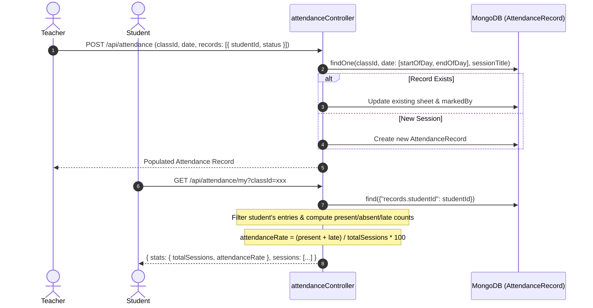

# Phase 08: Backend — Assignments, Student Attendance & Academic Grading

**Execution Date:** 2026-10-01  
**Auditor:** Antigravity Clean Architecture Sentinel  
**Target Repository:** `/Users/chandupa/lms-server`  
**Legacy Reference Repository:** `/Users/chandupa/express`  
**Files Audited (8 files):**
1. `src/models/Assignment.ts`
2. `src/models/AttendanceRecord.ts`
3. `src/models/Grade.ts`
4. `src/models/ExamResult.ts`
5. `src/controllers/assignmentController.ts`
6. `src/controllers/attendanceController.ts`
7. `src/controllers/gradeController.ts`
8. `src/routes/assignmentRoutes.ts`

---

## 1. Executive Summary & Architecture Overview

Phase 08 audits the academic task, attendance tracking, and grading submodules. This domain exhibits a profound architectural divergence between the legacy codebase and the migrated server:

1. **Assignment Subsystem Degradation (Zero-Loss Violation):** In legacy `express`, assignments featured a complete lifecycle with `AssignmentSubmission` persistence, file attachments, deadline checks, teacher grading with score rubrics and feedback, and multi-filter querying. In `lms-server`, the `AssignmentSubmission` model was omitted; `assignmentController.ts:upsertSubmission` was reduced to an unpersisted entitlement check stub, and `req.user._id` is referenced instead of `req.user.userId`.
2. **Attendance Management Innovation:** In `lms-server`, a brand new, highly robust attendance tracking architecture was introduced (`AttendanceRecord.ts` and `attendanceController.ts`). It supports daily session types (`lecture`, `tutorial`, `revision`, `exam`, `other`), status states (`present`, `absent`, `late`, `excused`), class-level analytics, and student-level attendance rates.
3. **Academic Examination & Grading Engine:** Migrated code introduces `ExamResult.ts` and `gradeController.ts`, implementing automated percentage and letter-grade mapping ($A+, A, B, C, S, F$), privacy-preserving student views (masking peer scores while computing class-wide bell-curve averages and individual rank), and dynamic CSV generation. `Grade.ts` serves as an academic grade/cohort taxonomy (`"Grade 10"`, `"Grade 11"`).

---

## 2. Exhaustive Per-File Deep Dive

```
┌────────────────────────────────────────────────────────────────────────────────────────────────────────┐
│                                       PHASE 08: COMPONENT TOPOLOGY                                     │
├───────────────────────────────┬────────────────────────────────────────────────────────────────────────┤
│ Layer                         │ Files / Modules Audited                                                │
├───────────────────────────────┼────────────────────────────────────────────────────────────────────────┤
│ Data Models                   │ Assignment.ts, AttendanceRecord.ts, Grade.ts, ExamResult.ts            │
│ Domain Controllers            │ assignmentController.ts, attendanceController.ts, gradeController.ts  │
│ API Gateways                  │ assignmentRoutes.ts (plus mounted handlers in classRoutes.ts)          │
└───────────────────────────────┴────────────────────────────────────────────────────────────────────────┘
```

---

### File 1: `src/models/Assignment.ts`
- **Primary Responsibility:** Data schema for teacher-created coursework assignments within a specific class.
- **Schema & Indexes:**
  - `class_id`: `Schema.Types.ObjectId` (ref: `'Class'`, required).
  - `title`: `String` (required).
  - `description`: `String` (optional).
  - `due_date`: `Date` (required).
  - `urls`: `[String]` (reference resources or instructions).
  - `file_ids`: `[Schema.Types.ObjectId]` (ref: `'File'`).
  - `max_points`: `Number` (default: 100).
  - `created_by`: `Schema.Types.ObjectId` (ref: `'User'`, required).
  - `is_published`: `Boolean` (default: true).
  - `timestamps: true` (`createdAt`, `updatedAt`).
- **Gaps & Missing Features:**
  - Lacks database indexes on `class_id` and `due_date`. Sorting assignments by `due_date` across large classes will result in collection scans.
  - Does not embed or reference submissions; submissions were historically tracked via `AssignmentSubmission`.

---

### File 2: `src/models/AttendanceRecord.ts`
- **Primary Responsibility:** Modernized daily attendance sheet tracking per-student presence and session metadata for a class.
- **Schema & Embedded Subdocuments:**
  - `StudentAttendanceSchema` (`{ _id: false }`):
    - `studentId`: `Schema.Types.ObjectId` (ref: `'User'`, required).
    - `status`: `enum: ['present', 'absent', 'late', 'excused']` (default: `'present'`, required).
    - `note`: `String` (default: `""`).
  - `AttendanceRecordSchema`:
    - `classId`: `Schema.Types.ObjectId` (ref: `'Class'`, required, indexed).
    - `date`: `Date` (required, indexed).
    - `sessionTitle`: `String` (default: `"Regular Class Session"`).
    - `sessionType`: `enum: ['lecture', 'tutorial', 'revision', 'exam', 'other']` (default: `'lecture'`).
    - `markedBy`: `Schema.Types.ObjectId` (ref: `'User'`, required).
    - `records`: `[StudentAttendanceSchema]`.
    - `notes`: `String` (default: `""`).
  - **Indexes:**
    - Compound index: `{ classId: 1, date: -1 }`.
    - Embedded multikey index: `{ "records.studentId": 1 }`.
- **Design Review:** Excellent normalization and indexing for fast student historical lookups and chronological class sheets.

---

### File 3: `src/models/Grade.ts`
- **Primary Responsibility:** Academic grade/level taxonomy entity (e.g., Grade 10, Grade 11, Advanced Level).
- **Schema:**
  - `name`: `String` (required, unique: true).
  - `is_active`: `Boolean` (default: true).
  - `timestamps: { createdAt: 'created_at', updatedAt: 'updated_at' }`.
- **Role in Platform:**
  - Note: This model represents school year grades/cohorts, NOT student evaluation marks. Student evaluation marks are stored in `ExamResult`.

---

### File 4: `src/models/ExamResult.ts`
- **Primary Responsibility:** Term, monthly, or mock exam recording entity storing student marks and grade classifications.
- **Schema & Subdocuments:**
  - `StudentScoreSchema` (`{ _id: false }`):
    - `studentId`: `Schema.Types.ObjectId` (ref: `'User'`, required).
    - `marksObtained`: `Number` (required).
    - `percentage`: `Number` (required).
    - `grade`: `String` (letter grade: `'A+'`, `'A'`, `'B'`, `'C'`, `'S'`, `'F'`, default: `'F'`).
    - `remarks`: `String` (default: `""`).
  - `ExamResultSchema`:
    - `classId`: `Schema.Types.ObjectId` (ref: `'Class'`, required, indexed).
    - `examTitle`: `String` (required).
    - `examDate`: `Date` (required).
    - `termOrMonth`: `String` (default: `""`).
    - `maxMarks`: `Number` (required, default: 100).
    - `passMarks`: `Number` (default: 40).
    - `isPublished`: `Boolean` (default: false, indexed).
    - `recordedBy`: `Schema.Types.ObjectId` (ref: `'User'`, required).
    - `scores`: `[StudentScoreSchema]`.
    - `notes`: `String` (default: `""`).
  - **Indexes:**
    - `{ classId: 1, isPublished: 1, examDate: -1 }`.
    - `{ "scores.studentId": 1 }`.

---

### File 5: `src/controllers/assignmentController.ts`
- **Primary Responsibility:** Request handlers for assignment authoring, listing, and submissions.
- **Methods:**
  - `createAssignment(req, res)`:
    - Extracts `classId` from `req.params.id`.
    - Uses `req.user._id` (**BUG: `req.user.userId` is the standard set by JWT middleware**).
    - Dynamically imports `Assignment` model and creates assignment document. Returns 201.
  - `getAssignmentsByClass(req, res)`:
    - Extracts `classId` from `req.params.id`.
    - Supports query filters: `upcoming_only`, `past_only`, `page`, `limit`, `sortBy`, `sortOrder`.
    - Returns paginated assignments list with total count and `totalPages`.
  - `upsertSubmission(req, res)`:
    - **CRITICAL STUB / REGRESSION:**
      ```ts
      export const upsertSubmission = async (req: Request, res: Response) => {
        ...
        const hasEntitlement = await hasActiveEntitlement(userId, classId, currentMonth);
        if (!hasEntitlement) {
          return res.status(403).json({ success: false, message: 'No active monthly payment...' });
        }
        res.json({ success: true, message: 'Assignment submitted with entitlement check' });
      };
      ```
    - The code verifies enrollment and monthly entitlement but **NEVER saves files, URLs, or text answers to any database!**
    - Completely lacks the legacy grading, submission retrieval, and feedback lifecycle.

---

### File 6: `src/controllers/attendanceController.ts`
- **Primary Responsibility:** Comprehensive attendance recording, retrieval, and analytical aggregation.
- **Methods:**
  - `markAttendance`: Upserts attendance for a given class, date, and `sessionTitle`. If a sheet already exists for that calendar date and session title, updates `records`; otherwise creates a new `AttendanceRecord`.
  - `updateAttendance`: Updates specific record by `id` with new marks, session type, or dates.
  - `getClassAttendance`: Retrieves full chronological attendance records for a class, filterable by date range (`from`, `to`).
  - `getMyAttendance`: Student-facing endpoint. Populates all attendance records where `records.studentId == userId`. Calculates personal metrics: `totalSessions`, `presentCount`, `absentCount`, `lateCount`, `excusedCount`, and `attendanceRate` (percentage).
  - `getClassAttendanceStats`: Teacher/admin analytics endpoint. Iterates across all class sessions to compute per-student attendance rates and class-wide overall participation rates.

---

### File 7: `src/controllers/gradeController.ts`
- **Primary Responsibility:** Examination marks recording, letter grade assignment, publication toggling, student ranking, and CSV export.
- **Methods:**
  - `calculateGrade(percentage)`:
    $$\ge 85\% \rightarrow \text{A+}, \quad \ge 75\% \rightarrow \text{A}, \quad \ge 65\% \rightarrow \text{B}, \quad \ge 55\% \rightarrow \text{C}, \quad \ge 40\% \rightarrow \text{S}, \quad < 40\% \rightarrow \text{F}$$
  - `recordExamResults`: Validates class, computes percentage and grade per student entry, saves `ExamResult`.
  - `updateExamResults`: Edits existing exam record, recalculates percentages if `maxMarks` or scores are modified.
  - `togglePublishExamResults`: Toggles `isPublished` boolean to control student visibility.
  - `getClassExamResults`:
    - **Privacy Protection:** If user is a student (`!isPrivileged`), forces `isPublished: true`, calculates aggregate stats (`averageScore`, `highestScore`, `lowestScore`, `totalStudents`), and redacts peer scores, returning strictly `myScore`.
    - If privileged (`teacher`, `admin`, `moderator` or `grades.record` permission), returns full student score table.
  - `getMyExamResults`: Returns student's personal report card across classes with calculated rank in class:
    $$\text{rank} = \text{sortedScores.findIndex}(s \implies s.\text{studentId} == \text{userId}) + 1$$
  - `exportClassExamResults`: Generates a formatted CSV file with headers, metadata, student names, percentages, and teacher remarks with `Content-Type: text/csv`.

---

### File 8: `src/routes/assignmentRoutes.ts`
- **Primary Responsibility:** Route declarations for assignment submission.
- **Routes:**
  - `POST /:assignmentId/submit` $\rightarrow$ `requirePermission('assignments.submit')` $\rightarrow$ `assignmentController.upsertSubmission`.
- **Note on Mounting:**
  - `POST /api/classes/:id/assignments` and `GET /api/classes/:id/assignments` are mounted in `src/routes/classRoutes.ts`.
  - No routes exist for `GET /api/assignments/:id`, `PUT /api/assignments/:id`, or `DELETE /api/assignments/:id`.

---

## 3. Workflows & Sequence Diagrams

### 3.1 Attendance Recording & Student Analytics Pipeline


### 3.2 Exam Publishing & Privacy-Preserving Result Retrieval
```mermaid
sequenceDiagram
    autonumber
    actor Teacher
    actor Student
    participant API as gradeController
    participant DB as MongoDB (ExamResult)

    Teacher->>API: POST /api/grades/record (classId, examTitle, maxMarks, scores)
    Note over API: calculateGrade(pct): A+, A, B, C, S, F
    API->>DB: ExamResult.create(isPublished: false)
    Teacher->>API: PATCH /api/grades/:id/publish (isPublished: true)
    API->>DB: ExamResult.findByIdAndUpdate(isPublished: true)

    Student->>API: GET /api/grades/class/:classId
    API->>DB: ExamResult.find(classId, isPublished: true)
    Note over API: Detect role: student (unprivileged)
    Note over API: Compute Class Avg, High, Low, Total Students
    Note over API: REDACT all peer scores; isolate student's myScore
    API-->>Student: { examTitle, stats: { averagePercentage, highestScore }, myScore: { marks, grade } }
```

---

## 4. Legacy Delta & Gaps

| Feature / Pattern | Legacy Repository (`express`) | Migrated Repository (`lms-server`) | Status / Assessment |
| :--- | :--- | :--- | :--- |
| **Assignment Submissions** | Persisted in `AssignmentSubmission` with files, URLs, timestamps. | **Omitted**: `upsertSubmission` is an unpersisted stub returning mock success. | **CRITICAL REGRESSION**: Students cannot submit coursework. |
| **Assignment Grading & Feedback** | `gradeSubmission` updated marks and teacher feedback text. | **Omitted**: No controller or route for assignment grading. | **CRITICAL REGRESSION**: Teachers cannot grade homework. |
| **Assignment CRUD** | Full CRUD: `create`, `list`, `getById`, `update`, `remove`. | Only `createAssignment` and `getAssignmentsByClass` (mounted on `classRoutes.ts`). | **Gaps**: Missing update, delete, and single assignment get endpoints. |
| **Student Attendance Tracking** | **None** (Not implemented in legacy backend). | Fully implemented (`AttendanceRecord.ts`, `attendanceController.ts`). | **NEW CAPABILITY**: Complete session management and student analytics. |
| **Exam Marks & Letter Grading** | **None** (Not implemented in legacy backend). | Fully implemented (`ExamResult.ts`, `gradeController.ts`). | **NEW CAPABILITY**: Auto letter grades, privacy masking, CSV export. |
| **Grade Taxonomy** | Coarse string fields. | Normalized `Grade.ts` model. | **Modernized**: Centralized cohort taxonomy. |

---

## 5. Technical Debt & Critical Vulnerabilities Uncovered

### 1. [CRITICAL BUG / REGRESSION] `AssignmentSubmission` Persistence Missing
- **Location:** `src/controllers/assignmentController.ts:7-34`
- **Issue:** The `upsertSubmission` endpoint merely performs class enrollment and entitlement checks. It does not write any submission document to MongoDB. Students attempting to submit assignments have zero data saved.
- **Remediation:** Port `AssignmentSubmission` model from `express/models/assignmentSubmission.js` into `lms-server/src/models/AssignmentSubmission.ts`, and implement full persistence and file attachment handling in `assignmentController.ts`.

### 2. [DEFECT] `req.user._id` vs `req.user.userId` Inconsistency
- **Location:** `src/controllers/assignmentController.ts:10, 39`
- **Issue:**
  ```ts
  const userId = req.user._id;
  ```
  The JWT authentication middleware sets `req.user = decoded`, where the payload contains `userId`, not `_id`. `userId` evaluates to `undefined`, breaking enrollment matching on line 18 and setting `created_by: undefined` on line 47.
  In contrast, `attendanceController.ts` and `gradeController.ts` defensively handle this via `(req as any).user?.userId || (req as any).user?._id`.
- **Remediation:** Standardize on `const userId = req.user.userId || req.user._id;`.

### 3. [MISSING INDEXES] `Assignment.ts` Query Performance
- **Location:** `src/models/Assignment.ts`
- **Issue:** No index on `class_id` or `due_date`. `getAssignmentsByClass` queries `{ class_id }` and sorts by `due_date`, triggering unindexed sorts on MongoDB.
- **Remediation:** Add `assignmentSchema.index({ class_id: 1, due_date: 1 });`.

---

## 6. Execution Verification Matrix

| Component | Target File | Line Count | Status | Verdict |
| :--- | :--- | :--- | :--- | :--- |
| Model | `src/models/Assignment.ts` | 33 | Audited | Missing Indexes / Compliant schema |
| Model | `src/models/AttendanceRecord.ts` | 62 | Audited | Compliant |
| Model | `src/models/Grade.ts` | 16 | Audited | Compliant |
| Model | `src/models/ExamResult.ts` | 58 | Audited | Compliant |
| Controller | `src/controllers/assignmentController.ts` | 99 | Audited | Critical Bug (Submission stub & `req.user._id`) |
| Controller | `src/controllers/attendanceController.ts` | 299 | Audited | Compliant |
| Controller | `src/controllers/gradeController.ts` | 347 | Audited | Compliant |
| Route | `src/routes/assignmentRoutes.ts` | 11 | Audited | Incomplete (Missing CRUD routes) |

---
**Audit Complete — Phase 08 successfully logged.**
