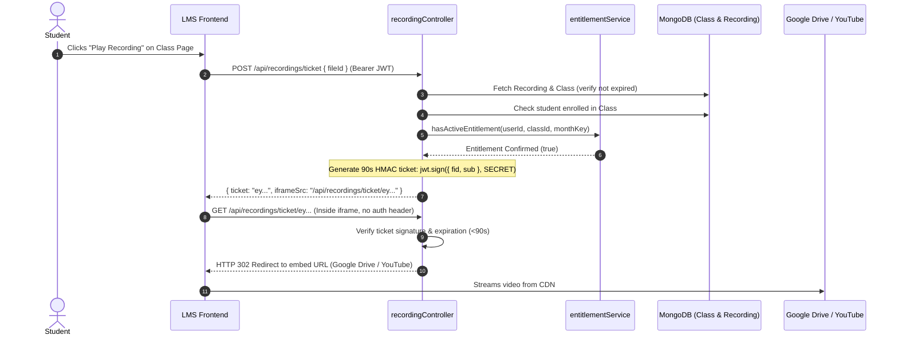

# Phase 09: Backend — Recordings, File Management & Media Streaming

**Execution Date:** 2026-10-01  
**Auditor:** Antigravity Clean Architecture Sentinel  
**Target Repository:** `/Users/chandupa/lms-server`  
**Legacy Reference Repository:** `/Users/chandupa/express`  
**Files Audited (8 files):**
1. `src/models/Recording.ts`
2. `src/models/File.ts`
3. `src/services/recordingService.ts`
4. `src/services/mediaService.ts`
5. `src/controllers/recordingController.ts`
6. `src/controllers/mediaController.ts`
7. `src/routes/recordingsRoutes.ts`
8. `src/routes/mediaRoute.ts`

---

## 1. Executive Summary & Architecture Overview

Phase 09 audits the recording lifecycle, multimedia cloud storage adapters (Supabase & Google Drive), streaming security tickets, and file upload gateways. The system manages classroom lecture recordings, student application receipts, assignments, and white-label media assets.

### Key Architectural Findings
- **High-Performance Signed Ticket Streaming:** In legacy `express`, recordings could be streamed either via ticket redirects or through a heavyweight Node.js byte-proxy (`/proxy/:fileId`). In `lms-server`, the byte-proxy was deprecated ("Fix 3.6: DELETING the byte-proxy flow") in favor of an HMAC-signed 90-second ticket flow (`createPreviewTicketHandler` $\rightarrow$ `previewByTicketPublic`) that redirects directly to YouTube or Google Drive preview embeds, preventing server bandwidth saturation.
- **Overly Broad RBAC Lockout on Generic Media Uploads:** In `mediaRoute.ts`, `requirePermission('recordings.create')` was improperly bound to `POST /api/media/upload`. Because `/media/upload` is the shared upload gateway for all files across the LMS (class applications, assignment attachments, user profiles), students—who lack `recordings.create`—are blocked from uploading application receipts and coursework.
- **Magic Number Validation Hardening:** `mediaController.ts` incorporates dynamic ESM import of `file-type` to inspect file binary buffers for MIME magic numbers, preventing file-extension spoofing and malicious executable uploads.

---

## 2. Exhaustive Per-File Deep Dive

```
┌────────────────────────────────────────────────────────────────────────────────────────────────────────┐
│                                       PHASE 09: COMPONENT TOPOLOGY                                     │
├───────────────────────────────┬────────────────────────────────────────────────────────────────────────┤
│ Layer                         │ Files / Modules Audited                                                │
├───────────────────────────────┼────────────────────────────────────────────────────────────────────────┤
│ Models                        │ Recording.ts, File.ts                                                  │
│ Storage Services              │ recordingService.ts (Google Drive), mediaService.ts (Supabase)         │
│ Controllers                   │ recordingController.ts, mediaController.ts                             │
│ Routes & Gateways             │ recordingsRoutes.ts, mediaRoute.ts                                     │
└───────────────────────────────┴────────────────────────────────────────────────────────────────────────┘
```

---

### File 1: `src/models/Recording.ts`
- **Primary Responsibility:** Metadata catalog for lecture recordings originating from Zoom sessions, Google Drive, or YouTube.
- **Schema & Indexes:**
  - `class_id`: `Schema.Types.ObjectId` (ref: `'Class'`, required).
  - `title`: `String` (required).
  - `driveUrl`: `String` (optional; raw URL).
  - `driveFileId`: `String` (extracted Drive or YouTube ID).
  - `provider`: `enum: ['drive', 'b2', 'processing', 'youtube']`, default: `'drive'`.
  - `storageKey`: `String` (for Backblaze B2/S3 keys).
  - `video_url`: `String` (canonical playback identifier).
  - `zoom_meeting_id`: `String`.
  - `zoom_recording_id`: `String` (unique, sparse index).
  - `uploaded_at`: `Date` (default: `Date.now`).
  - `is_expired`: `Boolean` (default: false).
  - `session_date`: `Date`.
  - `month_key`: `String` (e.g., `'2026-09'` for entitlement matching).
  - `batch_name`: `String`.
  - Timestamps: true.
- **Missing Index Defect:** Lacks index on `{ class_id: 1, session_date: -1 }`. Every class syllabus recording fetch performs an unindexed collection scan.

---

### File 2: `src/models/File.ts`
- **Primary Responsibility:** Central polymorphic file registry for assets stored in Supabase or cloud buckets.
- **Schema:**
  - `ownerType`: `enum: ['class', 'quiz', 'answer', 'enrollment', 'assignment', 'user', 'other']` (required).
  - `ownerId`: `Schema.Types.ObjectId` (optional, refPath: `'ownerType'`).
  - `filePath`: `String` (bucket key, required).
  - `previewUrl`: `String` (public CDN URL).
  - `contentType`: `String` (MIME type).
  - `size`: `Number` (bytes).
  - `expiresAt`: `Date` (optional expiration for temporary files).
  - Timestamps: true.
- **Design Review:** Clean polymorphic association pattern (`ownerType` + `refPath`).

---

### File 3: `src/services/recordingService.ts`
- **Primary Responsibility:** Stream adapter communicating with the Google Drive API.
- **Methods:**
  - `uploadRecordingToDrive(file, title)`: Converts Multer `file.buffer` to a `Readable` stream and invokes `googleDrive.uploadFileToDrive`.
  - `replaceRecordingOnDrive(oldFileId, newFile, newTitle)`: Deletes old file ID, streams new buffer, returns new file ID.
  - `deleteRecordingFromDrive(fileId)`: Removes file from Google Drive.
  - `getRecordingStreamFromDrive(fileId)`: Fetches a readable stream for a file ID.
- **Syntax Anomaly:** Line 1 uses CommonJS `const googleDrive = require('../utils/googleDrive');` instead of TypeScript ESM `import * as googleDrive from '../utils/googleDrive';`.

---

### File 4: `src/services/mediaService.ts`
- **Primary Responsibility:** Supabase Storage bucket interaction and MongoDB `File` record tracking.
- **Methods:**
  - `uploadMedia({ fileBuffer, path, ownerType, ownerId, contentType })`:
    - Uploads buffer to Supabase bucket (`process.env.SUPABASE_BUCKET || 'files'`) with `upsert: true` and `cacheControl: '3600'`.
    - Generates public URL via `supabase.storage.from(BUCKET).getPublicUrl(path)`.
    - Creates `File` record in MongoDB. Returns `{ fileId, filePath, publicUrl }`.
  - `deleteMedia(filePath, bucket)`:
    - Removes object from Supabase bucket via `supabase.storage.from(bucket).remove([filePath])`.
    - Deletes document in MongoDB (`File.deleteOne({ filePath })`).

---

### File 5: `src/controllers/recordingController.ts`
- **Primary Responsibility:** HTTP request handlers for recording CRUD, entitlement access evaluation, and signed streaming tickets.
- **Methods:**
  - `createRecording`: Validates `class_id`, `title`, `driveUrl`, `session_date`. Extracts provider and ID via `getProviderAndId(driveUrl)`. Computes `month_key` using Sri Lanka timezone (`"Asia/Colombo"`). Creates `Recording`.
  - `updateRecording`: Modifies title, link, provider, expiration, or session dates.
  - `deleteRecording` / `expireRecording`: Soft-expires or permanently deletes recording records.
  - `getRecordingById`: Returns raw recording document.
  - `createPreviewTicketHandler`:
    - Validates `fileId` against regex `/^[a-zA-Z0-9_-]{10,}$/`.
    - Extracts `userId` from `(req as any).user?._id` (**BUG: `req.user.userId` can cause 401 Unauthorized if `_id` is missing**).
    - Runs `assertAccess`: checks class enrollment and verifies `hasActiveEntitlement` for the recording's `month_key`.
    - Issues a 90-second signed JWT ticket:
      ```ts
      jwt.sign({ sub: String(userId), fid: fileId, typ: "preview" }, TICKET_SECRET, { expiresIn: "90s" });
      ```
  - `previewByTicketPublic`:
    - Public streaming gate (no Authorization header required).
    - Verifies JWT ticket against `TICKET_SECRET`.
    - Redirects (HTTP 302) to `https://www.youtube.com/embed/${fileId}?rel=0` for YouTube, or `drivePreviewUrl(fileId)` for Google Drive.

---

### File 6: `src/controllers/mediaController.ts`
- **Primary Responsibility:** Generic file upload and deletion controller with binary magic number verification.
- **Methods:**
  - `upload`:
    - Inspects `req.file.buffer` using `file-type` (`fileTypeFromBuffer`) to deduce true MIME type from magic numbers.
    - Sanitizes original file name by replacing whitespace with dashes.
    - Formats canonical storage path: `${ownerType}/${ownerId}/${Date.now()}-${safeName}`.
    - Calls `mediaService.uploadMedia`.
  - `remove`:
    - Validates `filePath` parameter and removes object from Supabase storage and MongoDB.

---

### File 7: `src/routes/recordingsRoutes.ts`
- **Primary Responsibility:** Route declarations and RBAC authorization for video recordings.
- **Permission Bindings:**
  - `POST /` $\rightarrow$ `requirePermission('recordings.create')`
  - `PUT /:id` $\rightarrow$ `requirePermission('recordings.create')`
  - `DELETE /:id` $\rightarrow$ `requirePermission('recordings.delete')`
  - `PUT /:id/expire` $\rightarrow$ `requirePermission('recordings.create')`
  - `POST /ticket` $\rightarrow$ `requirePermission('recordings.read')`
  - `GET /ticket/:ticket` $\rightarrow$ Public endpoint (validates signed ticket)
  - `GET /:id` $\rightarrow$ `requirePermission('recordings.read')`
- **Architectural Cleanup:** The obsolete byte-proxy endpoint (`/proxy/:fileId`) that bogged down the legacy server was intentionally dropped.

---

### File 8: `src/routes/mediaRoute.ts`
- **Primary Responsibility:** Route declarations for generic file uploads.
- **Routes & RBAC:**
  - `POST /upload` $\rightarrow$ `requirePermission('recordings.create')` (**CRITICAL BUG**)
  - `DELETE /delete` $\rightarrow$ `requirePermission('recordings.delete')` (**CRITICAL BUG**)
- **Critical Flaw:** Binding `recordings.create` and `recordings.delete` to the generic media route prevents students from uploading application forms and homework submissions.

---

## 3. Workflows & Sequence Diagrams

### 3.1 Secure Ticket-Based Recording Playback


---

## 4. Legacy Delta & Gaps

| Feature / Pattern | Legacy Repository (`express`) | Migrated Repository (`lms-server`) | Status / Assessment |
| :--- | :--- | :--- | :--- |
| **Video Streaming Architecture** | Supported both byte-proxying (`/proxy/:fileId`) and ticket redirects. | Dropped byte-proxying; strictly uses signed 90s ticket redirect. | **Improved**: Massive performance and memory optimization. |
| **Media Upload Permissions** | Open upload with input schema validation. | Gated by `requirePermission('recordings.create')`. | **CRITICAL BUG**: Blocks students from uploading assignments & application proofs. |
| **MIME Validation** | Basic extension and multer file filter. | Binary magic number inspection via `file-type` buffer analysis. | **Security Improvement**: Prevents MIME forgery. |
| **Recording Expiration** | Simple flag. | Integrated with timezone-aware `month_key` and active monthly entitlement checks. | **Improved**: Tightly coupled with financial subscriptions. |

---

## 5. Technical Debt & Critical Vulnerabilities Uncovered

### 1. [CRITICAL BUG] Generic Media Upload Gated by `recordings.create`
- **Location:** `src/routes/mediaRoute.ts:13, 20`
- **Issue:**
  ```ts
  router.post('/upload', requirePermission('recordings.create'), uploadMiddleware.single('file'), upload);
  router.delete('/delete', requirePermission('recordings.delete'), remove);
  ```
  `/api/media/upload` is called by `apply-class.tsx` and `class-assignments.tsx` in `lms-client`. Students have `classes.apply` and `assignments.submit`, but NEVER `recordings.create`.
- **Consequence:** Students are strictly prevented from uploading class application receipts and assignment submissions (HTTP 403 Forbidden).
- **Remediation:** Replace with `authenticate` middleware, or gate by contextual permissions (`classes.apply`, `assignments.submit`, `recordings.create`).

### 2. [DEFECT] `req.user._id` in `createPreviewTicketHandler`
- **Location:** `src/controllers/recordingController.ts:191`
- **Issue:**
  ```ts
  const userId = (req as any).user?._id;
  ```
  JWT token payload sets `userId`. If `_id` is undefined, students receive HTTP 401 Unauthorized even when presenting a valid token.
- **Remediation:** Standardize to `const userId = (req as any).user?.userId || (req as any).user?._id;`.

### 3. [MISSING DATABASE INDEX] `Recording.ts` Class Lookup
- **Location:** `src/models/Recording.ts`
- **Issue:** Class recording lists filter by `{ class_id }` and sort by `session_date: -1`. The collection lacks a compound index on `{ class_id: 1, session_date: -1 }`.
- **Remediation:** Add `recordingSchema.index({ class_id: 1, session_date: -1 });`.

---

## 6. Execution Verification Matrix

| Component | Target File | Line Count | Status | Verdict |
| :--- | :--- | :--- | :--- | :--- |
| Model | `src/models/Recording.ts` | 46 | Audited | Missing Compound Index |
| Model | `src/models/File.ts` | 45 | Audited | Compliant |
| Service | `src/services/recordingService.ts` | 44 | Audited | CJS Require anomaly / Functional |
| Service | `src/services/mediaService.ts` | 54 | Audited | Compliant |
| Controller | `src/controllers/recordingController.ts` | 240 | Audited | `req.user._id` bug in ticket creation |
| Controller | `src/controllers/mediaController.ts` | 63 | Audited | Hardened (Magic numbers) |
| Route | `src/routes/recordingsRoutes.ts` | 57 | Audited | Compliant |
| Route | `src/routes/mediaRoute.ts` | 25 | Audited | Critical Bug (Overly restrictive RBAC) |

---
**Audit Complete — Phase 09 successfully logged.**
