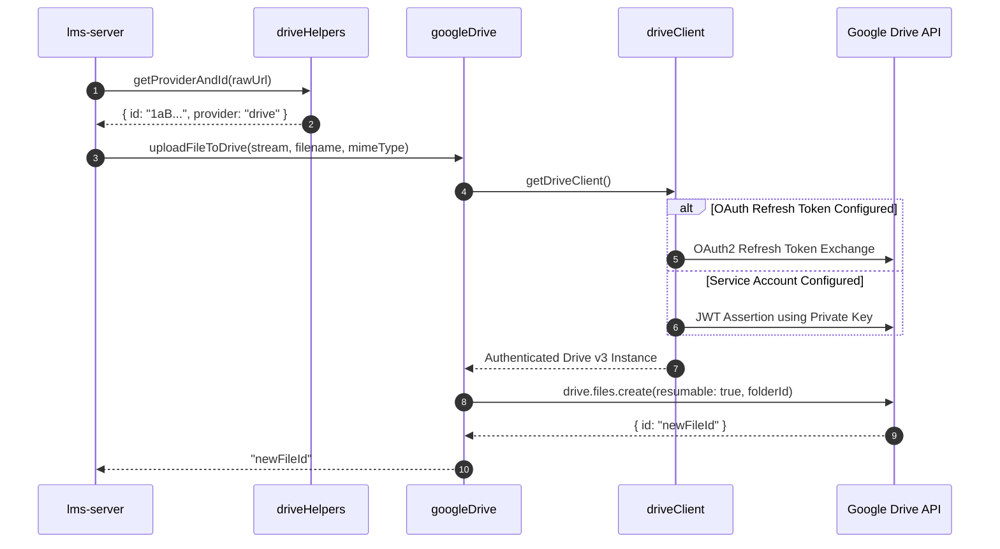

# Phase 10: Backend — Cloud Storage Adapters, Utilities & Tracking Routes

**Execution Date:** 2026-10-01  
**Auditor:** Antigravity Clean Architecture Sentinel  
**Target Repository:** `/Users/chandupa/lms-server`  
**Legacy Reference Repository:** `/Users/chandupa/express`  
**Files Audited (7 files):**
1. `src/utils/driveClient.ts`
2. `src/utils/driveHelpers.ts`
3. `src/utils/googleDrive.ts`
4. `src/utils/supabaseClient.ts`
5. `src/utils/monthKey.ts`
6. `src/routes/attendanceRoutes.ts`
7. `src/routes/gradeRoutes.ts`

---

## 1. Executive Summary & Architecture Overview

Phase 10 audits the low-level cloud storage integration adapters (Google Drive & Supabase), calendar/timezone utility helpers, and the HTTP route mappings for academic attendance and examination grading.

### Architectural Highlights
- **Dual Cloud Provider Architecture:** The LMS leverages a hybrid multi-cloud storage topology:
  - **Google Drive:** Utilized for high-volume, long-form video lecture storage and streaming. `driveClient.ts` provides fallback authentication between Google OAuth 2.0 (with refresh tokens) and Google Service Account JWTs, handling private key newline sanitization and personal Drive folder quota workarounds.
  - **Supabase Storage:** Utilized for fast object storage (student profile pictures, class promotional cover art, assignment PDFs, and application proof receipts) configured with serverless non-persisting authentication sessions.
- **Timezone-Aware Monthly Subscriptions (`monthKey.ts`):** Enforces canonical `YYYY-MM` month key calculations standardized on Sri Lankan Standard Time (`"Asia/Colombo"`), preventing timezone drift between billing cycles and entitlement checks.
- **Critical Data Privacy Finding in Grade Reporting:** An audit of `seedPermissions.ts` against `gradeRoutes.ts` and `gradeController.ts` uncovered a significant privilege escalation vulnerability: the `grades.exportReport` permission is granted to the default `student` role, enabling students to download full CSV reports containing all peers' names, emails, exam scores, and teacher remarks.

---

## 2. Exhaustive Per-File Deep Dive

```
┌────────────────────────────────────────────────────────────────────────────────────────────────────────┐
│                                       PHASE 10: COMPONENT TOPOLOGY                                     │
├───────────────────────────────┬────────────────────────────────────────────────────────────────────────┤
│ Layer                         │ Files / Modules Audited                                                │
├───────────────────────────────┼────────────────────────────────────────────────────────────────────────┤
│ Google Drive Adapters         │ driveClient.ts, driveHelpers.ts, googleDrive.ts                        │
│ Cloud & Time Utilities        │ supabaseClient.ts, monthKey.ts                                         │
│ Academic Tracking Routes      │ attendanceRoutes.ts, gradeRoutes.ts                                    │
└───────────────────────────────┴────────────────────────────────────────────────────────────────────────┘
```

---

### File 1: `src/utils/driveClient.ts`
- **Primary Responsibility:** Factory creating an authenticated Google Drive API client (`googleapis.drive('v3')`) supporting OAuth2 and Service Account JWT credentials.
- **Authentication Fallback Sequence:**
  1. **OAuth 2.0 Credentials:** Checks `GOOGLE_OAUTH_CLIENT_ID`, `GOOGLE_OAUTH_CLIENT_SECRET`, and `GOOGLE_OAUTH_REFRESH_TOKEN` in `process.env`. If absent, inspects filesystem at `oauth2_credentials.json` and `utils/tokens.json`.
  2. **Service Account Credentials:** Checks `GOOGLE_DRIVE_SERVICE_ACCOUNT_PATH` / `GOOGLE_APPLICATION_CREDENTIALS` file path. If absent, falls back to `GOOGLE_CLIENT_EMAIL` and `GOOGLE_PRIVATE_KEY` environment variables.
  3. **Private Key Cleaning:** Automatically strips surrounding quotation marks and converts literal `\n` character sequences into standard newline bytes.
  4. **Target Folder Resolution:** Returns `GOOGLE_DRIVE_FOLDER_ID` for shared drive targeting.
- **Code Quality & Syntax:**
  - Prefaced with `// @ts-nocheck` and exports via CommonJS `module.exports = { getDriveClient, getDriveFolderId }`. Needs refactoring to idiomatic TypeScript ESM exports.

---

### File 2: `src/utils/driveHelpers.ts`
- **Primary Responsibility:** Regex and URL parser extracting canonical IDs and providers from arbitrary user-provided video links.
- **Parsing Logic:**
  - `getProviderAndId(input)`:
    - If bare alphanumeric string of length 11 $\rightarrow$ classifies as `'youtube'`.
    - If bare alphanumeric string of length $>11$ $\rightarrow$ classifies as `'drive'`.
    - If URL with host `youtube.com` or `youtu.be` $\rightarrow$ parses pathname or `?v=` parameter, returning `{ id, provider: 'youtube' }`.
    - If URL matches `/file/d/([a-zA-Z0-9_-]{10,})` or `?id=` parameter $\rightarrow$ returns `{ id, provider: 'drive' }`.
  - `extractDriveFileId(input)`: Convenience wrapper returning strictly the ID.
  - `drivePreviewUrl(fileId)`: Generates `https://drive.google.com/file/d/${fileId}/preview`.

---

### File 3: `src/utils/googleDrive.ts`
- **Primary Responsibility:** Drive API operations: upload, metadata inspection, range-request streaming, and deletion.
- **Methods:**
  - `uploadFileToDrive(fileStream, filename, mimeType)`: Creates file with `resumable: true` and `supportsAllDrives: true`. Traps Google API quota errors (`"Service Accounts do not have storage quota"`) and outputs helpful configuration diagnostics.
  - `getDriveFileMeta(fileId)`: Fetches ownership, name, mimeType, and trashed status.
  - `getDriveStream(fileId, rangeHeader)`: Streams media bytes with support for HTTP `Range` headers (e.g., `bytes=0-`).
  - `deleteFileFromDrive(fileId)`: Permanently deletes file via `drive.files.delete`.
- **Code Quality:**
  - Prefaced with `// @ts-nocheck` and uses CommonJS exports.

---

### File 4: `src/utils/supabaseClient.ts`
- **Primary Responsibility:** Supabase Storage client initializer.
- **Implementation:**
  ```ts
  export const supabase = url && serviceRoleKey ? createClient(url, serviceRoleKey, {
    auth: {
      autoRefreshToken: false,
      persistSession: false,
    },
  }) : null;
  ```
- **Design Review:** Disabling `persistSession` and `autoRefreshToken` is appropriate for stateless Node.js server environments.

---

### File 5: `src/utils/monthKey.ts`
- **Primary Responsibility:** Generates canonical `YYYY-MM` month strings formatted to Sri Lankan time.
- **Implementation:**
  ```ts
  export function monthKey(date: Date = new Date(), tz: string = 'Asia/Colombo'): string {
    const fmt = new Intl.DateTimeFormat('en-CA', { timeZone: tz, year: 'numeric', month: '2-digit' });
    const parts = Object.fromEntries(fmt.formatToParts(date).map(p => [p.type, p.value]));
    return `${parts.year}-${parts.month}`; // "YYYY-MM"
  }
  ```
- **Significance:** Standardizes date math across financial subscription validation, class recording entitlement boundaries, and attendance monthly aggregations.

---

### File 6: `src/routes/attendanceRoutes.ts`
- **Primary Responsibility:** HTTP route declarations and permission gating for student attendance tracking.
- **Mounted Path:** `/api/attendance` (configured in `src/app.ts:53`).
- **Endpoints & RBAC Permissions:**
  - `POST /` $\rightarrow$ `requirePermission('attendance.mark')` $\rightarrow$ `markAttendance`
  - `PUT /:id` $\rightarrow$ `requirePermission('attendance.mark')` $\rightarrow$ `updateAttendance`
  - `GET /class/:classId` $\rightarrow$ `requirePermission('attendance.view')` $\rightarrow$ `getClassAttendance`
  - `GET /class/:classId/stats` $\rightarrow$ `requirePermission('attendance.view')` $\rightarrow$ `getClassAttendanceStats`
  - `GET /my` $\rightarrow$ `authenticate` $\rightarrow$ `getMyAttendance`
- **Audit Verdict:** Fully secured. Gated by explicit attendance permissions and personal user context.

---

### File 7: `src/routes/gradeRoutes.ts`
- **Primary Responsibility:** HTTP route declarations and permission gating for exam marks and grade reporting.
- **Mounted Path:** `/api/grades` (configured in `src/app.ts:54`).
- **Endpoints & RBAC Permissions:**
  - `POST /` $\rightarrow$ `requirePermission('grades.record')` $\rightarrow$ `recordExamResults`
  - `PUT /:id` $\rightarrow$ `requirePermission('grades.record')` $\rightarrow$ `updateExamResults`
  - `PUT /:id/publish` $\rightarrow$ `requirePermission('grades.publish')` $\rightarrow$ `togglePublishExamResults`
  - `GET /class/:classId` $\rightarrow$ `requirePermission('grades.view')` $\rightarrow$ `getClassExamResults`
  - `GET /export/:id` $\rightarrow$ `requirePermission('grades.exportReport')` $\rightarrow$ `exportClassExamResults`
  - `GET /my` $\rightarrow$ `authenticate` $\rightarrow$ `getMyExamResults`
- **Security Vulnerability:** Gating `/export/:id` with `grades.exportReport` allows unauthorized student data downloads due to permissive seeding in `seedPermissions.ts`.

---

## 3. Workflows & Sequence Diagrams

### 3.1 Multi-Tier Google Drive Authentication & Upload Flow


---

## 4. Legacy Delta & Gaps

| Feature / Pattern | Legacy Repository (`express`) | Migrated Repository (`lms-server`) | Status / Assessment |
| :--- | :--- | :--- | :--- |
| **Drive Client Code Style** | Native CommonJS modules. | CommonJS mixed with TypeScript (`// @ts-nocheck`). | **Technical Debt**: Requires full ESM conversion. |
| **Drive Helpers URL Parsing** | Split across regex matchers in controllers. | Centralized in `driveHelpers.ts` supporting YouTube & Drive. | **Improved**: Robust single source of truth for URL parsing. |
| **Timezone Normalization** | Inconsistent UTC vs local offsets. | Enforced Sri Lankan Standard Time (`Asia/Colombo`) via `monthKey.ts`. | **Modernized**: Guarantees billing/entitlement alignment. |
| **Attendance & Grade Routes** | Not present in legacy backend. | Implemented with fine-grained RBAC permissions. | **NEW CAPABILITY**: Complete academic record tracking. |

---

## 5. Technical Debt & Critical Vulnerabilities Uncovered

### 1. [CRITICAL PRIVILEGE ESCALATION] Student Access to Class-Wide CSV Export
- **Location:** `src/routes/gradeRoutes.ts:18` & `src/scripts/seedPermissions.ts:136`
- **Issue:**
  In `seedPermissions.ts`, the default `studentKeys` array includes:
  ```ts
  'grades.exportReport', // Line 136
  ```
  `gradeRoutes.ts:18` gates the CSV export endpoint with this permission:
  ```ts
  router.get("/export/:id", requirePermission("grades.exportReport"), exportClassExamResults);
  ```
  `exportClassExamResults` in `gradeController.ts:297-346` dumps every student's full name, email address, raw score, percentage, grade, and teacher remarks into an unmasked CSV spreadsheet.
- **Consequence:** Any enrolled student can execute `GET /api/grades/export/:id` and download a full class roster containing sensitive academic records of all their classmates.
- **Remediation:** Remove `'grades.exportReport'` from `studentKeys` in `seedPermissions.ts`. Restrict export access strictly to teachers, moderators, and administrators.

### 2. [TECHNICAL DEBT] CommonJS Legacy Residue in TypeScript Server
- **Location:** `src/utils/driveClient.ts` & `src/utils/googleDrive.ts`
- **Issue:** Both files utilize `// @ts-nocheck`, `require()`, and `module.exports`, bypassing TypeScript compiler type checks and violating clean code architecture standards.
- **Remediation:** Convert to native TypeScript ES module syntax (`import { google } from 'googleapis'`, typed interfaces, and named exports).

---

## 6. Execution Verification Matrix

| Component | Target File | Line Count | Status | Verdict |
| :--- | :--- | :--- | :--- | :--- |
| Utility | `src/utils/driveClient.ts` | 246 | Audited | Technical Debt (`@ts-nocheck` / CommonJS) |
| Utility | `src/utils/driveHelpers.ts` | 35 | Audited | Compliant |
| Utility | `src/utils/googleDrive.ts` | 134 | Audited | Technical Debt (`@ts-nocheck` / CommonJS) |
| Utility | `src/utils/supabaseClient.ts` | 16 | Audited | Compliant |
| Utility | `src/utils/monthKey.ts` | 6 | Audited | Compliant |
| Route | `src/routes/attendanceRoutes.ts` | 20 | Audited | Compliant |
| Route | `src/routes/gradeRoutes.ts` | 22 | Audited | Critical Security Defect (Student export leak) |

---
**Audit Complete — Phase 10 successfully logged.**
