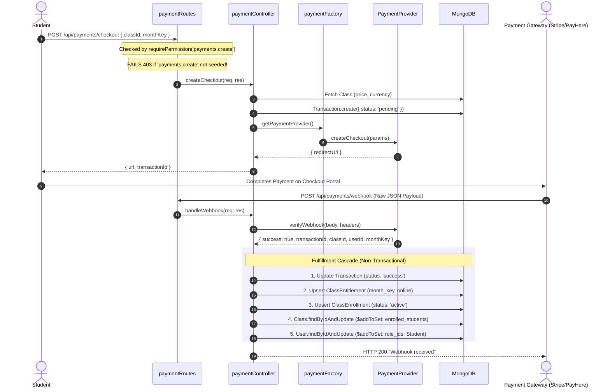

# Phase 11: Backend — Payment Gateways & Financial Transactions

**Execution Date:** 2026-10-01  
**Auditor:** Antigravity Clean Architecture Sentinel  
**Target Repository:** `/Users/chandupa/lms-server`  
**Legacy Reference Repository:** `/Users/chandupa/express`  
**Files Audited (7 files):**
1. `src/models/Transaction.ts`
2. `src/services/payments/paymentProvider.ts`
3. `src/services/payments/paymentFactory.ts`
4. `src/services/payments/stripeProvider.ts`
5. `src/services/payments/payhereProvider.ts`
6. `src/controllers/payments/paymentController.ts`
7. `src/routes/payments/paymentRoutes.ts`

---

## 1. Executive Summary & Architecture Overview

Phase 11 audits the newly introduced online checkout and webhook processing architecture. In the legacy platform (`express`), student access was granted strictly via manual admission slips (`ClassApplication`). In `lms-server`, an automated financial infrastructure was designed to support real-time digital payments, monthly entitlement provisioning, and immediate course activation.

### Key Architectural Findings
- **Unseeded RBAC Permission Locking Checkout:** In `paymentRoutes.ts:7`, `POST /checkout` is gated by `requirePermission("payments.create")`. However, an audit of `seedPermissions.ts` reveals that `"payments.create"` was never added to `CANONICAL_PERMISSIONS` and was never granted to the `Student` role. Any student attempting to pay for a class receives an immediate HTTP 403 Forbidden.
- **Mock Payment Providers in Production:** Both `StripeProvider.ts` and `PayHereProvider.ts` are skeleton stubs. They return mock checkout URLs (`https://checkout.stripe.mock/...`) and accept webhooks with spoofed signatures, creating a severe vulnerability where arbitrary class entitlements could be granted without payment verification.
- **Complex Non-Transactional Fulfillment Cascade:** When a webhook succeeds, `paymentController.ts:handleWebhook` performs five sequential database updates across `Transaction`, `ClassEntitlement`, `ClassEnrollment`, `Class`, and `User` without a MongoDB ACID transaction session (`session.withTransaction`).

---

## 2. Exhaustive Per-File Deep Dive

```
┌────────────────────────────────────────────────────────────────────────────────────────────────────────┐
│                                       PHASE 11: COMPONENT TOPOLOGY                                     │
├───────────────────────────────┬────────────────────────────────────────────────────────────────────────┤
│ Layer                         │ Files / Modules Audited                                                │
├───────────────────────────────┼────────────────────────────────────────────────────────────────────────┤
│ Financial Ledger Model        │ Transaction.ts                                                         │
│ Payment Gateway Providers     │ paymentProvider.ts, paymentFactory.ts, stripeProvider.ts,              │
│                               │ payhereProvider.ts                                                     │
│ Controller & Routing Gateway  │ paymentController.ts, paymentRoutes.ts                                 │
└───────────────────────────────┴────────────────────────────────────────────────────────────────────────┘
```

---

### File 1: `src/models/Transaction.ts`
- **Primary Responsibility:** Ledger record tracking payment attempts, gateway references, and fulfillment states.
- **Schema & Indexes:**
  - `user_id`: `Schema.Types.ObjectId` (ref: `'User'`, required).
  - `class_id`: `Schema.Types.ObjectId` (ref: `'Class'`, required).
  - `month_key`: `String` (required, e.g., `'2026-09'`).
  - `gateway`: `enum: ['stripe', 'payhere', 'manual']` (required).
  - `gateway_transaction_id`: `String` (optional; external reference).
  - `amount`: `Number` (required).
  - `currency`: `String` (required; default: `'LKR'`).
  - `status`: `enum: ['pending', 'success', 'failed']`, default: `'pending'`.
  - `created_at` / `updated_at`: `Date` (default: `Date.now`).
  - Index: `{ user_id: 1, class_id: 1, month_key: 1 }`.
- **Defects:**
  - Lacks a unique constraint or index on `gateway_transaction_id`. Duplicate webhook deliveries could create race conditions or redundant entitlement overwrites.

---

### File 2: `src/services/payments/paymentProvider.ts`
- **Primary Responsibility:** Common TypeScript contract defining provider interactions.
- **Interfaces:**
  - `CheckoutParams`: `{ classId?, monthKey?, productId?, userId, amount, currency }`.
  - `WebhookResult`: `{ success: boolean, transactionId: string, monthKey?, userId: string, classId?, productId? }`.
  - `PaymentProvider`:
    - `createCheckout(params: CheckoutParams): Promise<{ redirectUrl: string }>`
    - `verifyWebhook(rawBody: any, headers: any): Promise<WebhookResult>`
- **Design Review:** Well-structured interface decoupling controllers from vendor-specific payment APIs.

---

### File 3: `src/services/payments/paymentFactory.ts`
- **Primary Responsibility:** Strategy factory resolving active payment provider at runtime.
- **Implementation:**
  - Inspects `process.env.ACTIVE_PAYMENT_GATEWAY`.
  - If `'payhere'`, instantiates `PayHereProvider`.
  - Defaults to `StripeProvider`.

---

### File 4: `src/services/payments/stripeProvider.ts`
- **Primary Responsibility:** Stripe Checkout Session creator and webhook validator.
- **Implementation Status:** **MOCK STUB**
  - `createCheckout`: Returns hardcoded `https://checkout.stripe.mock/${params.classId}`.
  - `verifyWebhook`: Does not instantiate the Stripe SDK or verify `stripe-signature` via `stripe.webhooks.constructEvent`. It parses the raw buffer and blindly returns `success: true`.

---

### File 5: `src/services/payments/payhereProvider.ts`
- **Primary Responsibility:** Sri Lankan PayHere payment gateway integration.
- **Implementation Status:** **MOCK STUB**
  - `createCheckout`: Returns hardcoded `https://sandbox.payhere.lk/pay/checkout`.
  - `verifyWebhook`: Imports `crypto` but never calculates or compares the PayHere MD5 checksum (`md5(merchant_id + order_id + amount + currency + md5(merchant_secret))`). Blindly returns `success: true`.

---

### File 6: `src/controllers/payments/paymentController.ts`
- **Primary Responsibility:** Orchestration of student checkouts and webhook fulfillment cascades.
- **Methods:**
  - `createCheckout(req, res)`:
    - Reads `classId` and `monthKey` from `req.body`, `userId` from `req.user?.userId`.
    - Fetches class pricing and currency.
    - Creates a `pending` `Transaction` document.
    - Requests checkout URL from active provider and returns `{ url, transactionId }`.
  - `handleWebhook(req, res)`:
    - Calls `provider.verifyWebhook(req.body, req.headers)`.
    - If `result.success` and `result.classId`:
      1. Marks `Transaction` status as `'success'`.
      2. Upserts `ClassEntitlement` (`month_key`, `source: 'online'`).
      3. Upserts `ClassEnrollment` (`status: 'active'`).
      4. Pushes `userId` to `Class.enrolled_students` via `$addToSet`.
      5. Pushes `studentRole._id` to `User.role_ids` via `$addToSet`.
- **Vulnerability:** If webhook verification is mocked or spoofed, attackers can self-authorize unlimited free access to any class.

---

### File 7: `src/routes/payments/paymentRoutes.ts`
- **Primary Responsibility:** Route declarations and middleware binding for payments.
- **Mounted Path:** `/api/payments` (configured in `src/app.ts:49`).
- **Endpoints:**
  - `POST /checkout` $\rightarrow$ `requirePermission('payments.create')` $\rightarrow$ `createCheckout` (**CRITICAL BUG**)
  - `POST /webhook` $\rightarrow$ `express.raw({ type: 'application/json' })` $\rightarrow$ `handleWebhook`

---

## 3. Workflows & Sequence Diagrams

### 3.1 Digital Checkout & Fulfillment Pipeline


---

## 4. Legacy Delta & Gaps

| Feature / Pattern | Legacy Repository (`express`) | Migrated Repository (`lms-server`) | Status / Assessment |
| :--- | :--- | :--- | :--- |
| **Payment Subsystem** | No automated digital payments; enrollment occurred via manual bank receipts (`classApplication`). | Full digital payment gateway architecture (`Stripe`, `PayHere`). | **NEW SUBSYSTEM**: Foundation for automated student subscriptions. |
| **Stripe Integration** | None. | Stubbed mock (`StripeProvider.ts`). | **Incomplete**: Production SDK integration required. |
| **PayHere Integration** | None. | Stubbed mock (`PayHereProvider.ts`). | **Incomplete**: Production MD5 verification required. |
| **RBAC Authorization** | Role strings. | Gated by `payments.create`. | **CRITICAL BUG**: Permission was omitted from `CANONICAL_PERMISSIONS`. |

---

## 5. Technical Debt & Critical Vulnerabilities Uncovered

### 1. [CRITICAL SHOWSTOPPER] Unseeded Permission `payments.create`
- **Location:** `src/routes/payments/paymentRoutes.ts:7` & `src/scripts/seedPermissions.ts:51-54`
- **Issue:**
  `paymentRoutes.ts` gates `/checkout` with `requirePermission("payments.create")`. In `seedPermissions.ts`, the only payment permissions are:
  - `payments.manage`
  - `payments.viewOwn`
  `payments.create` was never declared or granted to students.
- **Consequence:** 100% of student checkouts fail with HTTP 403 Forbidden.
- **Remediation:** Add `payments.create` to `CANONICAL_PERMISSIONS` and grant it to `studentKeys` in `seedPermissions.ts`, or gate the route with `authenticate` / `requirePermission('classes.apply')`.

### 2. [CRITICAL SECURITY HOLE] Mock Webhook Verification Bypasses
- **Location:** `src/services/payments/stripeProvider.ts:22` & `payhereProvider.ts:23`
- **Issue:** Both providers return `{ success: true }` without verifying cryptographic signatures.
- **Consequence:** Any unauthenticated external client can POST to `/api/payments/webhook` with an arbitrary `userId` and `classId` to automatically gain active enrollments and entitlements for free.
- **Remediation:** Implement real Stripe signature verification (`stripe.webhooks.constructEvent`) and PayHere MD5 checksum comparison.

### 3. [DATA INTEGRITY] Multi-Document Mutation Without MongoDB Transaction
- **Location:** `src/controllers/payments/paymentController.ts:55-86`
- **Issue:** Five independent mutations execute sequentially without a transaction session. A crash after step 2 or 3 leaves entitlements created without enrolling the student in the class.
- **Remediation:** Wrap steps 1–5 in `mongoose.startSession()` with `session.withTransaction()`.

---

## 6. Execution Verification Matrix

| Component | Target File | Line Count | Status | Verdict |
| :--- | :--- | :--- | :--- | :--- |
| Model | `src/models/Transaction.ts` | 20 | Audited | Missing unique transaction ID index |
| Interface | `src/services/payments/paymentProvider.ts` | 23 | Audited | Compliant |
| Factory | `src/services/payments/paymentFactory.ts` | 18 | Audited | Compliant |
| Provider | `src/services/payments/stripeProvider.ts` | 41 | Audited | Mock Implementation / Security Risk |
| Provider | `src/services/payments/payhereProvider.ts` | 42 | Audited | Mock Implementation / Security Risk |
| Controller | `src/controllers/payments/paymentController.ts` | 94 | Audited | Non-transactional cascade |
| Route | `src/routes/payments/paymentRoutes.ts` | 11 | Audited | Critical Bug (Unseeded `payments.create`) |

---
**Audit Complete — Phase 11 successfully logged.**
