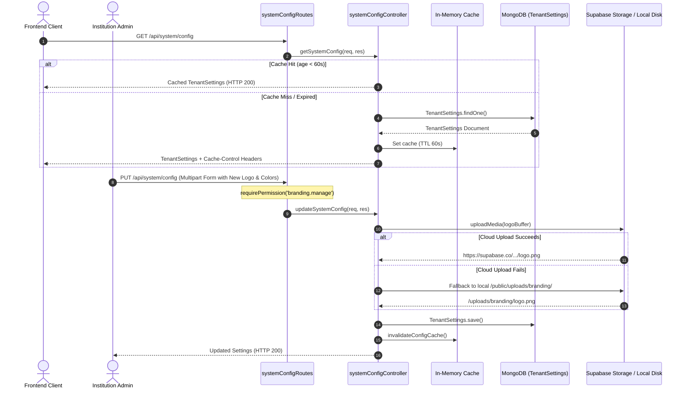

# Phase 12: Backend — White-Label Branding & Site Customization Engine

**Execution Date:** 2026-10-01  
**Auditor:** Antigravity Clean Architecture Sentinel  
**Target Repository:** `/Users/chandupa/lms-server`  
**Legacy Reference Repository:** `/Users/chandupa/express`  
**Files Audited (7 files):**
1. `src/models/TenantSettings.ts`
2. `src/models/SiteSettings.ts`
3. `src/controllers/systemConfigController.ts`
4. `src/controllers/customizationController.ts`
5. `src/routes/systemConfigRoutes.ts`
6. `src/routes/customizationRoutes.ts`
7. `src/scripts/migrateCustomization.ts`

---

## 1. Executive Summary & Architecture Overview

Phase 12 audits the white-label branding, theme customization, and CMS page configuration engine. In legacy `express`, branding assets, institute names, instructor credentials, and course categorization were hardcoded into frontend markup. In `lms-server`, a complete dynamic white-labeling subsystem was engineered.

### Key Architectural Findings
- **Dual Singleton Settings Topology:** The subsystem operates two distinct singleton schemas:
  - `TenantSettings`: Core institution identity (platform name, instructor name, support contacts, theme color hex codes, and brand image assets: logo, favicon, hero, avatar).
  - `SiteSettings`: Dynamic CMS landing page schema storing mixed JSON structures for navigation, hero banners, feature grids, testimonials, and FAQs.
- **In-Memory & HTTP Edge Caching:** `systemConfigController.ts` implements a 60-second in-memory cache (`cachedConfig`) and sets HTTP headers `Cache-Control: public, max-age=60, stale-while-revalidate=120`, minimizing database hits for high-frequency branding lookups.
- **Graceful Asset Storage Fallback:** When updating branding assets, `systemConfigController.ts` attempts to upload media to Supabase Storage; if cloud credentials or connectivity fail, it falls back to writing directly to the server's local disk (`public/uploads/branding`) without interrupting the administrative save.
- **Taxonomy Normalization Pipeline:** `migrateCustomization.ts` scans existing `classes` and `quizzes` collections, extracts legacy free-text strings for subjects and grades, instantiates normalized `Subject` and `Grade` records, and rewrites the parent documents to store relational MongoDB `ObjectId` references.

---

## 2. Exhaustive Per-File Deep Dive

```
┌────────────────────────────────────────────────────────────────────────────────────────────────────────┐
│                                       PHASE 12: COMPONENT TOPOLOGY                                     │
├───────────────────────────────┬────────────────────────────────────────────────────────────────────────┤
│ Layer                         │ Files / Modules Audited                                                │
├───────────────────────────────┼────────────────────────────────────────────────────────────────────────┤
│ Branding & CMS Schemas        │ TenantSettings.ts, SiteSettings.ts                                     │
│ Configuration Controllers     │ systemConfigController.ts, customizationController.ts                  │
│ API Gateways & Routes         │ systemConfigRoutes.ts, customizationRoutes.ts                          │
│ Data Migration Script         │ migrateCustomization.ts                                                │
└───────────────────────────────┴────────────────────────────────────────────────────────────────────────┘
```

---

### File 1: `src/models/TenantSettings.ts`
- **Primary Responsibility:** Global singleton storing white-label branding, institution identity, and CSS color tokens.
- **Schema & Defaults:**
  - `platformName`: `String` (default: `'NexvoLearn'`).
  - `instructorName`: `String` (default: `'Danidu'`).
  - `slogan`: `String` (default: `'Empowering Minds Through Modern Education'`).
  - `contactPhone`, `contactEmail`, `supportWhatsApp`: Communication channels.
  - `assets`:
    - `logoUrl`: `String` (default: `'/assets/logo.png'`).
    - `faviconUrl`: `String` (default: `'/favicon.ico'`).
    - `heroBannerUrl`: `String` (default: `'/assets/hero.png'`).
    - `loginIllustrationUrl`: `String` (default: `'/assets/login-illustration.png'`).
    - `defaultAvatarUrl`: `String` (default: `'/assets/default-avatar.png'`).
  - `themeTokens`:
    - `primaryColor`: `String` (default: `'#4f46e5'`).
    - `accentColor`: `String` (default: `'#06b6d4'`).
  - Timestamps: `{ createdAt: 'created_at', updatedAt: 'updated_at' }`.
- **Audit Review:** Clean schema serving as the source of truth for frontend dynamic theming.

---

### File 2: `src/models/SiteSettings.ts`
- **Primary Responsibility:** Dynamic CMS landing page and navigation block storage.
- **Schema & Singleton Enforcement:**
  - `site`: `Schema.Types.Mixed` (header navigation, footer links, social media URLs).
  - `pages`: `Schema.Types.Mixed` (landing page layout, feature cards, testimonial blocks).
  - Pre-save hook: Enforces a single document limit:
    ```ts
    siteSettingsSchema.pre('save', async function () {
      if (this.isNew) {
        const count = await mongoose.model('SiteSettings').countDocuments();
        if (count > 0) throw new Error('Only one SiteSettings document can exist');
      }
    });
    ```

---

### File 3: `src/controllers/systemConfigController.ts`
- **Primary Responsibility:** HTTP request handler for retrieving and updating tenant branding.
- **Methods:**
  - `getSystemConfig`:
    - Reads from in-memory cache if `now < cacheExpiry`.
    - If cache miss, queries `TenantSettings.findOne()`. If null, auto-creates default document.
    - Sets `Cache-Control: public, max-age=60, stale-while-revalidate=120`.
  - `updateSystemConfig`:
    - Parses text fields and JSON strings from multipart form data.
    - Inspects uploaded files (`req.files`): `logo`, `favicon`, `heroBanner`, `loginIllustration`, `defaultAvatar`.
    - Dispatches file upload to Supabase via `uploadMedia`.
    - Fallback mechanism: If `uploadMedia` throws, writes file to disk at `public/uploads/branding/${localFileName}` and sets relative URL path.
    - Invalidates cache via `invalidateConfigCache()`.

---

### File 4: `src/controllers/customizationController.ts`
- **Primary Responsibility:** CRUD operations for academic taxonomies (`Subject`, `Grade`) and CMS layout (`SiteSettings`).
- **Methods:**
  - `getSubjects`, `createSubject`, `updateSubject`, `deleteSubject`: Academic subject taxonomy CRUD.
  - `getGrades`, `createGrade`, `updateGrade`, `deleteGrade`: Academic grade cohort CRUD.
  - `getSiteSettings`, `updateSiteSettings`: Retrieves and upserts dynamic CMS landing page configuration.
  - `uploadImage`: Local disk upload handler saving to `public/uploads/` and returning `/uploads/${filename}`.

---

### File 5: `src/routes/systemConfigRoutes.ts`
- **Primary Responsibility:** Route declarations for white-label platform configuration.
- **Mounted Path:** `/api/system` (in `src/app.ts:51`).
- **Endpoints:**
  - `GET /config` $\rightarrow$ Public endpoint (cached).
  - `PUT /config` $\rightarrow$ `requirePermission('branding.manage')` $\rightarrow$ Multer multipart memory parser (`upload.fields(...)`) $\rightarrow$ `updateSystemConfig`.

---

### File 6: `src/routes/customizationRoutes.ts`
- **Primary Responsibility:** Route declarations for taxonomy and CMS page customization.
- **Mounted Path:** `/api/customization` (in `src/app.ts:50`).
- **Endpoints:**
  - Public reads: `GET /subjects`, `GET /grades`, `GET /settings`.
  - Protected writes (`requirePermission('branding.manage')`):
    - `POST /subjects`, `PUT /subjects/:id`, `DELETE /subjects/:id`.
    - `POST /grades`, `PUT /grades/:id`, `DELETE /grades/:id`.
    - `PUT /settings`.
    - `POST /upload` (disk storage upload).

---

### File 7: `src/scripts/migrateCustomization.ts`
- **Primary Responsibility:** Standalone migration script initializing CMS settings and normalizing database taxonomies.
- **Execution Workflow:**
  1. Inspects `SiteSettings`. If empty, reads default JSON from `lms-client/src/lib/content-v2.json` and inserts document.
  2. Queries raw MongoDB collections `classes` and `quizzes` to aggregate unique subject and grade strings.
  3. Inserts unique entries into `Subject` and `Grade` collections.
  4. Rewrites `classes.subject`, `classes.grade`, and `quizzes.subject` from legacy strings to relational `ObjectId` references.

---

## 3. Workflows & Sequence Diagrams

### 3.1 White-Label Branding Hydration & Cache Invalidation


---

## 4. Legacy Delta & Gaps

| Feature / Pattern | Legacy Repository (`express`) | Migrated Repository (`lms-server`) | Status / Assessment |
| :--- | :--- | :--- | :--- |
| **White-Label Branding** | Non-existent; hardcoded frontend strings and assets. | Dynamic `TenantSettings` schema with theme color tokens and asset URLs. | **NEW CAPABILITY**: Multi-institute white-label support. |
| **CMS Page Builder** | None. | `SiteSettings` mixed document storing dynamic landing page layouts. | **NEW CAPABILITY**: CMS-driven landing experience. |
| **Academic Taxonomies** | Unindexed free-text string fields on Class/Quiz. | Normalized `Subject` and `Grade` relational collections. | **Modernized**: Prevents typographical variations across classes. |
| **Asset Fallback Handling** | None. | Cloud upload with automatic local filesystem fallback. | **Resilient**: Prevents branding edit failures if cloud storage is down. |

---

## 5. Technical Debt & Critical Vulnerabilities Uncovered

### 1. [ARCHITECTURAL AMBIGUITY] Overlapping Roles between `TenantSettings` and `SiteSettings`
- **Location:** `src/models/TenantSettings.ts` vs `src/models/SiteSettings.ts`
- **Issue:** Both schemas store branding and logo information (`TenantSettings.assets.logoUrl` vs `SiteSettings.site.logo`). Changes made in the Branding customizer (`/admin/settings/branding`) update `TenantSettings`, while edits made in the CMS builder update `SiteSettings`.
- **Remediation:** Consolidate branding metadata into `TenantSettings` and dedicate `SiteSettings` strictly to page section layouts (`pages`).

### 2. [EPHEMERAL STORAGE RISK] Local Disk Uploads in `customizationController.ts`
- **Location:** `src/controllers/customizationController.ts:131-143` & `src/routes/customizationRoutes.ts:22-31`
- **Issue:** `POST /api/customization/upload` uses `multer.diskStorage` writing directly to `../../public/uploads`.
- **Consequence:** In cloud containerized environments (Kubernetes, AWS ECS, Railway, Render), local disk writes are ephemeral and will be wiped upon instance restart or deployment.
- **Remediation:** Route all image uploads through `mediaService.ts` to ensure persistence in Supabase Storage or S3 buckets.

---

## 6. Execution Verification Matrix

| Component | Target File | Line Count | Status | Verdict |
| :--- | :--- | :--- | :--- | :--- |
| Model | `src/models/TenantSettings.ts` | 46 | Audited | Compliant |
| Model | `src/models/SiteSettings.ts` | 25 | Audited | Compliant |
| Controller | `src/controllers/systemConfigController.ts` | 125 | Audited | Compliant (Cached with fallback) |
| Controller | `src/controllers/customizationController.ts` | 144 | Audited | Ephemeral disk storage risk |
| Route | `src/routes/systemConfigRoutes.ts` | 32 | Audited | Compliant |
| Route | `src/routes/customizationRoutes.ts` | 53 | Audited | Compliant |
| Script | `src/scripts/migrateCustomization.ts` | 143 | Audited | Compliant |

---
**Audit Complete — Phase 12 successfully logged.**
