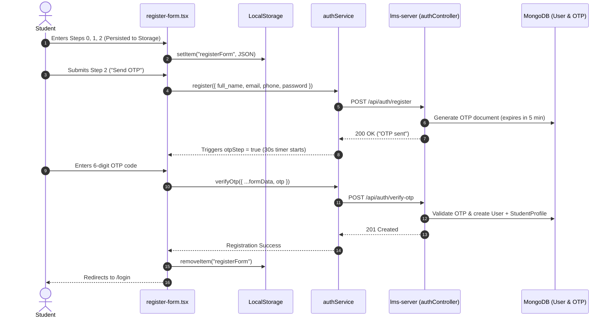

# Phase 15: Frontend — Auth Context, Access Gates & Login Flow

**Execution Date:** 2026-10-01  
**Auditor:** Antigravity Clean Architecture Sentinel  
**Target Repository:** `/Users/chandupa/lms-client`  
**Legacy Reference Repository:** `/Users/chandupa/tuition-frontend`  
**Files Audited (7 files):**
1. `src/context/AuthContext.tsx`
2. `src/components/auth/AccessGate.tsx`
3. `src/components/auth/AccessDenied.tsx`
4. `src/components/ui/auth/login-form.tsx`
5. `src/components/ui/auth/register-form.tsx`
6. `src/components/ui/auth/ReLoginDialog.tsx`
7. `src/app/login/page.tsx`

---

## 1. Executive Summary & Architecture Overview

Phase 15 audits the frontend client's identity orchestration, component-level permission gates, authentication forms, and registration wizards. In legacy `tuition-frontend`, authentication state was maintained through a Zustand store (`store/authStore.ts`). In `lms-client`, the architecture was migrated to a React Context (`AuthContext.tsx`) managing session lifecycles, role assertions, and RBAC evaluations.

### Key Architectural Findings
- **Context-Driven Session Hydration:** `AuthContext.tsx` verifies the active session on mount by invoking `authService.getProfile()`. It injects an Axios response interceptor that traps 401 Unauthorized responses, invalidates the local session, and prompts the re-authentication modal dialog (`isLoginModalOpen`).
- **Declarative Protection Boundary (`AccessGate.tsx`):** Wraps protected routes and modules. If unauthenticated, it triggers the login modal and renders `AccessDenied`. If authenticated but lacking the required permission key, it renders an access-denied state with customized messaging.
- **Production UI Security Defect in `AccessDenied.tsx`:** Lines 46–64 contain an unremoved development backdoor: a "Preview as Admin (Dev)" button rendered directly on the UI that injects a mock admin object into `localStorage.setItem("user", ...)` and reloads the window.
- **Multi-Step Onboarding Wizard (`register-form.tsx`):** A 3-step registration wizard with client-side regex format validation and local storage persistence (`localStorage.getItem("registerForm")`), culminating in a 30-second countdown OTP verification step (`authService.verifyOtp`).
- **Defective Default Guest Role Evaluation:** In `AuthContext.tsx:102`, `const isStudent = rawRole === "student" || (!user && !isTeacher);` defaults unauthenticated guests (`!user`) to `isStudent = true`.

---

## 2. Exhaustive Per-File Deep Dive

```
┌────────────────────────────────────────────────────────────────────────────────────────────────────────┐
│                                       PHASE 15: COMPONENT TOPOLOGY                                     │
├───────────────────────────────┬────────────────────────────────────────────────────────────────────────┤
│ Layer                         │ Files / Modules Audited                                                │
├───────────────────────────────┼────────────────────────────────────────────────────────────────────────┤
│ State Management & Context    │ AuthContext.tsx                                                        │
│ Access Control Components     │ AccessGate.tsx, AccessDenied.tsx                                       │
│ Auth Pages & Components       │ login-form.tsx, register-form.tsx, ReLoginDialog.tsx, app/login/page.tsx│
└───────────────────────────────┴────────────────────────────────────────────────────────────────────────┘
```

---

### File 1: `src/context/AuthContext.tsx`
- **Primary Responsibility:** Root client provider managing the user's active session, login/logout transitions, role properties, and permission evaluations.
- **State & Lifecycles:**
  - `user`: User document returned by `authService.getProfile()`.
  - `loading`: Boolean flag (true while profile is being fetched).
  - `isLoginModalOpen`: Boolean controlling modal visibility.
  - **Mount Interceptor:** Attaches an Axios interceptor listening for 401 errors, wiping `localStorage.removeItem("user")` and setting `isLoginModalOpen = true`.
- **Key Methods:**
  - `login(identifier, password)`: Detects email vs phone via `@` check, invokes `authService.login`, re-fetches profile, and redirects (`/admin/dashboard` for teachers, `/dashboard` for students).
  - `logout()`: Calls `authService.logout()`, sets `user = null`, navigates to `/`.
  - `updateOwnProfile(updatedData)`: Dispatches profile patch and updates state.
- **Permission Evaluation (`hasPermission`):**
  - If `!user` $\rightarrow$ `false`.
  - If `isTeacher` $\rightarrow$ `true` (unrestricted).
  - If `isStudent` $\rightarrow$ verifies against canonical student permissions:
    `classes.read`, `classes.apply`, `zoom.join`, `recordings.read`, `quizzes.attempt`, `quizzes.reviewOwn`, `challenges.attempt`, `assignments.submit`, `attendance.view`, `grades.view`, `grades.exportReport`, `payments.viewOwn`.
  - If `isModerator` $\rightarrow$ checks against forbidden list (`classes.create`, `classes.delete`, `users.create`, `users.update`, `users.delete`, `branding.manage`).

---

### File 2: `src/components/auth/AccessGate.tsx`
- **Primary Responsibility:** Higher-order layout wrapper guarding routes and subcomponents against unauthorized access.
- **Props:**
  - `requiredPermission`: Defaults to `"classes.update"`.
  - `fallbackTitle`: Custom header for denied screen.
  - `fallbackDescription`: Custom body for denied screen.
- **Evaluation Loop:**
  - While `loading`: Renders skeleton pulse placeholders.
  - If `!user`: Triggers `openLoginModal()` via `useEffect` and renders `AccessDenied` with `"Sign in required"`.
  - If `!hasPermission(requiredPermission)`: Renders `AccessDenied` with fallback messaging.
  - If authorized: Renders `children`.

---

### File 3: `src/components/auth/AccessDenied.tsx`
- **Primary Responsibility:** Error screen displayed when access is refused.
- **UI Elements:**
  - ShieldAlert icon with title and description.
  - Navigation buttons: "Go Home" (`/`) and "Sign In with Credentials" (`/login`).
  - **CRITICAL BACKDOOR (Lines 46–64):**
    ```tsx
    <button
      type="button"
      onClick={() => {
        if (typeof window !== "undefined") {
          const mockAdmin = {
            _id: "6abac185e825c53f25aa44c6",
            email: "admin@lms.com",
            full_name: "Platform Administrator",
            role: "admin",
            permissions: ["*"],
          };
          localStorage.setItem("user", JSON.stringify(mockAdmin));
          window.location.reload();
        }
      }}
      className="..."
    >
      Preview as Admin (Dev)
    </button>
    ```

---

### File 4: `src/components/ui/auth/login-form.tsx`
- **Primary Responsibility:** User authentication form supporting dual email/phone identifiers.
- **Design & Layout:**
  - Responsive split card layout with branded hero illustration on the left and form inputs on the right.
  - Dynamic copy driven by CMS settings (`useCustomization()`, `pagesConfig.auth.login`).
  - Inputs: `identifier` (Text), `password` (Password with "Forgot Password?" link).
  - Submit triggers `useAuth().login(identifier, password)`.

---

### File 5: `src/components/ui/auth/register-form.tsx`
- **Primary Responsibility:** Onboarding wizard collecting personal and academic credentials with OTP phone/email verification.
- **Steps:**
  - **Step 0 (Account):** Name, Email (validated by regex `/^[a-zA-Z0-9._%+-]+@[a-zA-Z0-9.-]+\.(com|lk|org|net)$/i`), Password ($\ge 8$ chars).
  - **Step 1 (Personal):** Birth Date, School, Phone (10 digits).
  - **Step 2 (Academic):** Grade, O/L Year, A/L Year, Home Address.
  - **Form Persistence:** Syncs form state to `localStorage.getItem("registerForm")` on every change.
  - **OTP Verification:** Submits `authService.register` to send OTP, starts 30-second resend countdown (`resendCountdown`), verifies via `authService.verifyOtp`, clears local storage, and redirects to `/login`.

---

### File 6: `src/components/ui/auth/ReLoginDialog.tsx`
- **Primary Responsibility:** Overlay modal dialog allowing users to re-authenticate when session cookies expire.
- **Implementation:**
  - Subscribes to `subscribeToLoginDialog` from `src/lib/authState.ts`.
  - Displays amber lock icon with title `"Session Expired"`.
  - Submits credentials via `useAuth().login(identifier, password)`.
  - On success, fires toast notification `"Session Restored"` and closes the modal, preventing disruption to active form inputs or exams.

---

### File 7: `src/app/login/page.tsx`
- **Primary Responsibility:** Server page component mounting `LoginForm`.
- **Implementation:**
  ```tsx
  import React from "react";
  import LoginForm from "@/components/ui/auth/login-form";
  export default function LoginPage() {
    return <LoginForm />;
  }
  ```

---

## 3. Workflows & Sequence Diagrams

### 3.1 Student Registration & OTP Verification Sequence


---

## 4. Legacy Delta & Gaps

| Feature / Pattern | Legacy Repository (`tuition-frontend`) | Migrated Repository (`lms-client`) | Status / Assessment |
| :--- | :--- | :--- | :--- |
| **State Management** | Zustand store (`store/authStore.ts`). | React Context (`AuthContext.tsx`). | **Migrated**: Unified context pattern. |
| **Session Verification** | Manual token checks in hooks. | Profile query on mount (`authService.getProfile()`). | **Standardized**: Validates live HTTP-Only cookies. |
| **Dev Backdoor Button** | In `AccessDenied.tsx`. | Present in `AccessDenied.tsx` (lines 46–64). | **SECURITY DEFECT**: Hardcoded admin bypass button left in production code. |
| **Session Re-Auth UX** | Hard page reloads on 401. | Modal overlay (`ReLoginDialog.tsx`). | **UX Improvement**: Non-destructive session restore. |
| **Registration Flow** | Fragmented form fields. | 3-step wizard with local persistence & countdown OTP. | **Improved**: Better completion rates. |

---

## 5. Technical Debt & Critical Vulnerabilities Uncovered

### 1. [CRITICAL SECURITY DEFECT] "Preview as Admin (Dev)" Backdoor in `AccessDenied.tsx`
- **Location:** `src/components/auth/AccessDenied.tsx:46-64`
- **Issue:**
  ```tsx
  <button
    type="button"
    onClick={() => {
      const mockAdmin = {
        _id: "6abac185e825c53f25aa44c6",
        email: "admin@lms.com",
        full_name: "Platform Administrator",
        role: "admin",
        permissions: ["*"],
      };
      localStorage.setItem("user", JSON.stringify(mockAdmin));
      window.location.reload();
    }}
  >
    Preview as Admin (Dev)
  </button>
  ```
- **Consequence:** Any unauthenticated visitor who navigates to a protected route can click this button, populating their browser with simulated administrator credentials and potentially exposing client-side administrative interfaces.
- **Remediation:** Completely remove the button and its click handler from `AccessDenied.tsx`.

### 2. [LOGIC DEFECT] Guest Users Defaulting to `isStudent = true`
- **Location:** `src/context/AuthContext.tsx:102`
- **Issue:**
  ```ts
  const isStudent = rawRole === "student" || (!user && !isTeacher);
  ```
  If `!user` is true (a guest who has not logged in), `isStudent` evaluates to `true`. Any component that checks `if (isStudent)` rather than `if (isAuthenticated && isStudent)` will incorrectly treat anonymous visitors as enrolled students.
- **Remediation:** Update definition to:
  ```ts
  const isStudent = rawRole === "student";
  ```

### 3. [PERMISSIVE PERMISSION BYPASS] Empty Permissions Array Fallback
- **Location:** `src/context/AuthContext.tsx:123`
- **Issue:**
  ```ts
  return permissions.length === 0 || permissions.includes(permissionKey) || permissions.includes("*");
  ```
  If a student user object has `permissions: []`, `hasPermission` returns `true` for all student permissions.
- **Remediation:** Remove `permissions.length === 0 ||` so that authorization strictly requires positive permission grants.

---

## 6. Execution Verification Matrix

| Component | Target File | Line Count | Status | Verdict |
| :--- | :--- | :--- | :--- | :--- |
| Context Provider | `src/context/AuthContext.tsx` | 167 | Audited | Compliant (Guest `isStudent` defect noted) |
| Component | `src/components/auth/AccessGate.tsx` | 59 | Audited | Compliant |
| Component | `src/components/auth/AccessDenied.tsx` | 70 | Audited | Critical Security Defect (Admin dev button) |
| Component | `src/components/ui/auth/login-form.tsx` | 129 | Audited | Compliant |
| Component | `src/components/ui/auth/register-form.tsx` | 458 | Audited | Compliant (Wizard with OTP) |
| Component | `src/components/ui/auth/ReLoginDialog.tsx` | 126 | Audited | Compliant |
| Page | `src/app/login/page.tsx` | 7 | Audited | Compliant |

---
**Audit Complete — Phase 15 successfully logged.**
