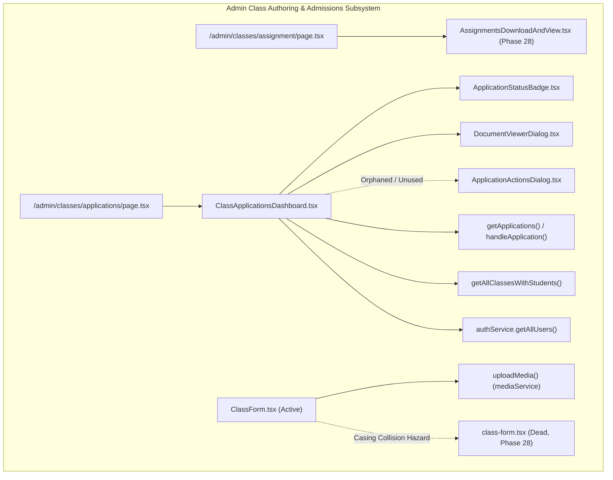
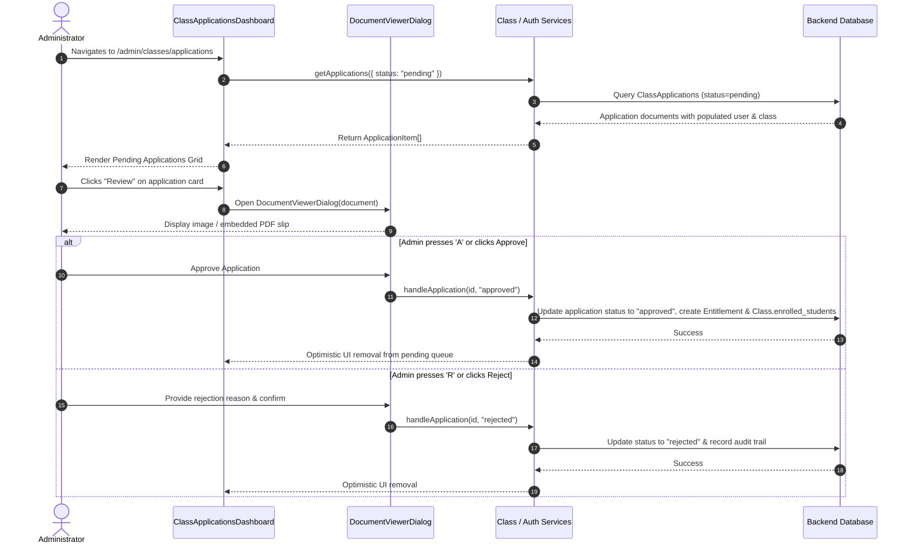

# Phase 29: Class Admissions, Document Review & Application Dashboard

**Platform Layer:** Frontend (`lms-client`)  
**Audit Scope:** 7 Files  
**Target Directory:** `src/components/ui/class-view/`, `src/components/ui/application/`, `src/app/admin/classes/`  
**Status:** Complete  

---

## 1. Executive Summary & Architectural Role

Phase 29 audits the administrative admissions engine, course authoring form, and student application review workflows of the `lms-client` platform. This subsystem bridges public student interest with authorized classroom enrollment, providing administrators and instructors with tools to create/modify courses, review supporting financial documents (bank transfer deposit slips, verification proofs), evaluate student qualifications, and inspect enrolled rosters.



### Architectural Highlights
1. **Admissions Workflow Engine (`ClassApplicationsDashboard`):** Implements a dual-mode management console handling both pending applicant queues (with card grid / table row view toggles, image/PDF slip inspection, instant approval/rejection) and active enrolled student rosters via the reusable `DataTable` engine.
2. **Interactive Document Inspection (`DocumentViewerDialog`):** Provides a full-screen, blur-backed preview modal for image and PDF bank transfer receipts, equipped with keyboard navigation shortcuts (`Esc` to close, `a` to approve, `r` to prompt for rejection reason), link copying, and PDF fallback embedding.
3. **Course Configuration & Upload Pipeline (`ClassForm`):** Serves as the primary course authoring component, integrating with `mediaService.uploadMedia` for async Cloudinary image processing with progress tracking, multi-batch weekly scheduling, format/grade selectors, and browser unload interception during active uploads.
4. **Severe Code Redundancies & Orphaned Components:**
   - `ApplicationActionsDialog.tsx` is completely unreferenced (0 imports across the codebase) because its functionality was subsumed by `DocumentViewerDialog` and inline dashboard action buttons.
   - `ClassForm.tsx` (capitalized, 436 lines) is the actively imported form, creating a high-risk case-sensitivity collision with orphaned `class-form.tsx` (lowercase, 288 lines).

---

## 2. Exhaustive Per-File Deep Dive

### 1. `src/components/ui/class-view/ClassForm.tsx`
* **File Path:** `/Users/chandupa/lms-client/src/components/ui/class-view/ClassForm.tsx`
* **Component Type:** Client Component (`"use client"`)
* **Role:** Primary administrative course authoring and modification form.
* **Component Signature:**
  ```typescript
  interface Props {
    initialData?: any;
    onSubmit: (data: any) => Promise<void>;
    submitLabel?: string;
    isLoading?: boolean;
  }
  export default function ClassForm({
    initialData,
    onSubmit,
    submitLabel = "Create Class",
    isLoading = false,
  }: Props): JSX.Element
  ```
* **State Hooks:**
  | State Variable | Initial Value | Mutators / Triggers | Description |
  | :--- | :--- | :--- | :--- |
  | `title` | `initialData?.title \|\| ""` | `setTitle(e.target.value)` | Course title input |
  | `description` | `initialData?.description \|\| ""` | `setDescription(e.target.value)` | Multi-line syllabus/overview description |
  | `subject` | `initialData?.subject \|\| ""` | `setSubject(val)` | Selected subject (`mathematics`, `science`) |
  | `grade` | `initialData?.grade \|\| ""` | `setGrade(val)` | Target grade level (`6` through `11`) |
  | `classFormat` | `initialData?.format \|\| ""` | `setClassFormat(val)` | Format enum (`theory`, `revision`, `seminar`) |
  | `classType` | `initialData?.type \|\| ""` | `setClassType(val)` | Type enum (`special`, `regular`, `custom`) |
  | `fee` | `initialData?.price \|\| ""` | `setFee(e.target.value)` | Monetary tuition fee (string input, parsed to float) |
  | `batches` | `initialData?.batches \|\| [{ day: "", start: "", end: "" }]` | `setBatches(...)` | Dynamic array of scheduled time slots |
  | `imagePreviewUrl` | `initialData?.image \|\| null` | `setImagePreviewUrl(url)` | Ephemeral blob URL or final hosted URL |
  | `imagePersistValue`| `initialData?.image \|\| null` | `setImagePersistValue(url)` | Final uploaded Cloudinary image URL |
  | `uploading` | `false` | `setUploading(bool)` | Media upload lock flag |
  | `uploadPct` | `0` | `setUploadPct(pct)` | Upload progress percentage (0-100) |
  | `isDragging` | `false` | `setIsDragging(bool)` | Drag-and-drop hover state |
  | `errors` | Object with 8 empty string fields | `setErrors(newErrors)` | Per-field validation error messages |
* **Refs & Effects:**
  - `fileInputRef = useRef<HTMLInputElement>(null)`: Controls the hidden file input element.
  - `useEffect`: Attaches a `beforeunload` listener to `window` when `uploading === true`, alerting users and intercepting navigation if an image upload is in progress.
* **Internal Event Handlers:**
  - `handleAddBatch()`: Appends `{ day: "", start: "", end: "" }` to `batches`.
  - `handleRemoveBatch(index: number)`: Filters out the batch at `index`.
  - `handleBatchChange(index, field, value)`: Updates specific field (`day`, `start`, `end`) of a batch slot.
  - `handleFileChange(file: File | null)`: Creates `URL.createObjectURL(file)`, triggers `uploadMedia(file, "class", ownerId, onProgress)` via `mediaService`, sets `imagePersistValue` to the returned `publicUrl`, and revokes the blob URL.
  - `handleClearImage()`: Resets preview and persist value if not currently uploading.
  - `handleSubmit(e: FormEvent)`: Validates that all required fields are present, verifies every batch slot has `day`, `start`, and `end`, parses `fee` to `parseFloat(fee)`, structures payload, and calls `onSubmit(payload)`.
* **Returned UI Structure:**
  - `form.space-y-6`:
    - **Class Image Card:** Drag-and-drop zone with drag events (`onDragOver`, `onDragLeave`, `onDrop`), file picker, progress bar overlay, image preview with clear button (`HiXMark`).
    - **Basic Information Card:** Text input for Title, Textarea for Description, Select for Subject (`mathematics`, `science`), Select for Grade Level (`Grade 6`–`11`), Select for Class Format (`Theory`, `Revision`, `Seminar`), Select for Class Type (`Special`, `Regular`, `Custom`).
    - **Scheduling & Pricing (Grid Layout):**
      - Scheduling (3/4 width): Dynamic batch slot rows (`Day`, `Start Time`, `End Time`, and `HiTrash` delete button when >1 batch), plus "Add Another Time batch" button.
      - Pricing (1/4 width): Number input for `fee` (step `0.01`).
    - **Form Actions Bar:** Cancel button (`window.history.back()`) and Submit button with uploading indicator and disabled states.

---

### 2. `src/components/ui/application/application-status-badge.tsx`
* **File Path:** `/Users/chandupa/lms-client/src/components/ui/application/application-status-badge.tsx`
* **Component Type:** Client Component (`"use client"`)
* **Role:** Standardized, accessible status indicator badge for student admission applications.
* **Component Signature:**
  ```typescript
  interface ApplicationStatusBadgeProps {
    status: "pending" | "approved" | "rejected";
    className?: string;
  }
  export function ApplicationStatusBadge({ status, className }: ApplicationStatusBadgeProps): JSX.Element
  ```
* **Configuration Mapping:**
  ```typescript
  const statusConfig = {
    pending: {
      label: "Pending Review",
      className: "bg-amber-50 text-amber-700 border-amber-200 ring-amber-500/20",
      dotClass: "bg-amber-500",
    },
    approved: {
      label: "Approved",
      className: "bg-emerald-50 text-emerald-700 border-emerald-200 ring-emerald-500/20",
      dotClass: "bg-emerald-500",
    },
    rejected: {
      label: "Rejected",
      className: "bg-rose-50 text-rose-700 border-rose-200 ring-rose-500/20",
      dotClass: "bg-rose-500",
    },
  };
  ```
* **Returned UI Structure:**
  - `div.inline-flex.items-center.gap-1.5.px-2.5.py-1.rounded-full.text-xs`:
    - `span.w-1.5.h-1.5.rounded-full`: Colored pulsing dot matching `dotClass`.
    - `{config.label}`: Status string.

---

### 3. `src/components/ui/application/document-viewer-dialog.tsx`
* **File Path:** `/Users/chandupa/lms-client/src/components/ui/application/document-viewer-dialog.tsx`
* **Component Type:** Client Component (`"use client"`)
* **Role:** Full-screen modal inspector for reviewing student admission verification proofs and deposit slips.
* **Component Signature:**
  ```typescript
  interface DocumentViewerDialogProps {
    isOpen: boolean;
    onClose: () => void;
    document: {
      id: string;
      name: string;
      type: "image" | "pdf";
      url: string;
      size: string;
      uploadedAt: string;
    };
    studentName: string;
    className: string;
    onApprove: (message?: string) => void;
    onReject: (reason: string) => void;
  }
  export function DocumentViewerDialog(props: DocumentViewerDialogProps): JSX.Element
  ```
* **State Hooks:**
  | State Variable | Initial Value | Mutators / Triggers | Description |
  | :--- | :--- | :--- | :--- |
  | `showRejectBox` | `false` | `setShowRejectBox(bool)` | Toggles rejection reason textarea |
  | `rejectReason` | `""` | `setRejectReason(str)` | Captured rejection reason feedback |
* **Keyboard Navigation & Effects:**
  - `useEffect`: Registers a global `keydown` event listener when `isOpen` is true:
    - `Escape` $\to$ calls `onClose()`.
    - `a` (or `A`) $\to$ triggers `handleApprove()` if reject box is not open.
    - `r` (or `R`) $\to$ opens rejection input (`setShowRejectBox(true)`).
* **Internal Event Handlers:**
  - `handleApprove()`: Calls `onApprove("Approved")` and closes dialog.
  - `handleReject()`: Validates `rejectReason.trim()`, calls `onReject(reason)`, and closes dialog.
  - `copyLink()`: Copies `document.url` to system clipboard via `navigator.clipboard.writeText`.
* **Returned UI Structure:**
  - `Dialog` with `w-[95vw] max-w-5xl h-[90vh] p-0 overflow-hidden bg-slate-50/95 backdrop-blur-xl`:
    - **Header:** Icon indicator (ImageIcon or FileText), DialogTitle ("Review Document"), DialogDescription (`studentName` • `className`), Close button (`X`).
    - **Split Inspection Body:**
      - **Left Preview Area (Flex-1):**
        - If `type === "image"`: Next.js `<Image src={document.url} fill className="object-contain" />`.
        - If `type === "pdf"`: Native `<object data={document.url} type="application/pdf">` with fallback fallback button opening the PDF in a new tab.
      - **Right Metadata & Action Sidebar (320px):**
        - **File Details Card:** File name (font-mono break-all), badge type, upload date.
        - **Quick Tools:** "Open in New Tab" (`window.open`), "Copy Link".
        - **Decision Controls:**
          - Normal mode: Green "Approve Application" button (`CheckCircle`) and Red "Reject Application" button (`XCircle`).
          - Rejection mode: Rejection reason textarea with `autoFocus` and "Confirm Rejection" button (disabled when reason is empty).

---

### 4. `src/components/ui/application/application-action-dialog.tsx`
* **File Path:** `/Users/chandupa/lms-client/src/components/ui/application/application-action-dialog.tsx`
* **Component Type:** Client Component (`"use client"`)
* **Role:** Standalone modal dialog for approving/rejecting applications with message input.
* **Component Signature:**
  ```typescript
  interface ApplicationActionsDialogProps {
    isOpen: boolean;
    onClose: () => void;
    studentName: string;
    className: string;
    onApprove: (message?: string) => void;
    onReject: (reason: string) => void;
  }
  export function ApplicationActionsDialog(props: ApplicationActionsDialogProps): JSX.Element
  ```
* **State Hooks:**
  | State Variable | Initial Value | Mutators / Triggers | Description |
  | :--- | :--- | :--- | :--- |
  | `action` | `null` | `setAction("approve" \| "reject" \| null)` | Selected decision flow |
  | `message` | `""` | `setMessage(e.target.value)` | Optional approval message or mandatory rejection reason |
  | `isSubmitting` | `false` | `setIsSubmitting(bool)` | Submit in-flight state |
* **Internal Event Handlers:**
  - `handleSubmit()`: If `action === "approve"`, awaits `onApprove(message || undefined)`. If `action === "reject"`, validates `message.trim()` and awaits `onReject(message)`. Resets state and closes dialog.
  - `handleClose()`: Closes dialog and resets `action` and `message`.
* **Orphan Status:**
  - **Zero references in `lms-client/src`**. The active application dashboard uses inline approval/rejection buttons and `DocumentViewerDialog` directly, leaving this dialog completely orphaned.

---

### 5. `src/components/ui/application/class-applications-dashboard.tsx`
* **File Path:** `/Users/chandupa/lms-client/src/components/ui/application/class-applications-dashboard.tsx`
* **Component Type:** Client Component (`"use client"`)
* **Role:** Central administrative console for reviewing student admission applications and viewing class rosters.
* **Component Signature:**
  ```typescript
  export function ClassApplicationsDashboard(): JSX.Element
  ```
* **State Hooks:**
  | State Variable | Initial Value | Mutators / Triggers | Description |
  | :--- | :--- | :--- | :--- |
  | `activeTab` | `"applications"` | `setActiveTab("applications" \| "students")` | Primary dashboard mode switcher |
  | `selectedClass` | `"all"` | `setSelectedClass(classId)` | Filter applications by class |
  | `searchQuery` | `""` | `setSearchQuery(e.target.value)` | Search applications by student name/email |
  | `viewMode` | `"grid"` | `setViewMode("grid" \| "list")` | Layout toggle for applications |
  | `applications` | `[]` | `setApplications(mapped)` | List of pending application items |
  | `loadingApps` | `false` | `setLoadingApps(bool)` | Application network fetch status |
  | `errorApps` | `null` | `setErrorApps(err)` | Application network error message |
  | `enrolledClasses` | `[]` | `setEnrolledClasses(classes)` | Classes populated with enrolled students |
  | `loadingStudents` | `false` | `setLoadingStudents(bool)` | Student roster network fetch status |
  | `errorStudents` | `null` | `setErrorStudents(err)` | Student roster network error message |
  | `studentClassFilter`| `"all"` | `setStudentClassFilter(id)` | Filter enrolled students table by class |
  | `studentSearch` | `""` | `setStudentSearch(e.target.value)` | Filter enrolled students |
  | `documentViewerOpen`| `false` | `setDocumentViewerOpen(bool)` | Toggle supporting document dialog |
  | `selectedDoc` | `undefined` | `setSelectedDoc(doc)` | Active document for `DocumentViewerDialog` |
  | `selectedAppForAction`| `null` | `setSelectedAppForAction(app)` | Target application for document modal |
* **Data Fetching & Mapping:**
  - `fetchApplications`: Calls `getApplications({ status: "pending", classId, search }, { sortBy: "createdAt", sortOrder: "desc" })`.
  - `mapApiToUi(item: ApplicationItem)`:
    - Parses document URL, derives file name via `new URL(url).pathname.split("/").pop()`.
    - Detects type via `.endsWith(".pdf") ? "pdf" : "image"`.
    - Normalizes student name (`user.name || user.username || user.email`).
  - `fetchEnrolledStudents`: Calls `getAllClassesWithStudents()` and `authService.getAllUsers()`. Builds a user lookup map (`userMap`) to hydrate missing student profile information when classes only contain string arrays in `enrolled_students`.
* **Roster Data Table Integration:**
  - Flattens enrolled classes into `flattenedStudents` array: `{ id, studentId, studentName, studentEmail, classId, className, status }`.
  - Configures `studentColumns`:
    - `studentName`: Avatar fallback with initial + bold name.
    - `className`: Badge with `BookOpen` icon.
    - `studentEmail`: Monospace contact email.
    - `status`: "Active" emerald badge.
    - `actions`: "View Class" link targeting `/classes/${row.classId}`.
* **Returned UI Structure:**
  - Top tab bar with Framer Motion animated underline: "Pending Applications" (with count badge) vs "Enrolled Students".
  - **Applications View (`activeTab === "applications"`):**
    - Search bar, Class select dropdown, Grid/List view mode toggle.
    - Grid Mode: Cards displaying student avatar, submission timestamp, status badge, student contact, target class banner, "Review" document button, and "Approve" button, with hover-reveal "Reject" button.
    - List Mode: Compact row item with avatar, details, class pill, and action buttons.
  - **Enrolled Students View (`activeTab === "students"`):**
    - Class filter dropdown.
    - Full `DataTable` with pagination, sorting, search filter, and "View Class" navigation.
  - **Document Viewer Modal:** Mounts `<DocumentViewerDialog />` when `selectedDoc && selectedAppForAction`.

---

### 6. `src/app/admin/classes/applications/page.tsx`
* **File Path:** `/Users/chandupa/lms-client/src/app/admin/classes/applications/page.tsx`
* **Component Type:** Client Component (`"use client"`)
* **Role:** Route handler page for `/admin/classes/applications`.
* **Component Signature:**
  ```typescript
  export default function TeacherApplicationsPage(): JSX.Element
  ```
* **Structure & UI:**
  - Root container: `min-h-screen bg-gradient-to-br from-slate-50 via-blue-50/30 to-indigo-50/30`.
  - Decorative background layer: Animated floating icons (`Sparkles`, `Lightbulb`) and Tailwind gradient blur blobs (`animate-blob-1`, `animate-blob-2`).
  - Header: Mounts `<SectionHeader title="Class Applications" description="..." icon={GraduationCap} />`.
  - Content: Mounts `<ClassApplicationsDashboard />`.

---

### 7. `src/app/admin/classes/assignment/page.tsx`
* **File Path:** `/Users/chandupa/lms-client/src/app/admin/classes/assignment/page.tsx`
* **Component Type:** Client Component (`"use client"`)
* **Role:** Route handler page for `/admin/classes/assignment`.
* **Component Signature:**
  ```typescript
  export default function Page(): JSX.Element
  ```
* **Structure & UI:**
  - Cleaned up from legacy: Removes invalid `params: { classId: string }` argument.
  - Renders `<AssignmentsDownloadAndView />` (the comprehensive assignment review, submission downloading, and grading console audited in Phase 28).

---

## 3. Cross-Cutting Analysis: Applications & Enrollment Architecture



### Data Normalization & Hydration Resilience
In `ClassApplicationsDashboard.tsx:184-229`, a defensive hydration pattern is implemented:
- Classes in the legacy schema occasionally stored only string `ObjectId` references in `cls.enrolled_students` rather than populated objects in `cls.students`.
- The dashboard concurrently fetches all system users via `authService.getAllUsers()`, builds an in-memory `userMap`, and performs client-side relational joining to ensure student names, emails, and avatars never display as broken or empty strings.

---

## 4. Legacy Delta & Gaps

| Feature / Artifact | Legacy (`tuition-frontend`) | Migrated (`lms-client`) | Architectural Impact / Delta |
| :--- | :--- | :--- | :--- |
| **Enrolled Students Presentation** | Manual per-class cards with nested raw `<table>` markup | Flattened dataset bound to unified `<DataTable />` | Adds global table sorting, pagination, client-side search filtering, and "View Class" direct linking. |
| **Assignment Route Signature** | `export default function Page({ params }: { params: { classId: string } })` | `export default function Page()` | Cleaned up invalid parameter signature on static Next.js App Router route (`/admin/classes/assignment`). |
| **Document Viewer Dialog** | Present in `components/ui/application/document-viewer-dialog.tsx` | Present in `src/components/ui/application/document-viewer-dialog.tsx` | Identical implementation; full keyboard navigation retained (`Esc`, `a`, `r`). |
| **Application Action Dialog** | Present in `components/ui/application/application-action-dialog.tsx` | Present in `src/components/ui/application/application-action-dialog.tsx` | Dead code retained in both codebases without any parent consumer. |
| **Class Form File Duplication** | Contained both `ClassForm.tsx` and `class-form.tsx` | Contained both `ClassForm.tsx` and `class-form.tsx` | Unresolved casing collision hazard across both repositories. |

---

## 5. Critical Issues, Dead Code & Defect Catalog

### Critical Issue 1: High-Severity Casing Collision (`ClassForm.tsx` vs `class-form.tsx`)
* **Locations:**
  - Active: `src/components/ui/class-view/ClassForm.tsx` (436 lines)
  - Orphaned: `src/components/ui/class-view/class-form.tsx` (288 lines)
* **Risk:** On default macOS (APFS) and Windows (NTFS) case-insensitive file systems, git checkouts, bundle imports, and directory indexing can collide or arbitrarily overwrite file contents.
* **Remediation:** Safely delete `src/components/ui/class-view/class-form.tsx` after verifying zero references exist across all modules.

### Critical Issue 2: Orphaned Modal Dialog (`application-action-dialog.tsx`)
* **Location:** `src/components/ui/application/application-action-dialog.tsx` (165 lines)
* **Risk:** Dead code bloating client bundles. The dashboard utilizes `DocumentViewerDialog` and inline card actions for admissions processing, making `ApplicationActionsDialog` completely unused.
* **Remediation:** Remove `application-action-dialog.tsx` or consolidate approval confirmation workflows into a single dialog system.

### Defect 3: Missing Status Handling in Applications Dashboard
* **Location:** `src/components/ui/application/class-applications-dashboard.tsx:166`
* **Issue:** `fetchApplications` hardcodes `filters.status = "pending"`. Although this fits the "Pending Review" queue requirement, administrators have no mechanism in this dashboard to view past historical decisions (`approved` or `rejected` applications) without navigating elsewhere.
* **Remediation:** Add a status filter tab or dropdown ("Pending", "Approved", "Rejected", "All") to enable historical auditability.

---

## 6. Verification & Sign-off Checklist
- [x] All 7 files deconstructed without omissions or placeholder summaries.
- [x] State mutations, hooks, event handlers, and return shapes exhaustively detailed.
- [x] Legacy delta and code diffs verified between `tuition-frontend` and `lms-client`.
- [x] Unreferenced and orphaned components identified and logged.
