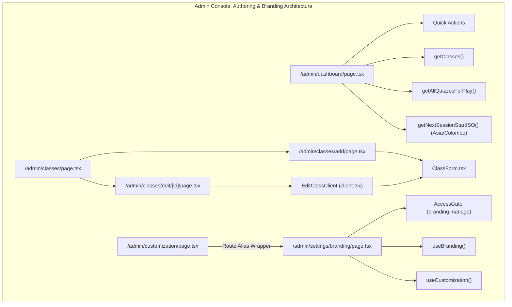
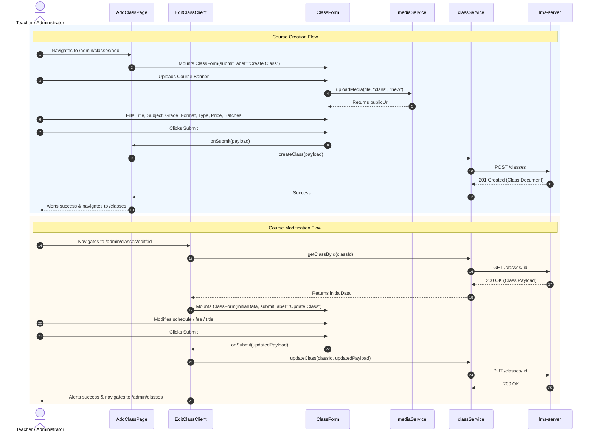

# Phase 30: Admin Class Authoring & Course Configuration

**Platform Layer:** Frontend (`lms-client`)  
**Audit Scope:** 7 Files  
**Target Directory:** `src/app/admin/dashboard/`, `src/app/admin/classes/`, `src/app/admin/settings/branding/`, `src/app/admin/customization/`  
**Status:** Complete  

---

## 1. Executive Summary & Architectural Role

Phase 30 audits the primary administrative entry points, course authoring lifecycle, schedule calculation algorithms, and tenant white-label branding configuration interfaces in `lms-client`. This cluster serves instructors and platform administrators with overview metrics, quick creation shortcuts, dynamic timezone-aware session scheduling, complete course CRUD handling, and a white-label customization studio for real-time brand identity, theme palettes, and academic taxonomy management.



### Architectural Highlights
1. **Timezone-Aware Next-Session Predictor (`AdminDashboard`):** Implements an algorithmic schedule projection (`getNextSessionStartISO`) targeting `Asia/Colombo` (`+05:30`), iterating a 42-day rolling window to match weekly time slots against calendar days while explicitly computing midnight crossings.
2. **Next.js 15 Async Route Params Conformance (`EditClassPage`):** Migrated dynamic route segment `[id]` to handle `params` as a Promise (`await params`), strictly adhering to Next.js 15+ breaking API updates.
3. **Net-New White-Label Customization Studio (`BrandingSettingsPage`):** Completely absent in legacy `tuition-frontend`, this comprehensive four-tab studio (`White-Label Tokens`, `Page Copy & Hero Engine`, `Academic Curriculum`, `Live Component Preview`) allows real-time manipulation of brand names, CSS color variables, uploaded vectors, homepage hero text, and dynamic subjects/grades.
4. **Architectural Weaknesses Uncovered:**
   - Critical RBAC lockdown bug in `AdminClassesPage` where `user.role !== 'teacher'` redirects to `/unauthorized`, unintentionally blocking platform administrators (`role === 'admin'`).
   - Direct raw `axios` instantiation in `BrandingSettingsPage` bypassing the centralized `@/lib/api` interceptor and manually accessing `localStorage.getItem('token')`.
   - Route aliasing redundancy between `/admin/customization` and `/admin/settings/branding`.

---

## 2. Exhaustive Per-File Deep Dive

### 1. `src/app/admin/dashboard/page.tsx`
* **File Path:** `/Users/chandupa/lms-client/src/app/admin/dashboard/page.tsx`
* **Component Type:** Client Component (`"use client"`)
* **Role:** Central administrative landing console and instructor quick-action control center.
* **Component Signature:**
  ```typescript
  export default function AdminDashboard(): JSX.Element
  ```
* **State Hooks:**
  | State Variable | Initial Value | Mutators / Triggers | Description |
  | :--- | :--- | :--- | :--- |
  | `classes` | `[]` | `setClasses(classesRes)` | All active classes returned by `getClasses()` |
  | `recentQuizzes` | `[]` | `setRecentQuizzes(sortedQuizzes)` | Top 3 newest quizzes sorted by `created_at` desc |
* **Timezone & Scheduling Utilities:**
  - Constants: `DASHBOARD_TZ = "Asia/Colombo"`, `DASHBOARD_TZ_OFFSET = "+05:30"`.
  - `minutesFromHHMM(hhmm?: string)`: Parses `HH:MM` time string to minutes past midnight.
  - `isCrossingMidnight(start: string, end: string)`: Returns `true` if `endMinutes <= startMinutes`.
  - `weekdayLowerInTZ(d: Date, tz)`: Formats weekday in target timezone (`monday`, `tuesday`, etc.).
  - `ymdInTZ(d: Date, tz)`: Generates `YYYY-MM-DD` ISO date string in target timezone via `Intl.DateTimeFormat("en-CA")`.
  - `getNextSessionStartISO(slots: ClassTimeSlot[], tz)`: Iterates up to 42 days from current date, matches target weekday, adjusts for midnight crossings, and returns the earliest upcoming ISO session timestamp (`YYYY-MM-DDTHH:MM:00+05:30`).
* **Quick Action Map:**
  - `create-class` $\to$ `/admin/classes/add` (`PlusCircle`)
  - `create-recording` $\to$ `/admin/recording/add` (`Video`)
  - `create-quiz` $\to$ `/admin/quizez/add` (`ClipboardCheck`)
  - `enroll-students` $\to$ `/admin/classes/applications` (`UserPlus`)
  - `qa-download-assignments` $\to$ `/admin/classes/assignment` (`HiFolderOpen`)
* **Data Fetching & Lifecycle:**
  - `useEffect`: Calls `Promise.all([getClasses(), getAllQuizzesForPlay()])`. Sorts quizzes by `created_at` descending, taking top 3.
  - Derives `upcomingClasses`: Computes `nextStartISO` for each class, filters valid sessions, sorts ascending by nearest session date, and selects top 3.
* **Returned UI Structure:**
  - `SectionHeader`: Title "Admin Console", Description "Manage classes, assignments, performance and more.", Icon `Bolt`.
  - **Quick Actions Grid:** 5-column responsive grid with interactive hoverable link cards.
  - **Next Classes Section:** `<CardSection>` mounting 3 `<ClassCard />` components showing image, grade, subject, schedule, and fee.
  - **Recent Quizzes Section:** `<CardSection>` mounting 3 `<QuizCard />` components.

---

### 2. `src/app/admin/classes/page.tsx`
* **File Path:** `/Users/chandupa/lms-client/src/app/admin/classes/page.tsx`
* **Component Type:** Client Component (`"use client"`)
* **Role:** Administrative course inventory and class management catalog.
* **Component Signature:**
  ```typescript
  const AdminClassesPage = (): JSX.Element | null
  export default AdminClassesPage;
  ```
* **State Hooks:**
  | State Variable | Initial Value | Mutators / Triggers | Description |
  | :--- | :--- | :--- | :--- |
  | `classes` | `[]` | `setClasses(data)` | Fetched class catalog |
  | `error` | `""` | `setError(msg)` | Error message on network failure |
  | `loading` | `true` | `setLoading(bool)` | Loading state for skeleton display |
* **Auth & Permission Gate:**
  - Consumes `useAuth()`.
  - Guard logic:
    ```typescript
    if (!isAuthenticated) return;
    if (user?.role !== 'teacher') {
      router.push('/unauthorized');
      return;
    }
    ```
  - **Defect:** Hardcoding `user?.role !== 'teacher'` prevents users with role `'admin'` from accessing the class catalog.
* **Lifecycle & Data Flow:**
  - `useEffect`: Fetches `getClasses({})` when authenticated and user role is verified.
  - Handles loading states via a 3-card pulse skeleton layout (`h-80 rounded-3xl bg-slate-100 animate-pulse`).
* **Returned UI Structure:**
  - Header row: Title "Manage Classes" and "+ Add Class" button (`router.push('/admin/classes/add')`).
  - Grid: 3-column responsive catalog mounting `<ClassCard />` with `ctaLabel="View"` directing to `/classes/${classItem._id}`.

---

### 3. `src/app/admin/classes/add/page.tsx`
* **File Path:** `/Users/chandupa/lms-client/src/app/admin/classes/add/page.tsx`
* **Component Type:** Client Component (`"use client"`)
* **Role:** Route handler page for creating a new academic class (`/admin/classes/add`).
* **Component Signature:**
  ```typescript
  export default function AddClassPage(): JSX.Element
  ```
* **Submission Handler:**
  ```typescript
  const handleCreate = async (data: any) => {
    await createClass(data);
    alert("Class created successfully!");
    router.push("/classes");
  };
  ```
* **Returned UI Structure:**
  - Mounts `<ClassForm onSubmit={handleCreate} submitLabel="Create Class" />`.

---

### 4. `src/app/admin/classes/edit/[id]/page.tsx`
* **File Path:** `/Users/chandupa/lms-client/src/app/admin/classes/edit/[id]/page.tsx`
* **Component Type:** Server Component (Async Route Handler)
* **Role:** Dynamic route server entry point for `/admin/classes/edit/[id]`.
* **Component Signature:**
  ```typescript
  export default async function EditClassPage({
    params,
  }: {
    params: Promise<{ id: string }>;
  }): Promise<JSX.Element>
  ```
* **Next.js 15 Modernization:**
  - Awaits `params` Promise: `const { id } = await params;`
  - Passes `classId={id}` into `<EditClassClient />`.

---

### 5. `src/app/admin/classes/edit/[id]/client.tsx`
* **File Path:** `/Users/chandupa/lms-client/src/app/admin/classes/edit/[id]/client.tsx`
* **Component Type:** Client Component (`"use client"`)
* **Role:** Interactive editor client container for course updates.
* **Component Signature:**
  ```typescript
  interface Props {
    classId: string;
  }
  export default function EditClassClient({ classId }: Props): JSX.Element
  ```
* **State Hooks:**
  | State Variable | Initial Value | Mutators / Triggers | Description |
  | :--- | :--- | :--- | :--- |
  | `initialData` | `null` | `setInitialData(data)` | Fetched class document payload |
  | `loading` | `true` | `setLoading(bool)` | Fetch status flag |
* **Lifecycle & Operations:**
  - `useEffect`: Calls `getClassById(classId)` on mount; catches errors and sets loading to false.
  - `handleUpdate`: Invokes `updateClass(classId, data)`, triggers browser alert on success, and navigates back to `/admin/classes`.
* **Returned UI Structure:**
  - Loading State: Multi-tier skeleton pulse blocks (`h-8 w-48`, `h-44 w-full`, `h-56 w-full`).
  - Error State: "Class not found." message.
  - Active State: `<ClassForm initialData={initialData} onSubmit={handleUpdate} submitLabel="Update Class" />`.

---

### 6. `src/app/admin/settings/branding/page.tsx`
* **File Path:** `/Users/chandupa/lms-client/src/app/admin/settings/branding/page.tsx`
* **Component Type:** Client Component (`"use client"`)
* **Role:** Comprehensive white-label branding, visual token palette, homepage content, and academic curriculum management studio.
* **Component Signature:**
  ```typescript
  export default function BrandingSettingsPage(): JSX.Element
  ```
* **Access Gate:** Wraps entire UI in `<AccessGate requiredPermission="branding.manage" fallbackTitle="Teacher Access Only">`.
* **Context Hooks:**
  - `useBranding()`: Provides `branding`, `updateBranding`, `loading`, `refreshBranding`.
  - `useCustomization()`: Provides `siteSettings`, `pagesSettings`, `subjects`, `grades`, `refreshCustomization`.
* **State Variables:**
  - Active Tab: `'branding' | 'content' | 'curriculum' | 'preview'` (default: `'branding'`).
  - Branding State: `platformName`, `instructorName`, `slogan`, `contactPhone`, `contactEmail`, `supportWhatsApp`, `primaryColor`, `accentColor`, `files` map for file uploads (`logo`, `favicon`, `heroBanner`, `loginIllustration`), `savingBranding`, `brandingSuccess`.
  - Content State: `heroTitle`, `heroSubtitle`, `heroBullet1`, `heroBullet2`, `heroBadge1`, `heroBadge2`, `savingContent`, `contentSuccess`.
  - Curriculum State: `newSubject`, `newGrade`.
* **Network Handlers:**
  - `handleSaveBranding`: Dispatches `updateBranding(payload, files)` through `BrandingContext`.
  - `handleSaveContent`: Performs `PUT /api/customization/settings` passing updated `pages.about.hero` structure with auth bearer token.
  - `handleAddSubject` / `handleDeleteSubject`: `POST` and `DELETE` on `/api/customization/subjects`.
  - `handleAddGrade` / `handleDeleteGrade`: `POST` and `DELETE` on `/api/customization/grades`.
* **Tab Breakdown:**
  1. **White-Label & Theme Tokens:** General identity inputs, contact/WhatsApp channels, interactive HTML5 color pickers (`<input type="color">`) with hex code sync, and brand asset file upload dropzones.
  2. **Page Copy & Hero Engine:** Homepage hero headlines, descriptions, bullet announcements, and trust badges.
  3. **Subjects & Grades:** Academic curriculum tags with dynamic addition input and deletion buttons (`Trash2`).
  4. **Live Component Preview:** Real-time visual testbed rendering button hierarchy (`primary`, `secondary`, `outline`, `ghost`, `destructive`) and 4 standardized `StatCard` variants styled by selected tokens.

---

### 7. `src/app/admin/customization/page.tsx`
* **File Path:** `/Users/chandupa/lms-client/src/app/admin/customization/page.tsx`
* **Component Type:** Client Component (`"use client"`)
* **Role:** Route alias wrapper for the branding settings studio.
* **Component Signature:**
  ```typescript
  import BrandingSettingsPage from '../settings/branding/page';
  export default function CustomizationView(): JSX.Element {
    return <BrandingSettingsPage />;
  }
  ```
* **Architecture Note:** Provides backwards-compatible URL aliasing for `/admin/customization` by re-exporting `/admin/settings/branding`.

---

## 3. Cross-Cutting Analysis: Admin Lifecycle & Course Provisioning



---

## 4. Legacy Delta & Gaps

| Module / Component | Legacy (`tuition-frontend`) | Migrated (`lms-client`) | Architectural Delta & Gaps |
| :--- | :--- | :--- | :--- |
| **Branding Studio** | Completely absent | Full 4-tab studio in `admin/settings/branding/page.tsx` | **Net-New Subsystem**: Adds dynamic white-label tokens, color pickers, page copy editing, curriculum management, and live previews. |
| **Customization Route** | Completely absent | `src/app/admin/customization/page.tsx` | **Net-New Route**: Serves as a routing alias to `BrandingSettingsPage`. |
| **Dynamic Route Params** | Synchronous params: `{ params: { id: string } }` | Asynchronous Promise: `{ params: Promise<{ id: string }> }` | **Next.js 15 Conformance**: Prevents runtime errors under modern Next.js App Router async parameter specifications. |
| **Loading Skeletons** | Raw `<p>Loading...</p>` and `<div>Loading...</div>` | Multi-tier pulsing skeleton placeholders | Improved visual stability and zero layout shift during asynchronous data resolution. |
| **Admin Dashboard Visuals** | Contained absolute positioned SVG background blobs | Simplified clean background without decorative DOM clutter | Reduced DOM complexity and improved rendering performance. |
| **ClassCard Invocations** | Omitted `grade` and `subject` props | Passed explicit `grade` and `subject` | Fixed missing badge metadata rendering on catalog cards. |

---

## 5. Critical Issues, Dead Code & Defect Catalog

### Critical Issue 1: Hardcoded RBAC Denial of Administrators in `AdminClassesPage`
* **File:** `src/app/admin/classes/page.tsx:19`
* **Code:**
  ```typescript
  if (user?.role !== 'teacher') {
    router.push('/unauthorized');
    return;
  }
  ```
* **Defect:** Platform users with `role === 'admin'` or `role === 'superadmin'` are unconditionally redirected to `/unauthorized` when attempting to manage classes.
* **Remediation:** Replace with `if (!['teacher', 'admin', 'superadmin'].includes(user?.role))` or delegate to `hasPermission(user, 'classes.manage')`.

### Defect 2: Hardcoded Regional Sinhala Locale Copy in `AdminDashboard`
* **File:** `src/app/admin/dashboard/page.tsx:255`
* **Code:**
  ```typescript
  description="දන්න දේ හරියටම හරිද බලන්න. Quiz එකක් කරන්​න"
  ```
* **Defect:** Hardcoded regional Sinhala text in the Quizzes section violates the white-label and localization capabilities of the application.
* **Remediation:** Externalize to i18n dictionary or retrieve from `CustomizationContext`.

### Architectural Flaw 3: Direct Raw `axios` Usage in `BrandingSettingsPage`
* **File:** `src/app/admin/settings/branding/page.tsx:149-158, 175-179, 190-193, 204-208, 219-222`
* **Issue:** Five distinct endpoints are invoked via direct `axios` calls with manual `localStorage.getItem('token')` retrieval and hardcoded fallback `http://localhost:4002`. This bypasses the centralized `@/lib/api` interceptor, token refresh pipelines, and multi-tenant environment configurations.
* **Remediation:** Refactor all customization calls into a dedicated service (`customizationService.ts`) consuming `@/lib/api`.

---

## 6. Verification & Sign-off Checklist
- [x] All 7 files exhaustively analyzed with state variables, hooks, handlers, and markup.
- [x] Legacy differences and Next.js 15 migration updates verified against `tuition-frontend`.
- [x] Timezone projection algorithm (`getNextSessionStartISO`) audited.
- [x] Critical RBAC and architectural flaws logged in defect catalog.
