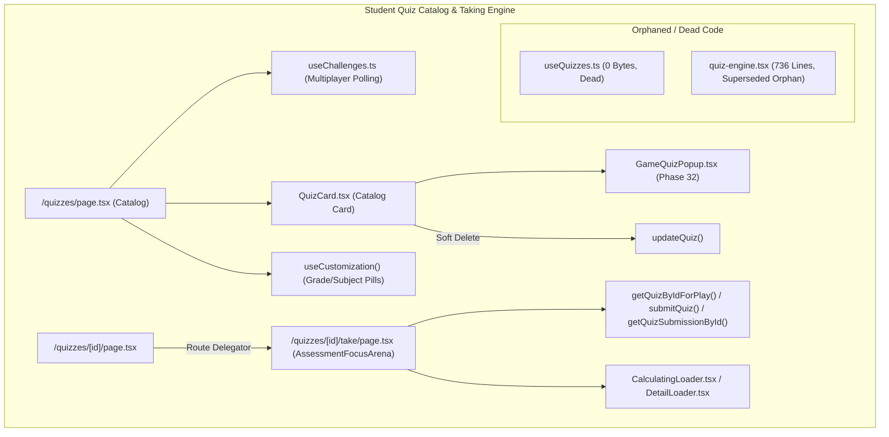
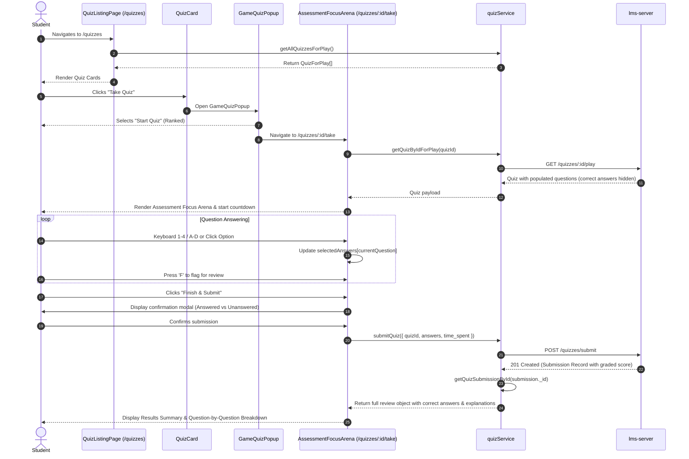

# Phase 31: Student Quiz Catalog, Interactive Quiz Engine & Popups

**Platform Layer:** Frontend (`lms-client`)  
**Audit Scope:** 7 Files  
**Target Directory:** `src/hooks/`, `src/app/quizzes/`, `src/components/ui/quiz/`  
**Status:** Complete  

---

## 1. Executive Summary & Architectural Role

Phase 31 audits the core assessment consumption engine of the `lms-client` platform. This subsystem enables students to discover academic quizzes, participate in asynchronous multiplayer head-to-head challenges, and execute examinations within a distraction-free, keyboard-accessible testing arena (`AssessmentFocusArena`). The phase also investigates the administrative and pedagogical lifecycle of quizzes, including teacher edit/delete capabilities and question-level evaluation metrics.



### Architectural Highlights
1. **Distraction-Free Assessment Focus Arena (`AssessmentFocusArena`):** A 980-line dedicated examination environment that locks the viewport (`fixed inset-0 select-none`), splits layout into a 50/50 sticky question/media column and an interactive option selection column, provides a bottom 64px progress palette dock, and features full keyboard accessibility (`1-4` / `A-D` to choose options, `ArrowLeft` / `ArrowRight` to step through questions, `F` to toggle review flags).
2. **Multiplayer Challenge & Head-to-Head Engine (`useChallenges`):** Implements real-time background polling (20,000ms interval) via `getMyChallenges()` to partition multiplayer matches into distinct state buckets (`queuedIncoming`, `queuedOutgoing`, `inProgress`, `completed`, `expired`, `cancelled`) and calculates win/loss percentages.
3. **Massive Dead Code Findings (737 Dead Lines):**
   - `src/hooks/useQuizzes.ts` is a 0-byte ghost file with 0 references in the repository.
   - `src/components/ui/quiz/quiz-engine.tsx` is an elaborate 736-line quiz engine from legacy prototyping that has **0 imports across the entire codebase**, having been completely superseded by `AssessmentFocusArena`.

---

## 2. Exhaustive Per-File Deep Dive

### 1. `src/hooks/useQuizzes.ts`
* **File Path:** `/Users/chandupa/lms-client/src/hooks/useQuizzes.ts`
* **File Size:** 0 bytes (0 lines)
* **Role:** Ghost / Dead Hook.
* **Orphan Analysis:**
  - Carried over from legacy `tuition-frontend/hooks/useQuizzes.ts` where it was also 0 bytes.
  - Zero imports across `src/`.
  - **Verdict:** Safe for immediate deletion.

---

### 2. `src/hooks/useChallenges.ts`
* **File Path:** `/Users/chandupa/lms-client/src/hooks/useChallenges.ts`
* **Component Type:** Custom React Hook
* **Role:** Multiplayer 1v1 quiz challenge management, background polling, and win-rate statistics engine.
* **Hook Signature:**
  ```typescript
  export type ChallengeBuckets = {
    all: ChallengeMatch[];
    queuedIncoming: ChallengeMatch[]; // p2 === me (invites to me)
    queuedOutgoing: ChallengeMatch[]; // p1 === me (invites sent by me)
    inProgress: ChallengeMatch[];
    completed: ChallengeMatch[];
    expired: ChallengeMatch[];
    cancelled: ChallengeMatch[];
  };

  export type ChallengeStats = {
    pendingInvites: number;
    opponentsInvites: number;
    winRatePct: number;
    wins: number;
    losses: number;
    ties: number;
  };

  export function useChallenges(opts: {
    userId?: string;
    enabled?: boolean;
    pollMs?: number;
  }): {
    rows: ChallengeMatch[];
    buckets: ChallengeBuckets;
    stats: ChallengeStats;
    loading: boolean;
    error: string | null;
    refetch: () => Promise<void>;
  }
  ```
* **State & Lifecycle:**
  - `rows`: Stores raw `ChallengeMatch[]` fetched from `quizService.getMyChallenges()`.
  - `timerRef`: Holds `setInterval` reference running every `pollMs` (defaults to 20,000ms / 20 seconds).
  - Cleanly unmounts and clears interval on dependency change.
* **Partitioning & Computation:**
  - `buckets`: Filters rows by status; discriminates `queuedIncoming` (matches where user is `p2_id`) vs `queuedOutgoing` (matches where user is `p1_id`).
  - `stats`: Iterates over `completed` matches, determines wins, losses, and ties, and derives integer win rate: `Math.round((wins / (wins + losses)) * 100)`.

---

### 3. `src/app/quizzes/page.tsx`
* **File Path:** `/Users/chandupa/lms-client/src/app/quizzes/page.tsx`
* **Component Type:** Client Component (`"use client"`)
* **Role:** Primary public and student quiz catalog, multiplayer challenge dashboard, and performance history console.
* **Component Signature:**
  ```typescript
  export default function QuizListingPage(): JSX.Element | null
  ```
* **State Hooks:**
  | State Variable | Initial Value | Mutators / Triggers | Description |
  | :--- | :--- | :--- | :--- |
  | `mounted` | `false` | `setMounted(true)` | SSR hydration protection |
  | `rawQuizzes` | `[]` | `setRawQuizzes(data)` | Fetched quiz list from `getAllQuizzesForPlay()` |
  | `loading` | `true` | `setLoading(bool)` | Quiz fetch status |
  | `subjectFilter`| `"all"` | `setSubjectFilter(str)` | Selected subject filter |
  | `gradeFilter` | `"all"` | `setGradeFilter(str)` | Selected grade filter |
  | `active` | `null` | `setActive("pending" \| "opponents" \| null)` | Toggles challenge drawer accordion |
  | `showH2H` | `false` | `setShowH2H(bool)` | Toggles Head-to-Head modal |
* **Dynamic Customization Integration:**
  - Consumes `useCustomization()` for dynamic `grades` and `subjects`.
  - `quickGradeOptions`: Dynamically formats grade labels using `formatGradeName` and generates a horizontal quick-select button bar with `GraduationCap` icon.
  - Normalizes quiz metadata via `toQuizMetadata` with safe question count and total marks calculations.
* **Multiplayer UI Features:**
  - 3 StatCards: Pending Invites, Opponent Invites, Win Rate %.
  - Expandable Framer Motion challenge accordion (`AnimatePresence`) listing pending match invitations with direct play links.
  - Head-to-Head modal dialog displaying historic 1v1 battle match logs, opponent details, score percentages, and completion timestamps.
* **Returned UI Structure:**
  - `<Head>` SEO metadata tag block (contains deprecated Next.js App Router import).
  - `<SectionHeader>` with CMS `<EditableContent>` titles and dropdown filters.
  - Quick-select horizontal grade pills bar.
  - Multiplayer Challenges `<CardSection>`.
  - Quiz Catalog `<CardSection>` rendering a responsive 3-column grid of `<QuizCard />` components.

---

### 4. `src/app/quizzes/[id]/page.tsx`
* **File Path:** `/Users/chandupa/lms-client/src/app/quizzes/[id]/page.tsx`
* **Component Type:** Client Component (`"use client"`)
* **Role:** Route delegator mounting the active assessment arena.
* **Component Signature:**
  ```typescript
  import AssessmentFocusArena from "./take/page";
  export default function QuizRunnerPage(): JSX.Element {
    return <AssessmentFocusArena />;
  }
  ```
* **Architectural Context:** In legacy `tuition-frontend`, this file contained an un-refactored 950-line monolithic component. In `lms-client`, it delegates directly to `<AssessmentFocusArena />` in `./take/page.tsx`.

---

### 5. `src/app/quizzes/[id]/take/page.tsx`
* **File Path:** `/Users/chandupa/lms-client/src/app/quizzes/[id]/take/page.tsx`
* **Component Type:** Client Component (`"use client"`)
* **Role:** Fullscreen, distraction-free assessment taking arena (`AssessmentFocusArena`).
* **Component Signature:**
  ```typescript
  export default function AssessmentFocusArena(): JSX.Element
  ```
* **State Hooks:**
  | State Variable | Initial Value | Mutators / Triggers | Description |
  | :--- | :--- | :--- | :--- |
  | `loading` | `true` | `setLoading(bool)` | Initial quiz fetch status |
  | `quiz` | `null` | `setQuiz(data)` | Fetched `QuizForPlay` payload |
  | `questions` | `[]` | `setQuestions(mapped)` | Normalized question items |
  | `currentQuestion` | `0` | `setCurrentQuestion(idx)` | Active question index pointer |
  | `selectedAnswers`| `[]` | `setSelectedAnswers(...)` | Array of chosen answers per question |
  | `flaggedQuestions`| `{}` | `setFlaggedQuestions(...)` | Map of flagged question indices |
  | `timeSpent` | `0` | `setTimeSpent(s => s + 1)` | Elapsed seconds counter |
  | `remainingSeconds`| `null` | `setRemainingSeconds(...)` | Countdown timer for timed assessments |
  | `isSubmitting` | `false` | `setIsSubmitting(bool)` | Submission in-flight indicator |
  | `showSubmitModal` | `false` | `setShowSubmitModal(bool)` | Finish confirmation dialog |
  | `showExitModal` | `false` | `setShowExitModal(bool)` | Exit warning dialog |
  | `imageZoomOpen` | `false` | `setImageZoomOpen(bool)` | Diagram figure lightbox modal |
  | `review` | `null` | `setReview(reviewedData)` | Submission evaluation payload |
  | `showResults` | `false` | `setShowResults(true)` | Toggles final results review view |
* **Question Types Handled:**
  - `mcq`: Single-choice radio options (A, B, C, D) with custom radio indicator dots.
  - `true-false`: Dual-card selector with `CheckCircle` / `XCircle`.
  - `fill-blank`: Single-line text input field.
  - `slider`: Continuous numeric range slider (`min`, `max`, `step`) displaying real-time value.
* **Keyboard Shortcuts System:**
  - `1-4` / `A-D`: Directly selects MCQ options.
  - `ArrowLeft` / `ArrowRight`: Navigates to previous or next question.
  - `F`: Toggles flag status for review on the current question.
  - Input protection: Bypasses shortcuts when focus is inside `<input>` or `<textarea>`.
* **Countdown & Urgency Control:**
  - Auto-submits exam when `remainingSeconds <= 1`.
  - Triggers pulsing red urgency styling (`bg-rose-100 text-rose-700 animate-pulse`) when `remainingSeconds <= 60`.
* **Results & Evaluation View:**
  - Computes pass/fail based on 50% threshold.
  - Displays summary metric cards: Score, Percentage, Time Spent, Accuracy.
  - Renders detailed question review comparing student selection against correct answer, accompanied by sanitized HTML explanations.

---

### 6. `src/components/ui/quiz/quiz-card.tsx`
* **File Path:** `/Users/chandupa/lms-client/src/components/ui/quiz/quiz-card.tsx`
* **Component Type:** Client Component (`"use client"`)
* **Role:** Interactive card presentation for individual quizzes with dual-role actions.
* **Component Signature:**
  ```typescript
  interface QuizCardProps {
    quiz: QuizMetadata & { _id?: string };
  }
  export default function QuizCard({ quiz }: QuizCardProps): JSX.Element | null
  ```
* **State Hooks:**
  - `fresh`: Evaluates whether the quiz was created within the last 10 days (`Date.now() - created <= 10 * 86400000`).
  - `deleteDialogOpen`: Controls `AlertDialog` visibility for quiz soft deletion.
  - `deleting`: Soft deletion mutation status.
* **Role-Based Workflows:**
  - **Student Flow:**
    - Logged-out users: Direct button navigating to `/quizzes/${quizId}/take?guest=1`.
    - Logged-in users: Triggers `<GameQuizPopup />` with options to enter Practice mode (`?mode=practice`) or Ranked Solo mode.
  - **Teacher / Admin Flow (`isTeacher`):**
    - Renders attempt count pill (`{attempts} took it`).
    - Renders "Edit Quiz" button linking to `/admin/quizez/edit/${quizId}`.
    - Renders "Delete Quiz" button triggering an `AlertDialog` that invokes `updateQuiz(quizId, { is_delete: true, is_active: false })`.
* **Styling & Metrics:**
  - Difficulty top border gradient (`gradientByDifficulty`).
  - Subject badge with dynamic icon (`Calculator`, `Atom`, `BookOpen`).
  - 3-column stats bar: Question count, estimated duration (`~Xm`), and total points.

---

### 7. `src/components/ui/quiz/quiz-engine.tsx`
* **File Path:** `/Users/chandupa/lms-client/src/components/ui/quiz/quiz-engine.tsx`
* **Component Type:** Client Component (`"use client"`)
* **File Length:** 736 lines
* **Role:** **Orphaned / Superseded Legacy Quiz Runner Component**.
* **Component Signature:**
  ```typescript
  export default function QuizEngine({
    questions,
    onSubmit,
    onReset,
  }: QuizEngineProps): JSX.Element
  ```
* **Orphan Status & Audit Finding:**
  - **0 references across `lms-client/src`**.
  - Superseded by `AssessmentFocusArena` (`src/app/quizzes/[id]/take/page.tsx`).
  - Contains full HTML5 drag-and-drop (`onDragStart`, `onDrop`), multiple-select, and slider question logic that is completely dead code.

---

## 3. Cross-Cutting Analysis: Assessment Execution Pipeline



---

## 4. Legacy Delta & Gaps

| Feature / Module | Legacy (`tuition-frontend`) | Migrated (`lms-client`) | Architectural Impact / Delta |
| :--- | :--- | :--- | :--- |
| **Quiz Runner Architecture** | Monolithic `quizzes/[id]/page.tsx` (950 lines) | Extracted to `quizzes/[id]/take/page.tsx` (`AssessmentFocusArena`, 980 lines) | Clean architecture decoupling: `/quizzes/[id]` delegates to `/take`; dedicated distraction-free viewport. |
| **Keyboard Accessibility** | Basic option clicks only | Comprehensive keyboard shortcuts (`1-4`, `A-D`, `Arrows`, `F`) | Enables rapid, accessible navigation without requiring mouse interaction. |
| **Catalog Grade Filtering** | Static dropdown only | Dropdown + dynamic quick-select horizontal pill bar (`quickGradeOptions`) | Enhanced UX for grade-based navigation pulling dynamically from `CustomizationContext`. |
| **Loading Skeletons** | Plain text `"Loading…"` | Tailored pulse skeletons (`h-10 rounded-xl animate-pulse`) | Prevents layout shift across challenge accordions and match lists. |
| **Legacy Prototype (`quiz-engine.tsx`)** | Present in `components/ui/quiz/quiz-engine.tsx` | Present in `src/components/ui/quiz/quiz-engine.tsx` | **Retained Dead Code**: 736 lines orphaned across both repositories. |
| **Empty Hook (`useQuizzes.ts`)** | 0 bytes | 0 bytes | **Retained Dead Code**: 0-byte placeholder retained without purpose. |

---

## 5. Critical Issues, Dead Code & Defect Catalog

### Critical Issue 1: Massive 736-Line Orphaned Component (`quiz-engine.tsx`)
* **File:** `src/components/ui/quiz/quiz-engine.tsx` (736 lines)
* **Risk:** Dead code inflating frontend build artifacts and confusing developers. `AssessmentFocusArena` in `take/page.tsx` completely replaced `QuizEngine`.
* **Remediation:** Remove `src/components/ui/quiz/quiz-engine.tsx` from the codebase.

### Defect 2: 0-Byte Empty Hook (`useQuizzes.ts`)
* **File:** `src/hooks/useQuizzes.ts` (0 bytes)
* **Risk:** Confusing empty file with zero exports.
* **Remediation:** Delete `src/hooks/useQuizzes.ts`.

### Defect 3: Deprecated `next/head` in App Router Client Page
* **File:** `src/app/quizzes/page.tsx:38, 332-344`
* **Issue:** Imports `Head from "next/head"` inside an App Router `"use client"` page. Next.js 13+ App Router ignores `<Head>` tags in client components and logs runtime console warnings.
* **Remediation:** Remove `<Head>` and export standard `generateMetadata` or configure layout-level metadata.

---

## 6. Verification & Sign-off Checklist
- [x] All 7 files deconstructed with hooks, state mutations, and keyboard handlers.
- [x] Full multiplayer challenge polling workflow in `useChallenges` mapped.
- [x] Focus arena execution and auto-submission lifecycle verified.
- [x] 736 lines of orphaned code in `quiz-engine.tsx` and 0-byte `useQuizzes.ts` documented.
