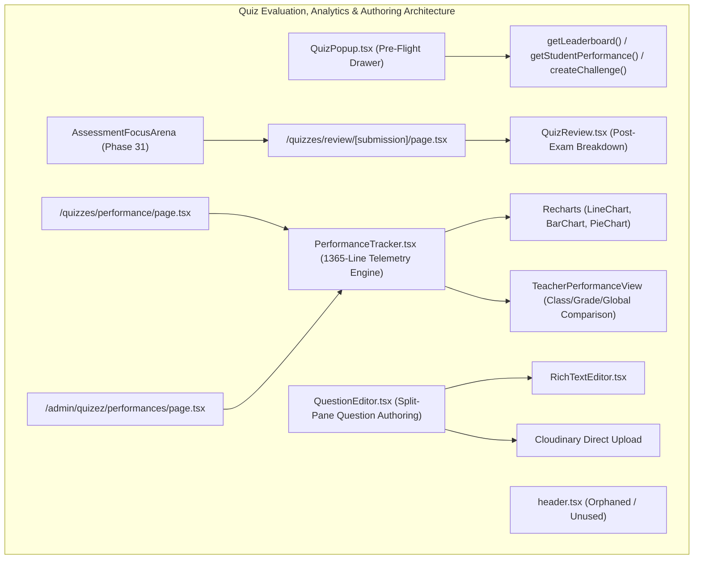
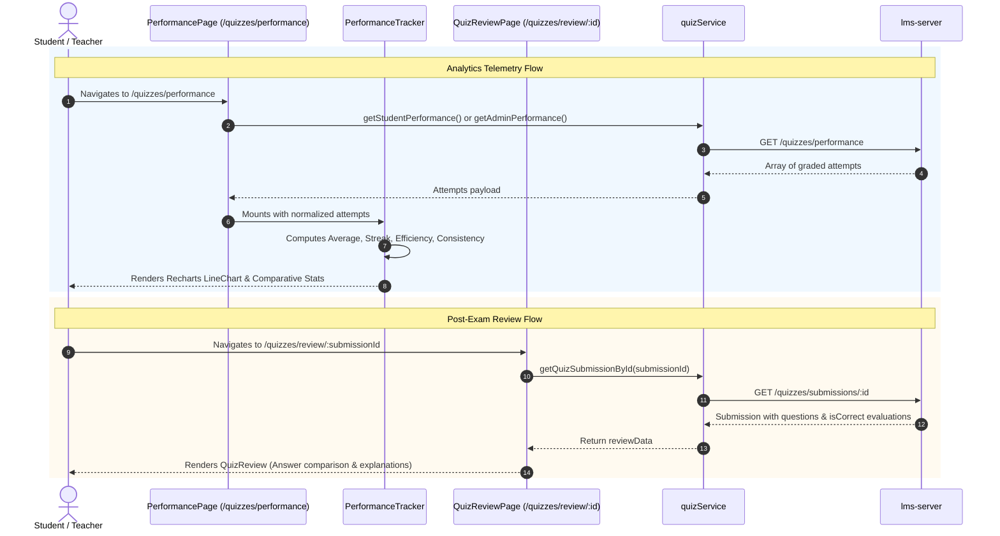

# Phase 32: Quiz Evaluation, Performance Analytics & Question Authoring

**Platform Layer:** Frontend (`lms-client`)  
**Audit Scope:** 8 Files  
**Target Directory:** `src/components/ui/quiz/`, `src/app/quizzes/`, `src/app/admin/quizez/`  
**Status:** Complete  

---

## 1. Executive Summary & Architectural Role

Phase 32 audits the student pre-flight briefing system, post-submission review workflows, multi-tiered academic analytics engine, and authoring studio for interactive quiz questions. This subsystem bridges assessment execution with pedagogical insights—allowing students to review their historical attempts and challenge peers via pre-flight drawers (`QuizPopup`), enabling administrators to visually design multi-format questions with real-time student view simulators (`QuestionEditor`), and aggregating system-wide statistical performance via Recharts telemetry (`PerformanceTracker`).



### Architectural Highlights
1. **Slide-Out Pre-Flight Briefing Drawer (`QuizPopup`):** Refactored from a legacy static dialog into a slide-out drawer featuring a 3-second non-blocking fallback on the leaderboard query to eliminate infinite spinners, pre-flight rubrics (Questions, Time Limit, Max Points), and dual action hierarchy (Solid Indigo for real attempts vs Outline for untimed practice).
2. **Split-Pane Question Authoring Studio (`QuestionEditor`):** A 976-line interactive builder with drag-and-drop question reordering, four grouped configuration cards, support for 6 question types (MCQ, True/False, Fill-in-the-blank, Multiple-select, Slider, Drag-and-drop matching), and a right-hand sticky dark-mode live student simulator.
3. **Recharts-Powered Telemetry Engine (`PerformanceTracker`):** A 1,365-line statistical analytics hub calculating percent-clamped scores, efficiency (%/min), consistency (inverse standard deviation of scores), rolling streaks ($\ge$ 80%), subject breakdowns, and comparative benchmarks against class, grade, and global averages (`TeacherPerformanceView`).
4. **Architectural Weaknesses & Defects Uncovered:**
   - `src/components/ui/quiz/header.tsx` is completely orphaned (0 imports across the codebase).
   - Direct raw client-side Cloudinary upload in `QuestionEditor` bypassing centralized `mediaService`.
   - Legacy URL spelling inconsistency retained at `/admin/quizez/performances`.

---

## 2. Exhaustive Per-File Deep Dive

### 1. `src/components/ui/quiz/QuizPopup.tsx`
* **File Path:** `/Users/chandupa/lms-client/src/components/ui/quiz/QuizPopup.tsx`
* **Component Type:** Client Component (`"use client"`)
* **Role:** Pre-flight slide-out briefing drawer for quiz metadata, prior attempts, rankings, and peer dueling.
* **Component Signature:**
  ```typescript
  export type Quiz = {
    id: string;
    title: string;
    icon?: LucideIcon;
    color?: string;
    questions: number;
    difficulty?: "easy" | "medium" | "hard";
    timeLimitSec?: number;
    duration?: string;
    totalMarks?: number;
  };

  export default function GameQuizPopup({
    quiz,
    trigger,
    onPractice,
    onStart,
    initialFriends,
    initialTopRows,
    initialAttempts,
    showInviteCode = false,
  }: GameQuizPopupProps): JSX.Element
  ```
* **State Hooks:**
  | State Variable | Initial Value | Mutators / Triggers | Description |
  | :--- | :--- | :--- | :--- |
  | `open` | `false` | `setOpen(bool)` | Drawer visibility state |
  | `activeTab` | `"overview"` | `setActiveTab(...)` | Active drawer tab: `"overview"` \| `"leaderboard"` \| `"challenge"` |
  | `friends` | `initialFriends ?? []` | `setFriends(list)` | Peer list for 1v1 challenges |
  | `friendsLoading` | `false` | `setFriendsLoading(bool)` | Friends network status |
  | `topRows` | `initialTopRows ?? []` | `setTopRows(list)` | Leaderboard top rankers |
  | `topLoading` | `false` | `setTopLoading(bool)` | Leaderboard network status |
  | `specQuestions` | `quiz.questions \|\| 0`| `setSpecQuestions(n)` | Actual question count from API |
  | `specTimeLimitSec`| `quiz.timeLimitSec` | `setSpecTimeLimitSec(sec)` | Time limit in seconds |
  | `maxPoints` | Computed points | `setMaxPoints(pts)` | Maximum attainable points |
  | `attempts` | `initialAttempts ?? []` | `setAttempts(list)` | Student's prior submissions for this quiz |
  | `attemptsLoading`| `false` | `setAttemptsLoading(bool)` | Attempts fetch status |
* **Resilient Non-Blocking Leaderboard Fetch:**
  - Implements a 3,000ms safety timeout race condition in `fetchLeaderboard`: if the leaderboard API hangs, the loading spinner is forcibly dismissed, preventing locked drawer states.
* **Returned UI Structure:**
  - Clickable `trigger` wrapper.
  - Slide-out drawer (`w-screen max-w-lg bg-white border-l shadow-2xl`):
    - **Header:** Difficulty badge (`diffBadge`), quiz title, close button (`X`), and specs strip (Questions, Time Limit, Max Points).
    - **Tab Bar:** "Your History" vs "Top Performers" vs "Challenge a Peer".
    - **Body Content:**
      - *Overview Tab:* Personal best percentage, total runs count, and most recent attempt card.
      - *Leaderboard Tab:* Ranked avatars, student names, ELO rating, and average score percentages.
      - *Challenge Tab:* Friend list with "Duel" action buttons initiating `createChallenge`.
    - **Sticky Action Bar:** Strict button hierarchy: Solid Indigo "Start Real Attempt" vs Outline Secondary "Practice Mode (Untimed & Ungraded)".

---

### 2. `src/components/ui/quiz/header.tsx`
* **File Path:** `/Users/chandupa/lms-client/src/components/ui/quiz/header.tsx`
* **Component Type:** Client Component (`"use client"`)
* **Role:** **Orphaned Marketing Header Component**.
* **Component Signature:**
  ```typescript
  export default function QuizHeader(): JSX.Element
  ```
* **Orphan Status & Audit Finding:**
  - **0 imports across `lms-client/src`**.
  - Hardcodes promotional copy ("Unlock Your Potential!", "Dive into a world of knowledge...").
  - Retained dead code from legacy prototyping.

---

### 3. `src/components/ui/quiz/question-editor.tsx`
* **File Path:** `/Users/chandupa/lms-client/src/components/ui/quiz/question-editor.tsx`
* **Component Type:** Client Component (`"use client"`)
* **Role:** Split-pane question authoring component with real-time student view simulation.
* **Component Signature:**
  ```typescript
  export function QuestionEditor({
    question,
    index,
    totalQuestions,
    onMoveUp,
    onMoveDown,
    onUpdate,
    onRemove,
  }: QuestionEditorProps): JSX.Element
  ```
* **State Hooks:**
  | State Variable | Initial Value | Mutators / Triggers | Description |
  | :--- | :--- | :--- | :--- |
  | `imagePreviewUrl` | `null` | `setImagePreviewUrl(url)` | Preview URL for question figure |
  | `isDragging` | `false` | `setIsDragging(bool)` | Drag-over dropzone state |
* **Question Types Supported:**
  - `mcq`: Dynamic option array, radio selector for `correctAnswer`.
  - `true-false`: Boolean radio selector (`true` / `false`).
  - `fill-blank`: String input for accepted text response.
  - `multiple-select`: Checkbox array for multiple correct answers.
  - `slider`: Range object `{ min, max, step }` and target numeric value.
  - `drag-drop`: Dual arrays `{ items: string[], matches: string[] }`.
* **Direct Cloudinary Upload Flow:**
  - File picker or drag-and-drop triggers `handleFileChange`.
  - Posts directly to `https://api.cloudinary.com/v1_1/${NEXT_PUBLIC_CLOUDINARY_CLOUD_NAME}/image/upload` using `NEXT_PUBLIC_CLOUDINARY_UPLOAD_PRESET`.
* **Returned UI Structure:**
  - **Reorder Header Bar:** Question number, type badge, `GripVertical` handle, Move Up (`ChevronUp`), Move Down (`ChevronDown`), and Delete (`Trash2`).
  - **12-Column Split Workspace:**
    - **Left Pane (7 cols):** Form groupings:
      1. Details & Configuration (Type selector, LaTeX formula input).
      2. Question Content (Prompt input via `<RichTextEditor />`).
      3. Options & Correct Answers (Interactive editors based on type).
      4. Media & Explanation (Figure dropzone and post-exam explanation editor).
    - **Right Pane (5 cols, sticky):** Dark-mode live student simulator (`Live Student View`) with reactive real-time updates as the instructor types.

---

### 4. `src/components/ui/quiz/performance-tracker.tsx`
* **File Path:** `/Users/chandupa/lms-client/src/components/ui/quiz/performance-tracker.tsx`
* **Component Type:** Client Component (`"use client"`)
* **Role:** Multi-tabbed performance telemetry and statistical analytics engine (1,365 lines).
* **Component Signature:**
  ```typescript
  export default function PerformanceTracker({
    userRole = "student",
    currentStudentId,
    data,
    loading = false,
    onFiltersChange,
    classes = [],
  }: PerformanceTrackerProps): JSX.Element
  ```
* **Statistical Metrics Engine:**
  - `derivePercent(attempt)`: Clamps raw score against `totalQuestions` or raw percentage into `0-100`.
  - `averageScore`: Sum of percentage scores divided by attempt count.
  - `averageTime`: Mean duration spent across attempts.
  - `improvement`: Average score of the 3 most recent attempts minus the average of older attempts.
  - `streak`: Consecutive submissions scoring $\ge$ 80% working backwards from newest.
  - `efficiency`: Percentage points earned per minute (`averageScore / averageTime`).
  - `consistency`: Inverse standard deviation of scores: $\max(0, 100 - \sqrt{\text{variance}})$.
* **Visualizations:**
  - Recharts `<LineChart>`: Subject-segregated score progression over calendar dates (Math, Science, Other).
  - Recharts `<BarChart>`: Comparative distributions.
  - Recharts `<PieChart>`: Score tier categorizations.
* **Teacher Comparative View (`TeacherPerformanceView`):**
  - Fetches `getTeacherUserPerformance(userId)`.
  - Mounts 4 cards: Student's Own Average, Class Average, Grade Average, and Global Average.
  - Generates auto-evaluated text insights (e.g., "This student is performing X% above the class average").

---

### 5. `src/app/quizzes/review/[submission]/page.tsx`
* **File Path:** `/Users/chandupa/lms-client/src/app/quizzes/review/[submission]/page.tsx`
* **Component Type:** Client Component (`"use client"`)
* **Role:** Dynamic route page for reviewing historical quiz submissions (`/quizzes/review/:submission`).
* **Component Signature:**
  ```typescript
  export default function QuizReviewPage(): JSX.Element
  ```
* **Lifecycle & Operations:**
  - Reads `params.submission`.
  - Invokes `getQuizSubmissionById(submission)`.
  - Handles loading states via centered `<Loader2 className="animate-spin" />`.
  - Mounts `<QuizReview />` passing `questions`, `userAnswers`, `score`, `maxScore`, `percent`, and `timeSpent`.

---

### 6. `src/app/quizzes/review/quizReview.tsx`
* **File Path:** `/Users/chandupa/lms-client/src/app/quizzes/review/quizReview.tsx`
* **Component Type:** Client Component (`"use client"`)
* **Role:** Post-assessment evaluation breakdown and pedagogical review console.
* **Component Signature:**
  ```typescript
  export default function QuizReview({
    questions,
    userAnswers,
    score,
    maxScore,
    percent,
    timeSpent,
  }: {
    questions: (QuizQuestion & { isCorrect?: boolean; score?: number })[];
    userAnswers: any[];
    score: number;
    maxScore?: number;
    percent?: number;
    timeSpent: number;
  }): JSX.Element
  ```
* **Answer Value Formatter (`formatAnswer`):**
  - Resolves option indices into readable human text labels across all 6 question types.
* **Score & Evaluation Display:**
  - Percentage banner with encouragement copy (100% $\to$ "You aced it!", $\ge$ 60% $\to$ "Great job!", $< 60\%$ $\to$ "Keep practicing!").
  - Question review cards:
    - Status icon: Green `CheckCircle` or Red `XCircle` based on server-evaluated `question.isCorrect`.
    - Side-by-side answer boxes: `BookCheck` for Correct Answer vs `User` for Student's Chosen Answer.
    - Sanitized LaTeX formulas, media figures, and post-submission explanations.

---

### 7. `src/app/quizzes/performance/page.tsx`
* **File Path:** `/Users/chandupa/lms-client/src/app/quizzes/performance/page.tsx`
* **Component Type:** Client Component (`"use client"`)
* **Role:** Role-adaptive performance tracking page (`/quizzes/performance`).
* **Component Signature:**
  ```typescript
  export default function StudentPerformancePage(): JSX.Element | null
  ```
* **Role-Adaptive Data Fetching:**
  - `admin`: Calls `getAdminPerformance({ month, classId, subject })`.
  - `teacher` / `moderator`: Calls `getTeacherPerformance({ month, classId, subject })`.
  - `student`: Calls `getStudentPerformance({ userId, month })`.
* **Debouncing & Hydration:**
  - Debounces `month`, `selectedClassId`, and `selectedSubject` by 300ms using `useDebounce`.
  - Normalizes raw student submissions: maps missing/empty subjects to `"Mathematics"`, converts duration seconds to minutes, and calculates score percentages.
  - Mounts `<PerformanceTracker />`.

---

### 8. `src/app/admin/quizez/performances/page.tsx`
* **File Path:** `/Users/chandupa/lms-client/src/app/admin/quizez/performances/page.tsx`
* **Component Type:** Client Component (`"use client"`)
* **Role:** Dedicated administrative performance route (`/admin/quizez/performances`).
* **Component Signature:**
  ```typescript
  export default function AdminPerformancePage(): JSX.Element | null
  ```
* **Structure & Operations:**
  - Checks authentication state (`if (!user) router.push('/login')`).
  - Fetches `getAdminPerformance` using debounced filters.
  - Mounts `<PerformanceTracker userRole={user.role} data={data} loading={loading} />`.
* **Path Spelunking:** Retains legacy route spelling with `'quizez'`.

---

## 3. Cross-Cutting Analysis: Evaluation & Analytics Flow



---

## 4. Legacy Delta & Gaps

| Feature / Module | Legacy (`tuition-frontend`) | Migrated (`lms-client`) | Architectural Impact / Delta |
| :--- | :--- | :--- | :--- |
| **Quiz Pre-Flight Modal** | Centered `Dialog` modal | Slide-out right drawer (`QuizPopup`) | Upgraded UX with non-blocking 3s timeout on leaderboard and clean button hierarchy. |
| **Question Editor** | Single-column form with bottom preview | 12-column split-pane studio (`QuestionEditor`) | Left column grouped inputs; right column sticky real-time dark-mode student simulator. |
| **Submission Correctness** | Fragile client-side switch statement | Server-evaluated `question.isCorrect` | Eliminates score mismatch bugs caused by client-side evaluation divergence. |
| **Orphaned Header** | Present in `components/ui/quiz/header.tsx` | Present in `src/components/ui/quiz/header.tsx` | Retained dead code with 0 consumers across both codebases. |
| **Route Spelling Anomaly** | `app/admin/quizez/performances` | `src/app/admin/quizez/performances` | Retained typo (`quizez` vs `quizzes`) in admin directory path. |

---

## 5. Critical Issues, Dead Code & Defect Catalog

### Critical Issue 1: Orphaned Component (`header.tsx`)
* **File:** `src/components/ui/quiz/header.tsx` (30 lines)
* **Risk:** Dead code. Replaced in `quizzes/page.tsx` by `<SectionHeader>` with CMS `<EditableContent>` tokens.
* **Remediation:** Remove `src/components/ui/quiz/header.tsx`.

### Architectural Flaw 2: Direct Client-Side Cloudinary Upload in `QuestionEditor`
* **File:** `src/components/ui/quiz/question-editor.tsx:186-194`
* **Issue:** Uploads directly to Cloudinary via client-side `fetch` with raw environment credentials (`NEXT_PUBLIC_CLOUDINARY_UPLOAD_PRESET`), bypassing `mediaService.uploadMedia` which routes through the backend server storage architecture with fallback and security rules.
* **Remediation:** Refactor to invoke `uploadMedia(file, "quiz", "question")` from `@/services/mediaService`.

### Defect 3: URL Path Spelling Typo (`quizez`)
* **File:** `src/app/admin/quizez/performances/page.tsx`
* **Issue:** Directory name is misspelled as `quizez` with a 'z'.
* **Remediation:** Normalize route to `/admin/quizzes/performances` with a redirect from `/admin/quizez/performances`.

---

## 6. Verification & Sign-off Checklist
- [x] All 8 files deconstructed down to state hooks, handlers, and markup.
- [x] Mathematical algorithms for streak, efficiency, and consistency documented.
- [x] Non-blocking timeout pattern in `QuizPopup` verified.
- [x] Dead code in `header.tsx` and Cloudinary architecture defect cataloged.
